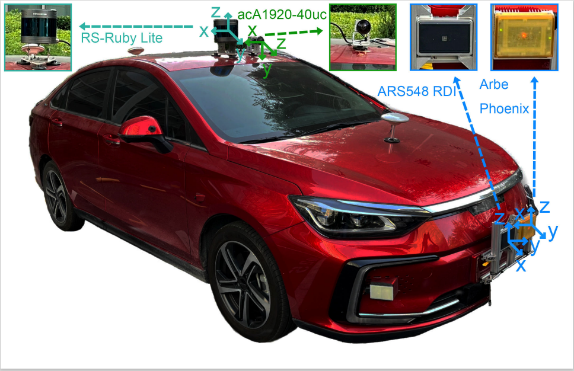

## About Radar

### 章节目录

| 章节 | 描述 | 备注 |
|:-------:|:-------:|:-------:|
| [数学基础](./数学基础篇/README.md) | 包含高数、线代、概率论等章节 | 持续更新中... |
| [雷达基础知识](./基础知识篇/README.md) | 描述毫米波雷达基础知识，包括分辨率、检测能力等等 |  |
| [信号处理](./信号处理篇/README.md) | 雷达测速测距测角、仿真代码   小波变换 | 持续更新中... |
| [数据处理](./数据处理篇/README.md) | 主要以多目标跟踪为主，描述相关流程 |  |
| [深度学习](./深度学习篇/README.md) | 深度学习基础知识   pointpillars的部署工程|  |
| [机器学习篇](./机器学习篇/README.md) | 区别于深度学习，主要介绍常见的机器学习算法 | 持续更新中... |
| [SLAM篇] | 暂未开展 | 暂未开展 |

  

## 数据集汇总

持续更新的各类任务的毫米波雷达数据集

[awesome-radar-perception](https://github.com/hcheng1005/awesome-radar-perception/tree/main?tab=readme-ov-file#Super-Resolution)

---

| 数据集 | 介绍 | 用途 | 代码 | 备注 |
| :--- | :---  | :--- | :--- | :---- | 
| [RadarScenes](https://radar-scenes.com/)|   | 1.目标检测  2.EgoMotion估计  3.环境感知（动静分类、freespace） | [EGO_MOTION_ESTIMATION_RADAR](https://github.com/hcheng1005/EGO_MOTION_ESTIMATION_RADAR)   [ENVIRONMENT_REPRESENTATION_USING_RADAR](https://github.com/hcheng1005/ENVIRONMENT_REPRESENTATION_USING_RADAR) |  |
| [ColoRadar](https://arpg.github.io/coloradar/)  |    **1. 3D FMCW radar, 3D lidar, and IMU data**.   2. The full dataset, including sensor data, calibration sequences, and evaluation scripts can be downloaded here. | 1. 系统一共包含两个4D毫米波雷达：SingleRadar 和 CascadedRadar，收发天线分别为3x4以及12x16;  2.提供原始ADC数据;  3. 理解并学习3D点云信号处理流程；  4. 学习天线频率、相位校正流程；| [LINK](https://github.com/hcheng1005/coloradar) | None |
| [Pitt-Radar](https://openaccess.thecvf.com/content/CVPR2023/papers/Li_Azimuth_Super-Resolution_for_FMCW_Radar_in_Autonomous_Driving_CVPR_2023_paper.pdf) | **TI AWR1843BOOST** | 1. 包含ADC  2. 数据集原本用于Azimuth super-resolution（角度超分辨处理）  3. 可以扩展用于标准的信号处理、目标跟踪的常规应用| [Pitt-Radar](https://github.com/yujheli/Pitt-Radar/) | - |
| [DualRadar]() |   1. based on **4D radar** that can be used for studies on **3D object detection** and tracking in the field of autonomous driving.   2. The perception system of ego vehicle includes a high-resolution camera, a 80-line LiDAR and two up-to-date and different models of **4D radars operating in different modes(Arbe and ARS548)** | 1. 4D radar数据集，使用Arbe和ARS548雷达模块;   2. 基于OpenpcDet完成3D目标检测任务;   3. 基于3D雷达点云实现单模态、多模态的目标检测任务 | - | - |
| [NTU4DRadLM (Oculli Eagle)](https://github.com/junzhang2016/NTU4DRadLM?tab=readme-ov-file)   [MSC RAD4R（Oculii Eagle 4D Radar）](https://mscrad4r.github.io/home/)   [MulRan](https://sites.google.com/view/mulran-pr/home)| SLAM相关的一些数据集 |  | [NTU4DRadLM  code](https://github.com/hcheng1005/4DRadarSLAM) [MulRan code](https://github.com/gisbi-kim/navtech-radar-slam) |  |

