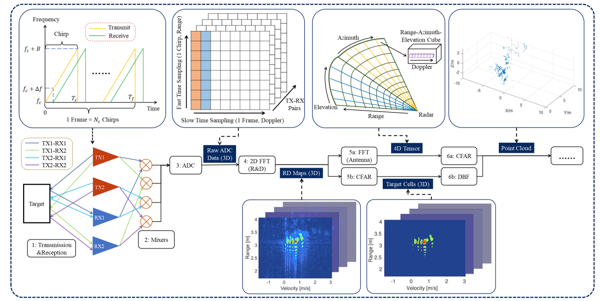
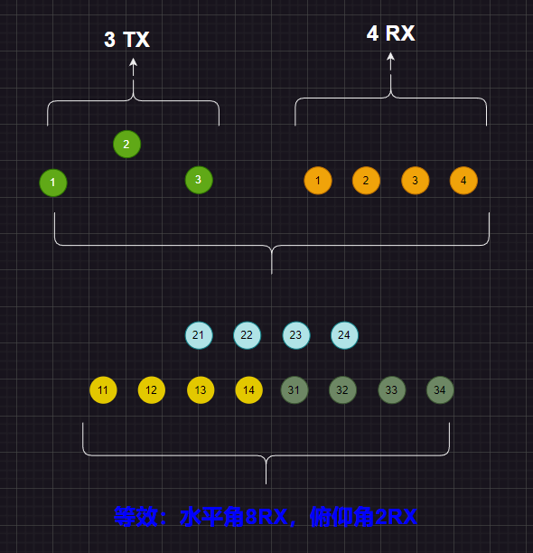
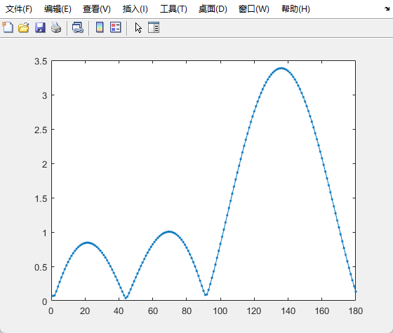
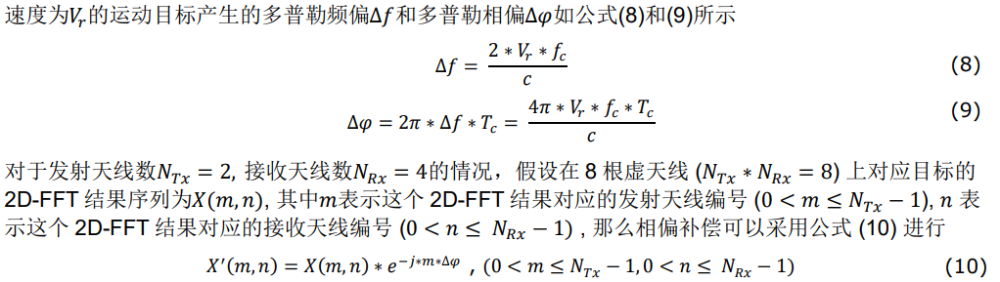
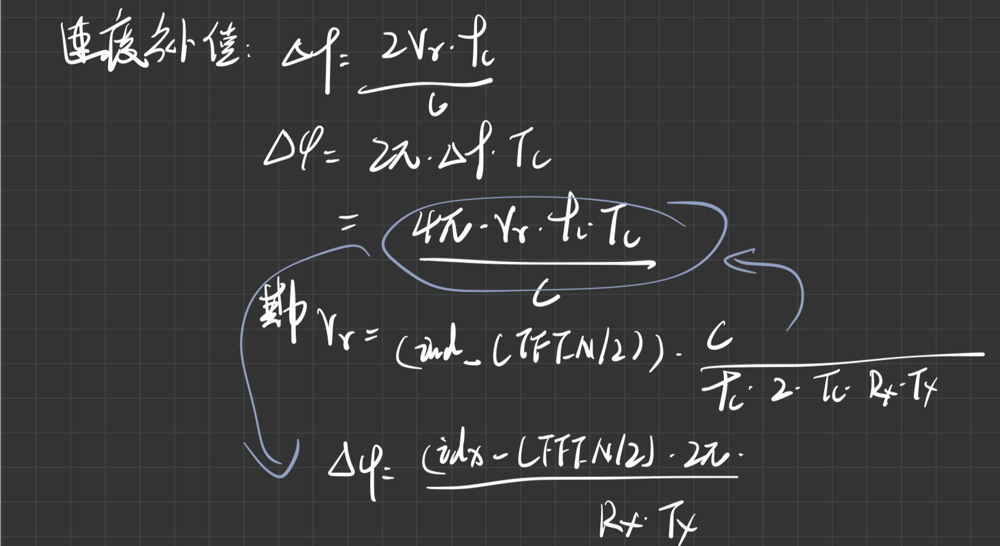
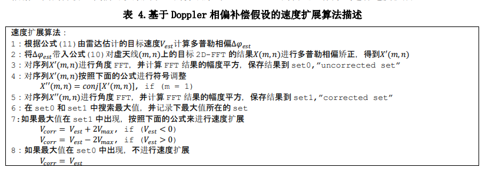

# 毫米波雷达信号处理



- [距离、速度](#距离速度)
- [CFAR](#cfar)
- [角度](#角度)
  - [信号空间重构](#信号空间重构)
- [DOA算法](#doa算法)
  - [基于FFT](#基于fft)
  - [基于music](#基于music)
- [补充](#补充)
  - [速度补偿](#速度补偿)
  - [速度扩展](#速度扩展)
- [参考](#参考)
- [相关资料](#相关资料)
- [其他参考](#其他参考)

---

## 距离、速度

距离和速度的解算采用标准的FFT，分别称为RangeFFT和DopplerFFT。

由于不可避免的[**泄露**](https://mp.weixin.qq.com/s?__biz=MzI5NTM0MTQwNA==&mid=2247484164&idx=1&sn=fdaf2164306a9ca4166c2aa8713cacc5&scene=21#wechat_redirect)存在，在执行RangeFFT之前，需要对原始采集的adc数据进行[**加窗处理**](https://zhuanlan.zhihu.com/p/24318554)。


在进行完RangeFFT后，得到的结果需要进行**校准**.
> 关于校准的细节内容参考[**signalPrcesssing_userguide_4chipCascade**](./signalPrcesssing_userguide_4chipCascade.pdf)中的第四章节：**Antenna calibration**


参考代码：

```matlab
% 距离维FFT
rangeWin = hanning(ADCNum); % 距离加窗
rangeWin3D = repmat(rangeWin, 1, ChirpNum, arrNum); % 扩充与rangeData数据一致
rangeData = adcData .* rangeWin3D ; % 距离维加窗
rangeFFTOut = fft(rangeData, [], 1) * 2 * 2 / ADCNum; % 对距离维做FFT【FFT补偿+汉宁窗补偿】

% 多普勒维FFT 
dopplerWin = hanning(ChirpNum)'; % 汉宁窗
dopplerWin3D = repmat(dopplerWin, ADCNum, 1, arrNum); % 扩充与dopplerData数据一致
dopplerData = rangeFFTOut .* dopplerWin3D; % 多普勒加窗
dopplerFFTOut = fftshift(fft(dopplerData, [], 2),2) * 2 * 2 / ChirpNum; % 对多普勒维做FFT【FFT补偿+汉宁窗补偿】 
```


在coloRadar处理代码中，校准和FFT步骤如下：
```python
if self.sensor != "scradar": # awr2243级联方案需要对原始adc数据进行频率和相位校准\补偿
    adc_samples *= self.calibration.get_frequency_calibration()
    adc_samples *= self.calibration.get_phase_calibration()

ntx, nrx, nc, ns = adc_samples.shape

rfft = np.fft.fft(adc_samples, ns, -1) - self.calibration.get_coupling_calibration() # 距离维FFT
dfft = np.fft.fft(rfft, nc, -2)                                                      # 速度维FFT
dfft = np.fft.fftshift(dfft, -2)
```


## CFAR
- [雷达目标CFAR检测算法](https://blog.csdn.net/weixin_45317919/article/details/125899133)
- [ FMCW雷达信号处理的二维CFAR（2D CFAR、十字CFAR）检测算法](https://zhuanlan.zhihu.com/p/508870274)


一般的流程是在2DFFT之后，进行CFAR处理，提取出潜在的目标的个数、位置bin以及速度bin。

根据每个目标的位置bin，获取其各个天线对象的索引数值，进行角度解算。

## 角度

如上述提到，首先根据目标位置bin获取所有的天线对应的数值。下面分析仿真代码的处理流程。

```matlab
sig_space = zeros(max(virtual_array.azi_arr)+1, max(virtual_array.ele_arr)+1); % 初始化信号子空间
for trx_id = 1 : size(cfgOut.sigIdx,2)
    sig_space(cfgOut.sigSpaceIdx(1, trx_id), cfgOut.sigSpaceIdx(2,trx_id)) = sig(cfgOut.sigIdx(1,trx_id), cfgOut.sigIdx(2,trx_id)); % 重排后的信号空间
end
% 至此我们生成的信号子空间维度为 方位虚拟天线数目 * 俯仰虚拟天线数目 

eleArrData = zeros(cfgDOA.FFTNum, size(sig_space,2)); % 俯仰维度数据
for ele_idx = 1 : size(sig_space, 2) % 这里采取遍历是为了适配不同的空间谱估计方法
    tmpAziData = sig_space(:, ele_idx);
    [azidoaOut] = azimuthDOA(tmpAziData, cfgDOA); % 提取第一列方位维度天线信息进行方位角估计 
    eleArrData(:, ele_idx) = azidoaOut.spectrum(:); % 复空间谱
end

for azi_peak_idx = 1 : length(azidoaOut.angleVal) % 对方位维度检测的谱峰进行检索
    tmpEleData = eleArrData(azidoaOut.angleIdx(azi_peak_idx), :).'; % 获取与方位维目标关联的信号
    [eledoaOut] = elevationDOA(tmpEleData, cfgDOA); % 进行俯仰角估计

    % 关联目标的距离、多普勒、信噪比、方位和俯仰信息
    aziVal = azidoaOut.angleVal; 
    eleVal = eledoaOut.angleVal;
end

```

### 信号空间重构
```matlab
sig_space = zeros(max(virtual_array.azi_arr)+1, max(virtual_array.ele_arr)+1); % 初始化信号子空间
```

这里初始化信号子空间的意思就是根据阵列天线设计，重新排列数据。

已AWR1243为例，3*4的物理天线一共会有12根虚拟天线，其阵列如下：(第一个数字代表Tx，第二个数字代表Rx)：

 > xx xx 31 32 33 34 xx xx  
 > 11 12 13 14 21 22 23 24

所以，实际的信号空间为2*8数列，天线阵列示意图如下：

<div align=left>

</div>


完成信号空间重构后，首先计算目标的水平角。即**对天线阵列【11 12 13 14 21 22 23 24】进行[DOA](#doa算法)算法处理，并寻找其峰值作为目标的方位角**。同时，也需要对天线阵列【xx xx 31 32 33 34 xx xx】进行DOA算法处理，其中xx使用0进行填充，这一步的目的是为了后续计算俯仰角。

现在计算目标的俯仰角，在得到目标的方位角bin后，获取其俯仰阵列对应bin的数值，这里的例子的话就是两个数值（因为这里俯仰角阵列只有两列），然后对该两个数值进行DOA算法，并寻找其峰值作为目标的俯仰角。

至此，目标的距离、速度、方位、俯仰信息都已解算得出。


## DOA算法

### 基于FFT
一般的DOA算法，既是对天线阵列数值进行FFT计算，然后寻找峰值。

```matlab
function [PoutFFT] = DOA_FFT(arrData, cfgDOA)
    %% 本文件为基于FFT的DOA/AOA估计    
    doa_fft = fftshift(fft(arrData, cfgDOA.FFTNum)) * 2 / cfgDOA.FFTNum;
    PoutFFT = (doa_fft); 
end
```

<div align=left>

</div>


### 基于music

- [MUSIC算法原理以及详细推导](https://blog.csdn.net/jiangwenqixd/article/details/118459087)

```matlab
function [PoutMusic] = DOA_MUSIC(X, P, thetaGrids)
    % X: 输入信号 Channel * ChirpNum
    % P: 目标数目
    % PoutMusic: 输出功率谱
    
    M = size(X, 1); % 阵元数
    snap = size(X, 2); % 快拍数
    RX = X * X' / snap; % 协方差矩阵
    
    [V, D] = eig(RX); % 特征值分解
    eig_value = real(diag(D)); % 提取特征值
    [B, I] = sort(eig_value, 'descend'); % 排序特征值
    EN = V(:, I(P+1:end)); % 提取噪声子空间
    
    PoutMusic = zeros(1, length(thetaGrids));
    
    for id = 1 : length(thetaGrids)
        atheta_vec = exp(1j * 2 * pi * [0:M-1]' * 1 / 2 * sind(thetaGrids(id))); % 导向矢量
        PoutMusic(id) = ((1 / (atheta_vec' * EN * EN' * atheta_vec))) ; % 功率谱计算
    end
end
```

> NOTE: 复数的转置：a = 0.0096 - 0.0389i, 则a' = 0.0096 + 0.0389i


## 补充

### 速度补偿


- [基于AWR1642汽车雷达的速度扩展算法研究](https://www.ti.com.cn/cn/lit/an/zhca901/zhca901.pdf)
  
<div align=left>

</div>

matlba代码如下：

```matlab
sig_bin_org = doaInput; % TARNUM * RXNUM * TXNUM
deltaPhi = 2 * pi * (dopplerIdx - ChirpNum / 2) / (numTx * ChirpNum); % 多普勒相位修正 tarNum * 1
deltaPhi = deltaPhi.';
tmpTX = (0 : numTx - 1); % 1 * TXNUM
correct_martrix = exp(-1j * deltaPhi * tmpTX ); % TARNUM * TXNUM 
correct_martrixs(:, 1, :) = correct_martrix;
com_dopplerFFTOut = sig_bin_org .* correct_martrixs; % TARNUM * RXNUM * TXNUM
```

上述代码推到过程：

<div align=left>

</div>


### 速度扩展
参考[基于 AWR1642 汽车雷达的速度扩展算法研究](https://www.ti.com.cn/cn/lit/an/zhca901/zhca901.pdf)文章的第四章节：**基于Doppler相偏补偿假设的速度扩展算法**

<div align=left>

</div>


## 参考
  
- [何时、何地应用何种的窗函数?](https://mp.weixin.qq.com/s?__biz=MzI5NTM0MTQwNA==&mid=2247484189&idx=1&sn=78af69208296935021da913200ff272d&scene=21#wechat_redirect)
- 

## 相关资料
- [Introduction_Radar_signal_processing](../file/Introduction_Radar_signal_processing.pdf)
  
- [4D Millimeter-Wave Radar in Autonomous Driving: A Survey](../file/2306.04242.pdf)
  
- [Imaging Radar Using Cascaded mmWave Sensor Reference Design](https://www.ti.com/lit/ug/tiduen5a/tiduen5a.pdf)

- [[Youtube:MATLAB]: FMCW Radar for Autonomous Vehicles | Understanding Radar Principles](https://www.youtube.com/watch?v=-N7A5CIi0sg)
  
## 其他参考  
