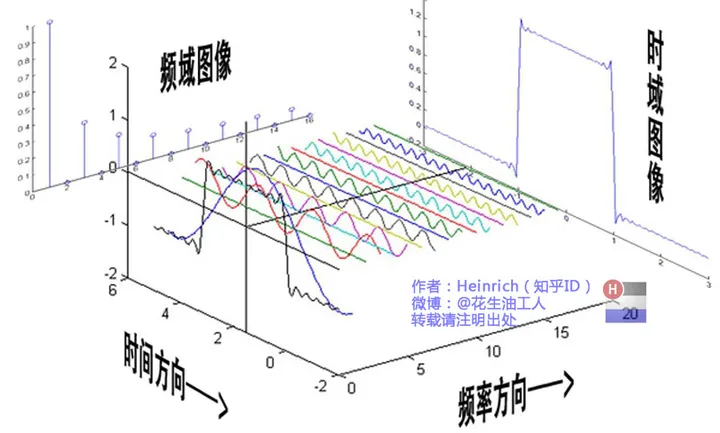
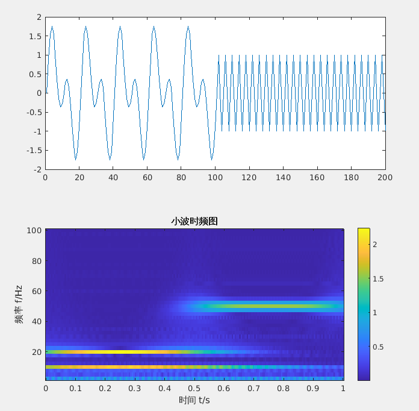
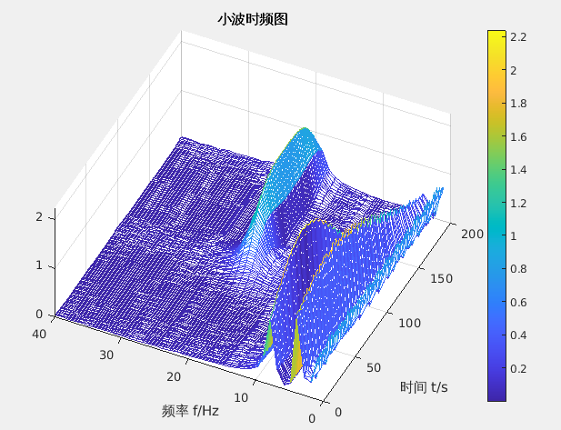

# 小波变换

- [从傅里叶变换开始](#从傅里叶变换开始)
  - [傅里叶变换介绍](#傅里叶变换介绍)
    - [离散傅里叶变换](#离散傅里叶变换)
  - [快速傅里叶变换](#快速傅里叶变换)
- [小波变换](#小波变换-1)
  - [连续小波变换](#连续小波变换)
    - [母小波](#母小波)
    - [连续小波变换CWT代码工程解析](#连续小波变换cwt代码工程解析)
  - [离散小波变换](#离散小波变换)
    - [基本原理](#基本原理)
    - [分解过程](#分解过程)
    - [重构过程](#重构过程)
    - [应用](#应用)
    - [示例代码](#示例代码)
  - [Haar小波变换](#haar小波变换)
    - [分解步骤](#分解步骤)
    - [重构步骤](#重构步骤)

---

<div align=center>

</div>


## 从傅里叶变换开始

### 傅里叶变换介绍

<div align=center>

</div>

**核心公式：**

**时域 ==> 频域**
$$
X(w)=\int_{-\infty}^{+\infty} x(t) e^{-j w t} \mathrm{~d} t
$$

**频域 ==> 时域**
$$
x(t)=\frac{1}{2 \pi} \int_{-\infty}^{+\infty} X(w) e^{j w t} \mathrm{~d} w
$$


**参考链接：**

[傅里叶分析之掐死教程（完整版）](https://zhuanlan.zhihu.com/p/19763358)

[傅里叶级数与傅里叶变换一](https://wzbtech.com/tech/fourier1.html)

[傅里叶级数与傅里叶变换二](https://wzbtech.com/tech/fourier2.html)

#### 离散傅里叶变换

设 $x(n)$ 是一个长度为 $M$ 的有限长序列, $x(n)$ 的 $N$ 点离散傅立叶变换:
$$
X(k)=DFT[x(n)]_{N}=\sum_{n=0}^{N-1} x(n) e^{-j \frac{2 \pi}{N} k n} \quad 0 \leq k \leq N-1
$$

$N$ 称为DFT变换区间长度, $N \geq M$
令 $W_{N}=e^{-j \frac{2 \pi}{N}}$ (简化书写)
- 离散傅立叶变换与逆变换对为:
  
$$
\begin{array}{l}
X(k)=\operatorname{DFT}[x(n)]=\sum_{n=0}^{N-1} x(n) W_{N}^{k n} \quad 0 \leq k \leq N-1 
\end{array}
$$

$$
\begin{array}{l}
x(n)=\operatorname{IDFT}[X(k)]=\frac{1}{N} \sum_{k=0}^{N-1} X(k) W_{N}^{-k n} \quad 0 \leq n \leq N-1
\end{array}
$$


**DFT代码：**

<details>
     <summary>Click To View</summary>

```python
    import math
    import cmath
    import matplotlib.pyplot as plt
    import numpy as np 


    def dft(x):
        N = len(x)
        X = []
        for k in range(N):
            re = 0.0
            im = 0.0
            for n in range(N):
                phi = 2 * math.pi * k * n / N
                re += x[n] * math.cos(phi)
                im -= x[n] * math.sin(phi)
            re = re / N
            im = im / N
            X.append(complex(re, im))
        return X


    # 生成测试信号
    N = 64
    f1 = 5  # 第一个正弦信号的频率
    f2 = 10 # 第二个正弦信号的频率
    x = [math.sin(2 * math.pi * f1 * n / N) + math.sin(2 * math.pi * f2 * n / N) for n in range(N)]


    plt.figure()
    plt.subplot(121)
    plt.plot(x)
    # plt.show()

    # 计算傅里叶变换
    X = dft(x)

    dft_data = np.abs(np.array(X))
    plt.subplot(122)
    plt.plot(dft_data)
    plt.show()
```

</details>

### 快速傅里叶变换
[快速傅里叶变换](./doc/快速傅里叶变换.pdf)

[库利-图基快速傅里叶变换算法](./doc/库利-图基快速傅里叶变换算法.pdf)

**FFT代码**

<details>
     <summary>Click To View</summary>

```python
import math
import cmath
import matplotlib.pyplot as plt
import numpy as np 


def fft(x):
    N = len(x)
    print("N: ", N)
    if N <= 1:
        return x
    even = fft(x[0::2])
    
    # print("cal odd \n")
    
    odd =  fft(x[1::2])
    T= [cmath.exp(-2j*cmath.pi*k/N)*odd[k] for k in range(N//2)]
    return [even[k] + T[k] for k in range(N//2)] + [even[k] - T[k] for k in range(N//2)]

# 生成测试信号
N = 64
f1 = 5  # 第一个正弦信号的频率
f2 = 10 # 第二个正弦信号的频率
x = [math.sin(2 * math.pi * f1 * n / N) + math.sin(2 * math.pi * f2 * n / N) for n in range(N)]

plt.figure()
plt.subplot(121)
plt.plot(x)
# plt.show()

# 计算傅里叶变换
X = fft(x)

dft_data = np.abs(np.array(X))
plt.subplot(122)
plt.plot(dft_data)
plt.show()

```

</details>

## 小波变换

[小波变换（wavelet transform）知乎回答系列](https://www.zhihu.com/topic/19621077/top-answers)

[形象易懂讲解算法I——小波变换](https://zhuanlan.zhihu.com/p/22450818)

### 连续小波变换

- [连续小波变换（CWT）👍🏻](https://zhuanlan.zhihu.com/p/28208640)
  - （详细介绍了为何小波变换能确定信号频率与其对应时间区间；通过母小波进行演示说明）

---

连续小波变换（Continuous Wavelet Transform, CWT）是一种时频分析工具，通过让小波函数（Wavelet）的平移参数和尺度参数连续变化，提供信号的过完备表示。

信号与其小波变换:

<div align=center>

</div>

三维视图：

<div align=center>

</div>


#### 母小波

母小波是生成所有其他小波的基本波形。在连续小波变换中，**通过对母小波进行缩放（改变频率或尺度）和平移（改变位置）**，可以生成一系列的小波函数，这些小波函数用于与信号进行卷积，从而分析信号在不同尺度和位置的特性。


[母小波介绍](./mother_wavelet.md)


#### 连续小波变换CWT代码工程解析
[CWT_Code](./wavelib/cwt_code.md)


### 离散小波变换

离散小波变换（Discrete Wavelet Transform, DWT）是一种在信号处理和图像分析中广泛使用的技术。它通过对信号进行多尺度分析，可以有效地捕捉信号的时间和频率信息。DWT 提供了一种比传统的傅里叶变换更灵活的方式来分析非平稳信号（其统计特性随时间变化的信号）。

#### 基本原理

离散小波变换利用一对互补的滤波器（通常是低通和高通滤波器）对信号进行迭代分解。在每一级分解中，信号被分为两个部分：近似系数（低频部分）和细节系数（高频部分）。

1. **近似系数**：这是通过将信号通过低通滤波器并下采样得到的，它代表了信号的粗略信息。
2. **细节系数**：这是通过将信号通过高通滤波器并下采样得到的，它捕捉了信号的细微变化。

#### 分解过程

在每一级的分解过程中，只有近似系数会被进一步分解，而细节系数则保存为该级的输出。这个过程可以重复多次，每次都将近似系数进一步分解，直到达到所需的分解级别或者近似系数的长度变得太短，无法再进行分解。

#### 重构过程

DWT 还支持逆变换，即从小波系数中重构原始信号。在重构过程中，使用与分解过程中相对应的逆滤波器（低通和高通）和上采样操作，将近似和细节系数组合回一起，逐级恢复出原始信号的近似。

#### 应用

离散小波变换在许多领域都有广泛的应用，包括：

- **信号去噪**：通过修改小波系数（如阈值处理细节系数）来去除噪声。
- **图像压缩**：利用小波系数的能量分布特性来实现有效的图像压缩。
- **特征提取**：在模式识别和机器学习中，小波系数可以作为特征使用。

#### 示例代码

以下是使用 Python 的 PyWavelets 库进行离散小波变换的一个简单示例：

```python
import pywt
import numpy as np

# 创建一个简单的信号
x = np.linspace(0, 1, num=256)
y = np.sin(2 * np.pi * 8 * x) + np.sin(2 * np.pi * 16 * x)

# 执行离散小波变换
coeffs = pywt.wavedec(y, 'db1', level=4)  # 使用Daubechies1小波

# coeffs 是一个列表，其中包含每一级的近似和细节系数
approx_coeffs, detail_coeffs_level1, detail_coeffs_level2, detail_coeffs_level3, detail_coeffs_level4 = coeffs

# 重构信号
y_reconstructed = pywt.waverec(coeffs, 'db1')
```

离散小波变换的关键优势是其多尺度性质，使其在处理具有不同时间尺度的信号特征时特别有效。


### Haar小波变换
编写一个简单的离散小波变换（DWT）程序而不使用第三方库确实是可能的，但需要手动实现相关的数学运算，包括信号的分解和重构过程。这里，我将提供一个简化的例子，使用Haar小波，这是最简单的小波，便于手动实现。

Haar小波变换使用简单的平均和差分运算来分解信号。在每个分解步骤中，**信号被分为两部分：近似系数（平均值）和细节系数（差值）**。

#### 分解步骤

1. **近似系数**: $a = \frac{x[2i] + x[2i+1]}{\sqrt{2}}$
2. **细节系数**: $d = \frac{x[2i] - x[2i+1]}{\sqrt{2}}$

其中 $x[2i]$ 和 $x[2i+1]$ 是信号的连续样本。

#### 重构步骤

从近似系数和细节系数重构原始信号的步骤是分解步骤的逆过程。

1. **原始信号的重构**:
   - $x[2i] = \frac{a[i] + d[i]}{\sqrt{2}}$
   - $x[2i+1] = \frac{a[i] - d[i]}{\sqrt{2}}$

下面是一个不使用任何第三方库，仅使用 Python 标准库实现的简单 Haar 小波变换和逆变换的示例代码：

<details>
  <summary>Click to view code </summary>

```python
import pywt
import numpy as np
import matplotlib.pyplot as plt

# 离散小波变换
def haar_wavelet_transform(signal, level=1):
    n = len(signal)
    approximation = []
    detail = []
    
    for idx in range(level):
        a = []
        d = []
        for i in range(0, n, 2):
            a.append((signal[i] + signal[i+1]) / np.sqrt(2))
            d.append((signal[i] - signal[i+1]) / np.sqrt(2))
        approximation.append(a)
        detail.append(d)
        signal = a
        n = len(signal)
    
    return approximation, detail

# 逆离散小波变换：从近似系数和细节系数中重构信号
def inverse_haar_wavelet_transform(approximation, detail):
    print("len(approximation): ", len(approximation))
    for i in range(len(approximation)-1, -1, -1): # 确定近似系数的层数
        a = approximation[i]
        d = detail[i]
        signal = []
        print("len(a): ", len(a))
        for j in range(len(a)):
            signal.append((a[j] + d[j]) / np.sqrt(2))
            signal.append((a[j] - d[j]) / np.sqrt(2))
            
        print("len(signal): ", len(signal))
    return signal


# 设置参数
fs = 512  # 采样频率
duration = 1  # 信号持续时间
t = np.linspace(0, duration, int(fs*duration), endpoint=False)  # 时间向量
freq1 = 50  # 第一个频率成分
freq2 = 100  # 第二个频率成分

# 生成信号
signal = np.sin(2 * np.pi * freq1 * t) + np.sin(2 * np.pi * freq2 * t)

# 进行离散小波变换
levels = 2
coeffs = pywt.wavedec(signal, 'db1', level=levels)  # 自动确定分解层数
cA, cD = coeffs[0], coeffs[1:]  # 近似系数和细节系数

# 由于pywt只保留最低频的近似系数，因此在这里逐级计算上级近似系数
cAA = []
cAA.append(coeffs[0:])
tmp_cA = coeffs[0]
for idx in range(levels-1):    
    tmp_cA = inverse_haar_wavelet_transform([tmp_cA], [coeffs[idx+1]])
    print(len(tmp_cA))
    cAA.append(tmp_cA)

cA2, cD2 = haar_wavelet_transform(signal, level=levels)

# 可视化
# 绘制近似系数
plt.figure(figsize=[8, 4])
for idx in range(levels):
    plt.subplot(levels, 1, idx+1)
    plt.plot(np.array(cAA[idx][0]),'r')
    plt.plot(np.array(cA2[levels-idx-1]),'b')
    
# 绘制细节系数
plt.figure(figsize=[8, 4])
for idx in range(levels):
    plt.subplot(levels, 1, idx+1)
    plt.plot(np.array(coeffs[idx+1]),'r')
    plt.plot(np.array(cD2[levels-idx-1]),'b')


# # 从近似和细节系数中恢复信号
# reconstructed_signal = inverse_haar_wavelet_transform(cA2, cD2)
# plt.figure(figsize=[8, 4])
# plt.subplot(211)
# plt.plot(signal, 'b')
# plt.title('Original Signal')
# plt.subplot(212)
# plt.plot(reconstructed_signal, 'r')
# plt.title('Reconstructed Signal')
# plt.show()
```

</details>

这个例子展示了如何手动实现 Haar 小波变换和逆变换。注意，这种实现仅适用于长度为 2 的幂的信号，且是一个非常基础的示例。在实际应用中，可能需要更复杂的小波和更健壮的实现来处理各种信号和边界条件。

由于pywt库的输出结果coeffs中只保留最低频的近似系数和各层的细节系数，因此代码中也展示了如何从pywt输出的coeffs结果逐级恢复原始信号的过程。

