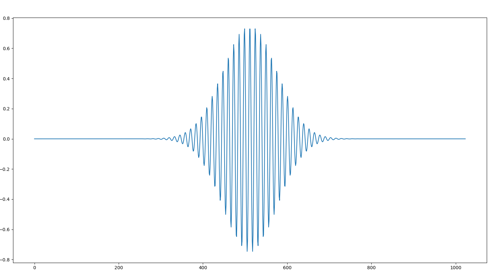

<!--
 * @Author: CharlesHAO hao.cheng@wuzheng.com
 * @Date: 2024-04-15 19:57:30
 * @LastEditors: CharlesHAO hao.cheng@wuzheng.com
 * @LastEditTime: 2024-04-17 16:37:17
 * @FilePath: /about_Radar/信号处理篇/小波变换/wavelib/mother_wavelet.md
 * @Description: 这是默认设置,请设置`customMade`, 打开koroFileHeader查看配置 进行设置: https://github.com/OBKoro1/koro1FileHeader/wiki/%E9%85%8D%E7%BD%AE
-->
# 母小波

- [前言](#前言)
- [Morlet小波](#morlet小波)
  - [定义](#定义)
  - [特点](#特点)
  - [傅里叶因子](#傅里叶因子)
    - [定义和计算](#定义和计算)
    - [解释和应用](#解释和应用)


## 前言

[连续小波变换详解](https://zhuanlan.zhihu.com/p/28208640)(连续小波变换比较详细的介绍，包括母小波的缩放与平移，以及能够检测不同时间下不同频率的原理。)

## Morlet小波

Morlet小波是一种常用的连续小波变换的小波函数，它是由法国地球物理学家Jean Morlet在20世纪80年代初期提出的。Morlet小波因其良好的时间-频率局部化特性而广泛应用于信号处理和时间序列分析中。

<div align=center>

</div>


### 定义
Morlet小波的基本形式可以表示为一个复指数函数（一个正弦波）乘以一个高斯窗。数学表达式如下：

$$
\psi(t) = \pi^{-1/4} e^{i \omega_0 t} e^{-t^2/2}
$$

其中：
- $\pi^{-1/4}$ 是归一化因子，确保小波具有单位能量。
- $\omega_0$ 是小波的中心频率。
- $t$ 是时间变量。


<details>
  <summary>Click to View Code</summary>

  ```py
  def morlet_wavelet(t, s=1.0, w=5.0):
    """
    改进的Morlet小波函数。
    参数:
    - t : 时间数组
    - w : 频率参数
    - s : 尺度参数，影响小波的宽度
    """
    return (s**(-0.25)) * (np.pi**(-0.25)) * np.exp(-0.5 * t **2) * np.exp(1j * 2 * np.pi * w * t)

    

  x = np.linspace(-8, 8, 1024) # 
  int_psi_scale = morlet_wavelet(x,s=1)
  plt.figure()
  plt.plot(np.real(int_psi_scale))
  plt.show()
  ```

</details>


### 特点
1. **时间-频率局部化**：Morlet小波由于其高斯包络，具有良好的时间和频率局部化特性。这意味着它能够在时间和频率域中同时提供精确的信息。
2. **调整性**：通过改变中心频率$\omega_0$，可以调整小波对不同频率成分的敏感性。通常，$\omega_0$被设定为大于5以避免高斯窗的负频率分量。
3. **复数形式**：Morlet小波是一个复数小波，这意味着它可以提供信号的相位信息，这在许多应用中是非常有用的。

### 傅里叶因子

Morlet小波的傅里叶因子（Fourier factor）是一个重要的参数，它用于将小波尺度转换为与之对应的傅里叶周期。这一转换对于将小波变换的结果与传统的傅里叶分析结果联系起来非常有用，尤其是在频率分析中。

#### 定义和计算
对于Morlet小波，傅里叶因子主要取决于小波的中心频率 $\omega_0$。傅里叶因子的计算公式为：

$$
\text{Fourier factor} = \frac{4\pi}{\omega_0 + \sqrt{2 + \omega_0^2}}
$$

这个公式提供了从小波尺度 $s$ 到对应的傅里叶周期 $T$ 的转换，其中 $T$ 可以通过以下关系计算：

$$
T = s \times \text{Fourier factor}
$$

#### 解释和应用
- **中心频率 $\omega_0$**：中心频率决定了小波函数的主频带位置。在实际应用中，常见的选择是 $\omega_0 = 6$，这个值是一个折衷的选择，它在时间和频率局部化之间提供了良好的平衡。
- **傅里叶周期 $T$**：这是在给定尺度下小波分析对应的主要周期，可以理解为该尺度下信号最主要的周期成分。

通过使用傅里叶因子，可以将小波变换的尺度直接关联到传统的频率分析结果，这使得小波变换在实际应用中更加直观和有用，尤其是在需要与傅里叶分析比较或结合的场合。

