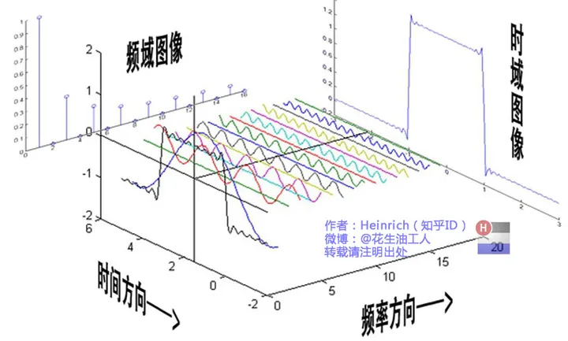
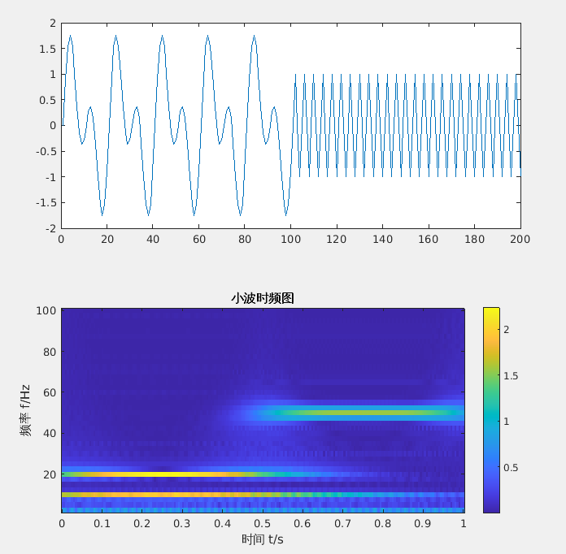
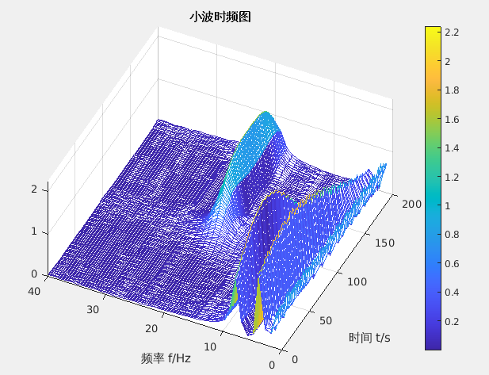

# 小波变换

- [从傅里叶变换开始](#从傅里叶变换开始)
  - [傅里叶变换介绍](#傅里叶变换介绍)
    - [离散傅里叶变换](#离散傅里叶变换)
  - [快速傅里叶变换](#快速傅里叶变换)
- [小波变换](#小波变换-1)
  - [连续小波变换](#连续小波变换)
    - [母小波](#母小波)
    - [连续小波变换CWT代码工程解析](#连续小波变换cwt代码工程解析)
  - [离散小波变换](#离散小波变换)

---

<div align=center>

</div>


## 从傅里叶变换开始

### 傅里叶变换介绍

<div align=center>

</div>

**核心公式：**

**时域 ==> 频域**
$$
X(w)=\int_{-\infty}^{+\infty} x(t) e^{-j w t} \mathrm{~d} t
$$

**频域 ==> 时域**
$$
x(t)=\frac{1}{2 \pi} \int_{-\infty}^{+\infty} X(w) e^{j w t} \mathrm{~d} w
$$


**参考链接：**

[傅里叶分析之掐死教程（完整版）](https://zhuanlan.zhihu.com/p/19763358)

[傅里叶级数与傅里叶变换一](https://wzbtech.com/tech/fourier1.html)

[傅里叶级数与傅里叶变换二](https://wzbtech.com/tech/fourier2.html)

#### 离散傅里叶变换

设 $x(n)$ 是一个长度为 $M$ 的有限长序列, $x(n)$ 的 $N$ 点离散傅立叶变换:
$$
X(k)=DFT[x(n)]_{N}=\sum_{n=0}^{N-1} x(n) e^{-j \frac{2 \pi}{N} k n} \quad 0 \leq k \leq N-1
$$

$N$ 称为DFT变换区间长度, $N \geq M$
令 $W_{N}=e^{-j \frac{2 \pi}{N}}$ (简化书写)
- 离散傅立叶变换与逆变换对为:
  
$$
\begin{array}{l}
X(k)=\operatorname{DFT}[x(n)]=\sum_{n=0}^{N-1} x(n) W_{N}^{k n} \quad 0 \leq k \leq N-1 
\end{array}
$$

$$
\begin{array}{l}
x(n)=\operatorname{IDFT}[X(k)]=\frac{1}{N} \sum_{k=0}^{N-1} X(k) W_{N}^{-k n} \quad 0 \leq n \leq N-1
\end{array}
$$


**DFT代码：**

<details>
     <summary>Click To View</summary>

```python
    import math
    import cmath
    import matplotlib.pyplot as plt
    import numpy as np 


    def dft(x):
        N = len(x)
        X = []
        for k in range(N):
            re = 0.0
            im = 0.0
            for n in range(N):
                phi = 2 * math.pi * k * n / N
                re += x[n] * math.cos(phi)
                im -= x[n] * math.sin(phi)
            re = re / N
            im = im / N
            X.append(complex(re, im))
        return X


    # 生成测试信号
    N = 64
    f1 = 5  # 第一个正弦信号的频率
    f2 = 10 # 第二个正弦信号的频率
    x = [math.sin(2 * math.pi * f1 * n / N) + math.sin(2 * math.pi * f2 * n / N) for n in range(N)]


    plt.figure()
    plt.subplot(121)
    plt.plot(x)
    # plt.show()

    # 计算傅里叶变换
    X = dft(x)

    dft_data = np.abs(np.array(X))
    plt.subplot(122)
    plt.plot(dft_data)
    plt.show()
```

</details>

### 快速傅里叶变换
[快速傅里叶变换](./doc/快速傅里叶变换.pdf)

[库利-图基快速傅里叶变换算法](./doc/库利-图基快速傅里叶变换算法.pdf)

**FFT代码**

<details>
     <summary>Click To View</summary>

```python
import math
import cmath
import matplotlib.pyplot as plt
import numpy as np 


def fft(x):
    N = len(x)
    print("N: ", N)
    if N <= 1:
        return x
    even = fft(x[0::2])
    
    # print("cal odd \n")
    
    odd =  fft(x[1::2])
    T= [cmath.exp(-2j*cmath.pi*k/N)*odd[k] for k in range(N//2)]
    return [even[k] + T[k] for k in range(N//2)] + [even[k] - T[k] for k in range(N//2)]

# 生成测试信号
N = 64
f1 = 5  # 第一个正弦信号的频率
f2 = 10 # 第二个正弦信号的频率
x = [math.sin(2 * math.pi * f1 * n / N) + math.sin(2 * math.pi * f2 * n / N) for n in range(N)]

plt.figure()
plt.subplot(121)
plt.plot(x)
# plt.show()

# 计算傅里叶变换
X = fft(x)

dft_data = np.abs(np.array(X))
plt.subplot(122)
plt.plot(dft_data)
plt.show()

```

</details>

## 小波变换

[小波变换（wavelet transform）知乎回答系列](https://www.zhihu.com/topic/19621077/top-answers)

[形象易懂讲解算法I——小波变换](https://zhuanlan.zhihu.com/p/22450818)

### 连续小波变换

- [连续小波变换（CWT）👍🏻](https://zhuanlan.zhihu.com/p/28208640)
  - （详细介绍了为何小波变换能确定信号频率与其对应时间区间；通过母小波进行演示说明）

---

连续小波变换（Continuous Wavelet Transform, CWT）是一种时频分析工具，通过让小波函数（Wavelet）的平移参数和尺度参数连续变化，提供信号的过完备表示。

信号与其小波变换:

<div align=center>

</div>

三维视图：

<div align=center>

</div>


#### 母小波

母小波是生成所有其他小波的基本波形。在连续小波变换中，**通过对母小波进行缩放（改变频率或尺度）和平移（改变位置）**，可以生成一系列的小波函数，这些小波函数用于与信号进行卷积，从而分析信号在不同尺度和位置的特性。


[母小波介绍](./mother_wavelet.md)


#### 连续小波变换CWT代码工程解析
[CWT_Code](./cwt_code.md)


### 离散小波变换