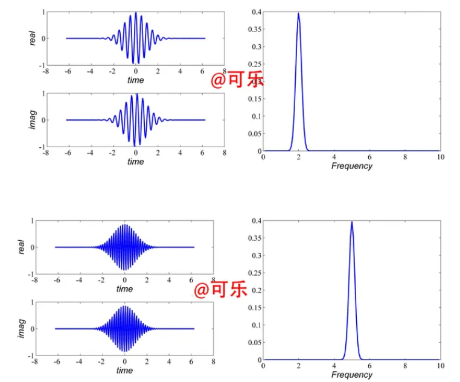
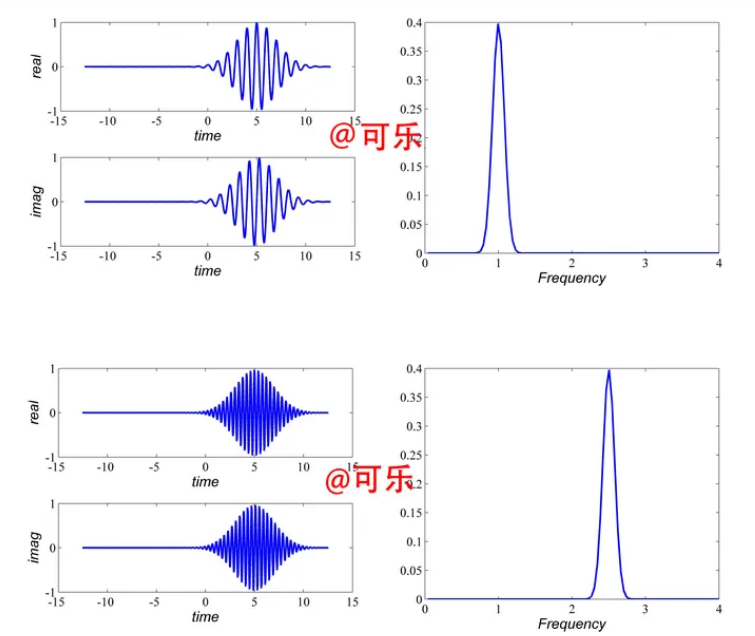

# 小波变换

<div align=center>

</div>


## 从傅里叶变换开始

### 傅里叶变换介绍

<div align=center>

</div>

**核心公式：**

**时域 ==> 频域**
$$
X(w)=\int_{-\infty}^{+\infty} x(t) e^{-j w t} \mathrm{~d} t
$$

**频域 ==> 时域**
$$
x(t)=\frac{1}{2 \pi} \int_{-\infty}^{+\infty} X(w) e^{j w t} \mathrm{~d} w
$$


**参考链接：**

[傅里叶分析之掐死教程（完整版）](https://zhuanlan.zhihu.com/p/19763358)

[傅里叶级数与傅里叶变换一](https://wzbtech.com/tech/fourier1.html)

[傅里叶级数与傅里叶变换二](https://wzbtech.com/tech/fourier2.html)

#### 离散傅里叶变换

设 $x(n)$ 是一个长度为 $M$ 的有限长序列, $x(n)$ 的 $N$ 点离散傅立叶变换:
$$
X(k)=DFT[x(n)]_{N}=\sum_{n=0}^{N-1} x(n) e^{-j \frac{2 \pi}{N} k n} \quad 0 \leq k \leq N-1
$$

$N$ 称为DFT变换区间长度, $N \geq M$
令 $W_{N}=e^{-j \frac{2 \pi}{N}}$ (简化书写)
- 离散傅立叶变换与逆变换对为:
  
$$
\begin{array}{l}
X(k)=\operatorname{DFT}[x(n)]=\sum_{n=0}^{N-1} x(n) W_{N}^{k n} \quad 0 \leq k \leq N-1 
\end{array}
$$

$$
\begin{array}{l}
x(n)=\operatorname{IDFT}[X(k)]=\frac{1}{N} \sum_{k=0}^{N-1} X(k) W_{N}^{-k n} \quad 0 \leq n \leq N-1
\end{array}
$$


**DFT代码：**

<details>
     <summary>Click To View</summary>

```python
    import math
    import cmath
    import matplotlib.pyplot as plt
    import numpy as np 


    def dft(x):
        N = len(x)
        X = []
        for k in range(N):
            re = 0.0
            im = 0.0
            for n in range(N):
                phi = 2 * math.pi * k * n / N
                re += x[n] * math.cos(phi)
                im -= x[n] * math.sin(phi)
            re = re / N
            im = im / N
            X.append(complex(re, im))
        return X


    # 生成测试信号
    N = 64
    f1 = 5  # 第一个正弦信号的频率
    f2 = 10 # 第二个正弦信号的频率
    x = [math.sin(2 * math.pi * f1 * n / N) + math.sin(2 * math.pi * f2 * n / N) for n in range(N)]


    plt.figure()
    plt.subplot(121)
    plt.plot(x)
    # plt.show()

    # 计算傅里叶变换
    X = dft(x)

    dft_data = np.abs(np.array(X))
    plt.subplot(122)
    plt.plot(dft_data)
    plt.show()
```

</details>

### 快速傅里叶变换
[快速傅里叶变换](./doc/快速傅里叶变换.pdf)

[库利-图基快速傅里叶变换算法](./doc/库利-图基快速傅里叶变换算法.pdf)

**FFT代码**

<details>
     <summary>Click To View</summary>

```python
import math
import cmath
import matplotlib.pyplot as plt
import numpy as np 


def fft(x):
    N = len(x)
    print("N: ", N)
    if N <= 1:
        return x
    even = fft(x[0::2])
    
    # print("cal odd \n")
    
    odd =  fft(x[1::2])
    T= [cmath.exp(-2j*cmath.pi*k/N)*odd[k] for k in range(N//2)]
    return [even[k] + T[k] for k in range(N//2)] + [even[k] - T[k] for k in range(N//2)]

# 生成测试信号
N = 64
f1 = 5  # 第一个正弦信号的频率
f2 = 10 # 第二个正弦信号的频率
x = [math.sin(2 * math.pi * f1 * n / N) + math.sin(2 * math.pi * f2 * n / N) for n in range(N)]

plt.figure()
plt.subplot(121)
plt.plot(x)
# plt.show()

# 计算傅里叶变换
X = fft(x)

dft_data = np.abs(np.array(X))
plt.subplot(122)
plt.plot(dft_data)
plt.show()

```

</details>

## 小波变换

### 介绍
[小波变换（wavelet transform）知乎回答系列](https://www.zhihu.com/topic/19621077/top-answers)

[形象易懂讲解算法I——小波变换](https://zhuanlan.zhihu.com/p/22450818)

### 连续小波变换

- [连续小波变换（CWT）👍🏻](https://zhuanlan.zhihu.com/p/28208640)
  - （详细介绍了为何小波变换能确定信号频率与其对应时间区间；通过母小波进行演示说明）

---

连续小波变换（Continuous Wavelet Transform, CWT）是一种时频分析工具，通过让小波函数（Wavelet）的平移参数和尺度参数连续变化，提供信号的过完备表示。

信号与其小波变换:

<div align=center>

</div>

三维视图：

<div align=center>

</div>


### 母小波

母小波是生成所有其他小波的基本波形。在连续小波变换中，**通过对母小波进行缩放（改变频率或尺度）和平移（改变位置）**，可以生成一系列的小波函数，这些小波函数用于与信号进行卷积，从而分析信号在不同尺度和位置的特性。

**特性**：

- **零均值**：母小波通常具有零均值，这意味着它在时间域内的积分为零。这一特性使得小波能够有效地检测信号中的变化点。

- **局部化**：母小波在时间域和频域都应该具有良好的局部化特性。这使得小波变换能够精确地定位信号的特征。

- **可调参数**：母小波具有尺度参数和位置参数，这使得小波能够在不同的尺度和位置捕捉信号的特征。

### morlet母小波介绍

morlet定义如下：

$$
\phi(t)=exp(iw_0t)exp(-\frac{t^2}{2})
$$

morlet小波的基函数是由复三角函数乘上一个指数衰减函数构成的。这里的 $w_0$ 表示中心频率。

下面以 $w_0=2$ 和$w_0=5$为例，观察两者区别：

<div align=center>

</div>


上图左边式基函数时域图像（上下分别表示实数域和虚数域），右边是其傅里叶变换图像。可以看到**基函数的频率正是其中心频率$w_0$的值**。

但是**只给一个固定的中心频率是不能辨认信号的频率**，同样，**基函数只在区间【-2，2】之间也确定不了时间区间**。

所以这里的小波基函数需要**平移**和**伸缩**。

给出b=5,a=2时，即平移5个单位，缩小2倍的morlet小波基函数的图像：

<div align=center>

</div>

> 从时域很明显可以看出平移，从频域也很明显看出尺度伸缩。


### 为什么小波变换会在原始信号固有的频率上产生极大值，而这极大值对应的区间正好是该固有频率的时区？

小波变换之所以能在原始信号的固有频率上产生极大值，并且这些极大值所对应的区间恰好是该固有频率的时间区域，主要原因在于小波变换的尺度和平移操作能够精确匹配信号中的局部频率特性。

**小波变换的工作原理**

`小波变换通过对母小波进行尺度变换和平移变换，生成一系列的小波函数，这些小波函数与原始信号进行卷积操作。卷积的结果表征了原始信号与各个小波函数之间的相似度。`

**尺度变换**

小波变换中的尺度参数 $\alpha$ 起到了频率调节的作用。

当尺度参数 $\alpha$ 较小时，母小波被压缩，其频率变高；

当尺度参数 $\alpha$ 较大时，母小波被拉伸，其频率变低。

这意味着通过调整尺度参数，小波变换可以探测信号在不同频率下的特性。

**平移变换**

小波变换中的平移参数 $b$ 用于控制小波函数在时间轴上的位置。通过改变平移参数，小波函数可以在整个信号的时间长度上移动，使得小波变换能够在每一个特定的时间点上分析信号的频率特性。

**极大值的产生**

当小波函数的频率与信号的某个局部区域的固有频率相匹配时，卷积结果会出现极大值。这是因为小波函数和信号在该区间内高度相似，它们的重叠部分最大，从而导致卷积积分的值达到最大。这个极大值不仅表明了信号在这个时间区间有一个显著的频率成分，而且还标明了这个频率成分的具体位置和强度。

**时间区域的对应**

由于小波变换能够通过尺度和平移参数的调节来适应信号的局部特性，因此极大值出现的时间区域正好对应着信号中那些具有特定固有频率的部分。

这使得小波变换成为一种非常有用的工具，用于分析信号在不同时间和频率上的动态变化，特别是对非平稳信号的分析更是有效。

**总结**

总之，小波变换之所以能在原始信号的固有频率上产生极大值，并且这些极大值所对应的时间区域正好是该固有频率的时区，是因为它通过尺度和平移的灵活调节，能够精确地捕捉并分析信号的局部频率和时间特性。这种能力使得小波变换在许多科学和工程领域中都有广泛的应用。

### 连续小波变换CWT代码工程解析
[CWT_Code](./cwt_code.md)