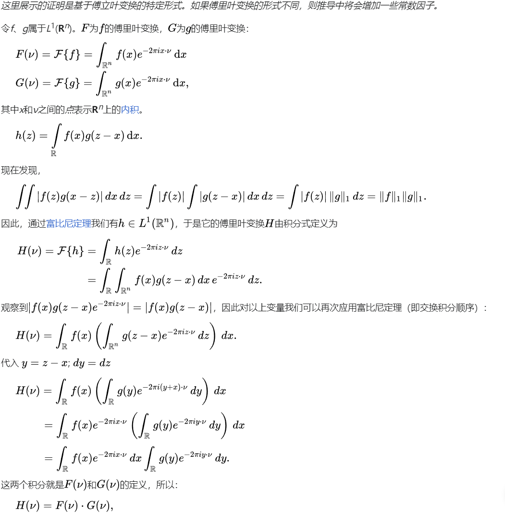

# CWT（连续小波变换）代码工程解析


- [CWT初始化](#cwt初始化)
	- [cwt\_init](#cwt_init)
	- [setCWTScales](#setcwtscales)
- [连续小波变换过程](#连续小波变换过程)
	- [步骤总览](#步骤总览)
	- [**Step1: 初始化和参数设定**](#step1-初始化和参数设定)
	- [**Step2: 输入信号FFT**](#step2-输入信号fft)
	- [**Step3: 小波变换过程**](#step3-小波变换过程)
		- [傅里叶变换的卷积定理](#傅里叶变换的卷积定理)
		- [小波变换的定义](#小波变换的定义)
		- [小波变换的频域实现](#小波变换的频域实现)
		- [在代码中的实现](#在代码中的实现)
- [知识扩展](#知识扩展)
	- [信号卷积 wiki](#信号卷积-wiki)
	- [卷积定理 wiki](#卷积定理-wiki)
		- [证明](#证明)
- [QA](#qa)
	- [Q1: 小波变换中，使用子小波与信号的FFT结果相乘，得到的是该子小波下的频域结果是吗?](#q1-小波变换中使用子小波与信号的fft结果相乘得到的是该子小波下的频域结果是吗)
	- [Q2: 既然已经得到小波变换的频域结果了，为何还要进行逆傅里叶变换](#q2-既然已经得到小波变换的频域结果了为何还要进行逆傅里叶变换)


## CWT初始化

```c++
...

char *wave = "morlet"; // 使用Morlet小波，可选"paul"和"dog"
char *type = "pow";

cwt_object wt;

// 初始化参数
N = 504;
param = 6.0;
subscale = 2;
dt = 0.25;
s0 = dt;
dj = 1.0 / (double)subscale;
J = 11 * subscale;   // 总的尺度数
a0 = 2;            // 幂次

// 初始化小波变换对象
wt = cwt_init(wave, param, N, dt, J);

// 设置小波变换的尺度
setCWTScales(wt, s0, dj, type, a0);
```

其中`cwt_object`结构体定义如下：

<details>

```c++
    struct cwt_set{
        char wave[10];// Wavelet - morl/morlet,paul,dog/dgauss
        int siglength;// Length of Input Data
        int J;// Total Number of Scales
        double s0;// Smallest scale. It depends on the sampling rate. s0 <= 2 * dt for most wavelets
        double dt;// Sampling Rate
        double dj;// Separation between scales. eg., scale = s0 * 2 ^ ( [0:N-1] *dj ) or scale = s0 *[0:N-1] * dj
        char type[10];// Scale Type - Power or Linear
        int pow;// Base of Power in case type = pow. Typical value is pow = 2
        int sflag;
        int pflag;
        int npad;
        int mother;
        double m;// Wavelet parameter param
        double smean;// Input Signal mean

        cplx_data *output;
        double *scale;
        double *period;
        double *coi;
        double params[0];
    };
```

</details>


CWT结构体详细解析：

<details>

`cwt_set` 结构体旨在为连续小波变换（Continuous Wavelet Transform, CWT）配置参数并存储结果。以下是该结构体中各个字段的详细描述：

1. **wave[10]**：存储母小波函数的名称，如"morl"或"morlet"（莫雷特小波）、"paul"（保罗小波）、"dog"或"dgauss"（导数高斯小波）。

2. **siglength**：输入数据的长度。

3. **J**：小波变换使用的总尺度数。

4. **s0**：最小尺度，这个参数依赖于采样率。对于大多数小波，s0 应小于或等于 2 * dt。

5. **dt**：采样率，即数据采样的时间间隔。

6. **dj**：尺度之间的间隔。例如，尺度可以是 $ s0 \times 2^{[0:J-1] \times dj} $（对于指数类型的尺度变化）或 $ s0 \times [0:J-1] \times dj $（对于线性类型的尺度变化）。

7. **type[10]**：尺度类型，可以是"Power"或"Linear"，表示尺度变化是指数形式还是线性形式。

8. **pow**：如果尺度类型是"Power"，则此字段表示幂的基数，常见的值为2。

9. **sflag**：可能用于标记某种特定的状态或选项，具体用途可能需要根据上下文或其他文档来确定。

10. **pflag**：同样可能用于标记某种特定的状态或选项，具体用途可能需要查阅相关文档。

11. **npad**：填充后的数据长度，通常用于FFT计算中，以提高频率分辨率。

12. **mother**：用于标识选用的小波母函数的编号或类型。

13. **m**：小波参数，用于调整小波函数的形状，具体含义取决于所选的小波母函数。

14. **smean**：输入信号的均值，用于在处理前去除信号的直流分量。

15. **output**：指向复数数据类型（cplx_data）的指针，用于存储小波变换的输出结果。

16. **scale**：存储每个尺度的实际值的数组。

17. **period**：存储每个尺度对应的周期的数组。

18. **coi**：存储每个时间点的锥形影响区（Cone of Influence）的数组。

19. **params[0]**：一个大小可变的数组，用于存储可能需要的额外参数，其大小和内容依赖于具体应用。

该结构体为执行小波变换提供了必要的配置信息，并存储了变换的结果，以便于进一步的分析和处理。

</details>

### cwt_init
[原始代码](./src/wavelib.c#L283)

初始化一个小波变换对象 cwt_object 的函数 cwt_init。这个函数根据指定的小波类型、参数、信号长度、采样率和尺度数来配置小波变换的各种参数。

<details>

```c
/**
 * @description: 连续小波变换对象初始化
 * @param {char*} wave: 指定小波函数的名称（如 "morlet", "paul", "dog"）。
 * @param {double} param: 特定小波函数的参数。
 * @param {int} siglength: 输入信号的长度。
 * @param {double} dt: 采样间隔。
 * @param {int} J: 小波变换使用的总尺度数。
 * @return {*}
 */
cwt_object cwt_init(const char* wave, double param,int siglength, double dt, int J) {
	cwt_object obj = NULL;
	int N, i,nj2,ibase2,mother;
	double s0, dj;
	double t1;
	int m, odd;
	const char *pdefault = "pow";

	m = (int)param;
	odd = 1;
	if (2 * (m / 2) == m) {
		odd = 0;
	}

	N = siglength;
	nj2 = 2 * N * J;

	// 构造cwt对象
	obj = (cwt_object)malloc(sizeof(struct cwt_set) + sizeof(double)* (nj2 + 2 * J + N));

	if (!strcmp(wave, "morlet") || !strcmp(wave, "morl")) {
		s0 = 2 * dt;
		dj = 0.4875; // why?
		mother = 0;
		if (param < 0.0) {
			printf("\n Morlet Wavelet Parameter should be >= 0 \n");
			exit(-1);
		}
		if (param == 0) {
			param = 6.0;
		}
		strcpy(obj->wave,"morlet");
		
	}
	else if (!strcmp(wave, "paul")) {
		s0 = 2 * dt;
		dj = 0.4875;
		mother = 1;
		if (param < 0 || param > 20) {
			printf("\n Paul Wavelet Parameter should be > 0 and <= 20 \n");
			exit(-1);
		}
		if (param == 0) {
			param = 4.0;
		}
		strcpy(obj->wave,"paul");
	
	}
	else if (!strcmp(wave, "dgauss") || !strcmp(wave, "dog")) {
		s0 = 2 * dt;
		dj = 0.4875;
		mother = 2;
		if (param < 0 || odd == 1) {
			printf("\n DOG Wavelet Parameter should be > 0 and even \n");
			exit(-1);
		}
		if (param == 0) {
			param = 2.0;
		}
		strcpy(obj->wave,"dog");
	}

	obj->pow = 2;
	strcpy(obj->type, pdefault);

	obj->s0 = s0; 	// 	最小尺度
	obj->dj = dj;	// 	尺度之间的间隔
	obj->dt = dt;	// 	采样率，即数据采样的时间间隔
	obj->J = J;		// 	小波变换使用的总尺度数
	obj->siglength = siglength; 	// 	输入信号长度
	obj->sflag = 0;			//
	obj->pflag = 1;			//
	obj->mother = mother;	// 	母小波
	obj->m = param;			//	小波参数，用于调整小波函数的形状

	t1 = 0.499999 + log((double)N) / log(2.0);
	ibase2 = 1 + (int)t1;

	obj->npad = (int)pow(2.0, (double)ibase2);

	// 分配数据地址
	obj->output = (cplx_data*) &obj->params[0];
	obj->scale = &obj->params[nj2];
	obj->period = &obj->params[nj2 + J];
	obj->coi = &obj->params[nj2 + 2*J];

	for (i = 0; i < nj2 + 2 * J + N; ++i) {
		obj->params[i] = 0.0;
	}

	return obj;
}

```

</details>

### setCWTScales

设置小波尺度等参数。

<details>

```c
void setCWTScales(cwt_object wt, double s0, double dj,const char *type,int power) {
	int i;
	strcpy(wt->type,type);
	//s0*pow(2.0, (double)(j - 1)*dj);
	if (!strcmp(wt->type, "pow") || !strcmp(wt->type, "power")) {
		for (i = 0; i < wt->J; ++i) {
			wt->scale[i] = s0*pow((double) power, (double)(i)*dj);
		}
		wt->sflag = 1;
		wt->pow = power;
		
	}
	else if (!strcmp(wt->type, "lin") || !strcmp(wt->type, "linear")) {
		for (i = 0; i < wt->J; ++i) {
			wt->scale[i] = s0 + (double)i * dj;
		}
		wt->sflag = 1;
	}
	else {
		printf("\n Type accepts only two values : pow and lin\n");
		exit(-1);
	}
	wt->s0 = s0;
	wt->dj = dj;
}
```

</details>


## 连续小波变换过程

[原始代码](./src/wavelib.c#L1576)

跳过执行小波变换前的一些预处理步骤，详细解析[小波变换主体](./src/cwt.c#L170)过程。

### 步骤总览

- **初始化和参数设定**

   1. **函数签名**：cwavelet函数接受原始数据、时间序列长度、时间间隔、小波母函数类型、小波参数、最小尺度、尺度间隔、总尺度数、填充长度、输出的小波变换结果、尺度数组、周期数组和锥形影响区（Cone of Influence, COI）数组。

   2. **参数检查**：检查npad（填充后的长度）是否大于或等于N（原始数据长度），若不满足则打印错误信息并退出。
   
   3. **FFT对象初始化**：初始化两个FFT对象，一个用于正向FFT，另一个用于逆向FFT。
   
   4. **内存分配**：为填充后的数据、FFT结果、小波“女儿”波形和波数数组分配内存。

- **数据预处理**

    5. **计算输入数据的均值**：计算原始数据的均值，用于去除直流分量。

    6. **填充和去直流**：用原始数据减去均值填充ypad数组的前N个元素，剩余部分填充0，以准备进行FFT。

- **FFT变换**

    7. **执行FFT**：对去直流后的数据执行FFT，得到频域表示。

    8. **归一化FFT结果**：将FFT的结果除以npad以进行归一化。

    9. **构建波数数组**：计算每个频率点对应的波数，用于后续的小波变换。

- **小波变换主循环**

    10. **遍历所有尺度**：对每一个尺度，使用小波母函数和对应的波数计算小波变换。

    11. **小波函数生成**：根据当前尺度和波数，计算小波“女儿”波形。

    12. **小波变换**：`将小波“女儿”波形与FFT的结果相乘，得到小波变换的频域表示`。

    13. **执行逆FFT**：对小波变换的结果执行逆FFT，得到时域的小波变换结果。

- **结果处理和内存释放**

    14. **记录结果**：将每个尺度的小波变换结果保存到输出数组中。

    15. **计算锥形影响区**：根据小波变换的特性，计算并记录每个时间点的锥形影响区。

    16. **释放内存**：释放所有分配的内存资源。

    17. **清理FFT对象**：释放FFT对象。


### **Step1: 初始化和参数设定**

```c
  int i, j, k, iter;
  double ymean, freq1, pi, period1, coi1;
  double tmp1, tmp2;
  double scale1;
  double *kwave;
  fft_object obj, iobj;
  fft_data *ypad, *yfft, *daughter;

  (void)s0;
  (void)dj; /* yes, we need these parameters unused */

  pi = 4.0 * atan(1.0);

  if (npad < N) {
    printf("npad must be >= N \n");
    exit(-1);
  }

  obj = fft_init(npad, 1);
  iobj = fft_init(npad, -1);


  ypad = (fft_data *)malloc(sizeof(fft_data) * npad);
  yfft = (fft_data *)malloc(sizeof(fft_data) * npad);
  daughter = (fft_data *)malloc(sizeof(fft_data) * npad);
  kwave = (double *)malloc(sizeof(double) * npad);
```

### **Step2: 输入信号FFT** 
  
```c
  // 以下是FFT标准流程：计算均值->去直流->执行FFT
  ymean = 0.0;

  for (i = 0; i < N; ++i) {
    ymean += y[i];
  }

  ymean /= N;

  for (i = 0; i < N; ++i) {
    ypad[i].re = y[i] - ymean;
    ypad[i].im = 0.0;
  }

  for (i = N; i < npad; ++i) {
    ypad[i].re = ypad[i].im = 0.0;
  }

  // Find FFT of the input y (ypad)
  fft_exec(obj, ypad, yfft);
  for (i = 0; i < npad; ++i) {
    yfft[i].re /= (double)npad;
    yfft[i].im /= (double)npad;
  }
```

### **Step3: 小波变换过程**

```c
  // Main loop
  // jtot是scale个数
  for (j = 1; j <= jtot; ++j) {
    scale1 = scale[j - 1]; // = s0*pow(2.0, (double)(j - 1)*dj);

    // 小波函数(傅里叶级数表示)
    wave_function(npad, dt, mother, param, scale1, kwave, pi, &period1, &coi1, daughter); 

	// 小波函数与FFT结果相乘，得到小波变换的频域表示
    period[j - 1] = period1;
    for (k = 0; k < npad; ++k) {
      tmp1 = daughter[k].re * yfft[k].re - daughter[k].im * yfft[k].im;
      tmp2 = daughter[k].re * yfft[k].im + daughter[k].im * yfft[k].re;
      daughter[k].re = tmp1;
      daughter[k].im = tmp2;
    }

    // 执行FFT并记录结果
    fft_exec(iobj, daughter, ypad);
    iter = 2 * (j - 1) * N;
    for (i = 0; i < N; ++i) {
      wave[iter + 2 * i] = ypad[i].re;
      wave[iter + 2 * i + 1] = ypad[i].im;
    }
  }

  for (i = 1; i <= (N + 1) / 2; ++i) {
    coi[i - 1] = coi1 * dt * ((double)i - 1.0);
    coi[N - i] = coi[i - 1];
  }
```

上述过程中，值得注意的是 **`小波函数与FFT结果相乘，得到小波变换的频域表示`** ，

下面是对这一过程的解释：

#### 傅里叶变换的卷积定理
傅里叶变换的卷积定理指出，两个函数在时域的卷积等价于它们在频域的乘积。数学表达为：
$$ \mathcal{F}\{f(t) * g(t)\} = \mathcal{F}\{f(t)\} \cdot \mathcal{F}\{g(t)\} $$
其中，$\mathcal{F}$ 表示傅里叶变换，$f(t)$ 和 $g(t)$ 是时域中的两个函数，$*$ 表示卷积操作。

#### 小波变换的定义
小波变换是通过将信号与一系列缩放和平移的小波母函数进行卷积来分析信号的。在时域中，连续小波变换（CWT）的定义为：
$$ W(a, b) = \int_{-\infty}^{\infty} x(t) \psi_{a,b}^*(t) \, dt $$
其中，$x(t)$ 是信号，$\psi_{a,b}(t)$ 是缩放 $a$ 和平移 $b$ 后的小波母函数，$\psi_{a,b}^*(t)$ 表示复共轭。

#### 小波变换的频域实现
利用卷积定理，小波变换可以在频域中实现为：
$$ \mathcal{F}\{W(a, b)\} = \mathcal{F}\{x(t)\} \cdot \mathcal{F}\{\psi_{a,b}^*(t)\} $$
这意味着，我们可以通过计算信号的傅里叶变换和小波函数的傅里叶变换，然后将这两者相乘来得到小波变换的频域表示。这种方法的优点是计算效率高，特别是对于大数据集，因为FFT（快速傅里叶变换）是一种高效的算法来计算傅里叶变换。

#### 在代码中的实现
在提供的代码中，首先计算了信号 $x(t)$ 的FFT，并存储在 `yfft` 中。然后，对于每个尺度 $a$，计算相应缩放的小波函数 $\psi_{a,b}(t)$ 的FFT，存储在 `daughter` 中。通过将 `yfft` 和 `daughter` 对应元素相乘，实现了小波变换的频域计算。最后，通过逆FFT将结果转换回时域，得到最终的小波系数。

这种频域的处理方式大大加快了小波变换的计算速度，使其适用于实时或大规模数据处理场景。


## 知识扩展

### 信号卷积 [wiki](https://zh.wikipedia.org/wiki/%E5%8D%B7%E7%A7%AF)

参考1：[信号与系统——卷积](https://zhuanlan.zhihu.com/p/37878381)

python卷积代码

```py
def manual_convolve(signal1, signal2):
	# 获取两个信号的长度
	len1 = len(signal1)
	len2 = len(signal2)
	
	# 结果信号的长度
	result_len = len1 + len2 - 1
	
	# 创建结果信号的数组，初始化为0
	result = np.zeros(result_len)
	
	# 进行卷积操作
	for i in range(len1):
		for j in range(len2):
			result[i + j] += signal1[i] * signal2[j]
	
	return result
```

<details>
	<summary>完整代码</summary>

```python
	import numpy as np
	import matplotlib.pyplot as plt

	def manual_convolve(signal1, signal2):
		# 获取两个信号的长度
		len1 = len(signal1)
		len2 = len(signal2)
		
		# 结果信号的长度
		result_len = len1 + len2 - 1
		
		# 创建结果信号的数组，初始化为0
		result = np.zeros(result_len)
		
		# 进行卷积操作
		for i in range(len1):
			for j in range(len2):
				result[i + j] += signal1[i] * signal2[j]
		
		return result

	# 定义两个信号
	signal1 = np.array([1, 2, 3, 4, 5])
	signal2 = np.array([0.5, 1, 1.5])

	# 使用自定义函数计算卷积
	convolved_signal = manual_convolve(signal1, signal2)

	# 输出结果
	print("Signal 1:", signal1)
	print("Signal 2:", signal2)
	print("Convolved Signal:", convolved_signal)

	# 可视化结果
	plt.figure(figsize=(10, 4))
	plt.subplot(131)
	plt.stem(signal1, basefmt=" ", use_line_collection=True)
	plt.title("Signal 1")
	plt.subplot(132)
	plt.stem(signal2, basefmt=" ", use_line_collection=True)
	plt.title("Signal 2")
	plt.subplot(133)
	plt.stem(convolved_signal, basefmt=" ", use_line_collection=True)
	plt.title("Convolved Signal")
	plt.tight_layout()
	plt.show()
```

</details>

### 卷积定理 [wiki](https://zh.wikipedia.org/wiki/%E5%8D%B7%E7%A7%AF%E5%AE%9A%E7%90%86)

卷积定理指出，**`函数卷积的傅里叶变换是函数傅里叶变换的乘积`**。即一个域中的卷积对应于另一个域中的乘积，例如时域中的卷积对应于频域中的乘积。

#### 证明

<details>
	<summary>点击查看证明过程</summary>

<div align=center>

</div>

</details>


## QA

### Q1: 小波变换中，使用子小波与信号的FFT结果相乘，得到的是该子小波下的频域结果是吗?

是的，您的理解是正确的。在小波变换中，特别是在连续小波变换（CWT）的快速实现中，经常使用信号的快速傅里叶变换（FFT）与缩放和平移变换后的小波（子小波）的FFT相乘的方法来计算。这一过程的主要步骤和原理如下：

**步骤和原理**

1. **信号的FFT**：
   首先，对原始时间序列信号 \( s(t) \) 进行快速傅里叶变换（FFT），得到信号的频域表示 $\hat{s}(\omega)$。

2. **小波的FFT**：
   对每一个特定的尺度 \( a \) 和平移 \( b \)，选择或计算相应的小波函数 $\psi_{a,b}(t)$。然后对这个小波函数也进行FFT，得到$\hat{\psi}_{a,b}(\omega)$。

3. **频域乘积**：
   在频域中，将信号的FFT $\hat{s}(\omega)$与相应尺度和平移下的小波FFT $\hat{\psi}_{a,b}(\omega)$ 相乘。这一步骤是基于傅里叶变换的卷积定理，即两个函数的卷积在频域中对应于这两个函数的傅里叶变换的乘积。

   $$
   \text{CWT}_{a,b} = \int \hat{s}(\omega) \hat{\psi}_{a,b}^*(\omega) d\omega
   $$

   其中$\hat{\psi}_{a,b}^*(\omega)$是小波函数的复共轭。

4. **逆傅里叶变换**：
   将乘积的结果进行逆傅里叶变换（IFFT），可以得到相应尺度和平移下的小波系数，这些系数描述了原信号在该尺度和平移下的特征。

**结论**

通过这种方法，小波变换能够在频域内有效地分析信号的局部特征，尤其是频率和时间的局部变化。这种频域的乘积方式相比直接在时间域使用卷积计算更为高效，尤其是对于长时间序列的处理。此外，这种方法也便于并行计算和优化，适用于实时或大规模数据处理。


### Q2: 既然已经得到小波变换的频域结果了，为何还要进行逆傅里叶变换

进行逆傅里叶变换（IFFT）的主要目的是将小波变换的结果从频域转换回时间域。这一步骤是重要的，因为它使我们能够解释和分析信号在时间维度上的特性。下面详细解释为什么这一步是必要的：

**理解和解释的需要**
   
在许多应用中，特别是在信号处理和时间序列分析中，我们关心的是信号在时间维度上的行为和特征。虽然频域的结果提供了关于信号频率成分的信息，但时间域的结果能更直观地展示信号随时间的变化情况。通过逆傅里叶变换，我们可以得到每个小波系数对应的时间局部化的信息，这对于理解和解释信号的动态特性是非常有用的。

 **时间-频率局部化**
   
小波变换的一个关键优势是它能同时提供时间和频率的局部信息。频域中的乘积结果给出了信号在不同频率上的分布，但这些信息还是以频率为主。通过逆傅里叶变换，我们可以将这些频率成分重新映射回它们在时间轴上的具体位置，从而获得在特定时间点上信号的频率特性。

**实用性和应用**
   
在实际应用中，如音频处理、地震数据分析、生物信号处理等，用户通常需要直接分析和操作时间域中的信号。时间域的小波系数可以直接用于信号重建、特征提取、模式识别等任务。

 **信号重建**
   
小波变换通常用于信号分析和信号重建。通过逆傅里叶变换获得的时间域小波系数可以直接用于信号的逆变换，从而实现信号的完整或部分重建。这在去噪、压缩和其他信号处理应用中非常重要。

**总结**

虽然小波变换的频域结果已经提供了信号的频率分析，逆傅里叶变换是将这些分析结果转化为更具可操作性和解释性的时间域表达，使得小波变换的应用更加广泛和有效。这种从频域到时间域的转换是理解和利用小波分析结果的关键步骤。
