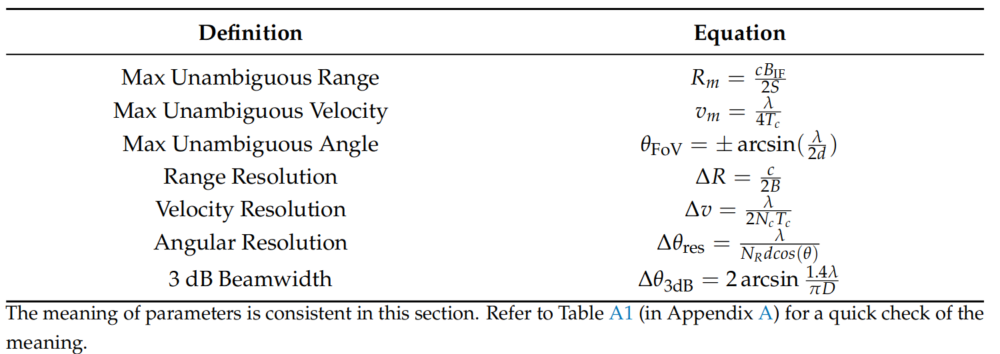
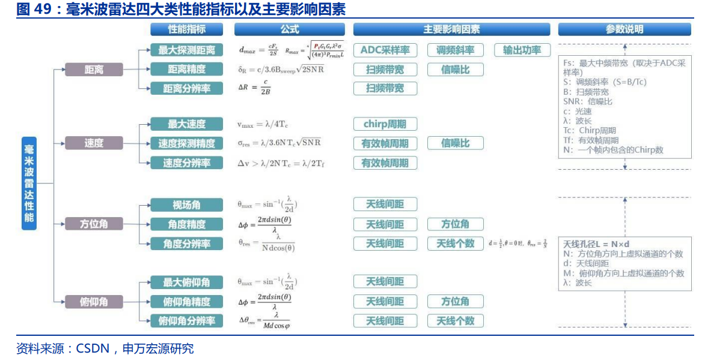
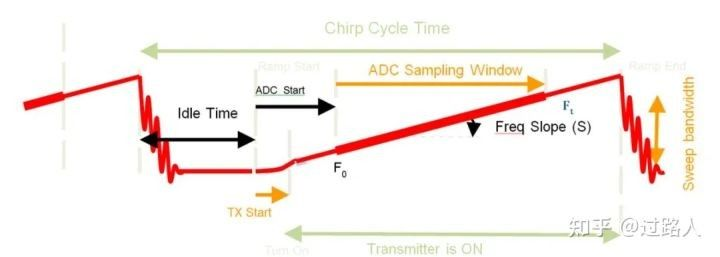
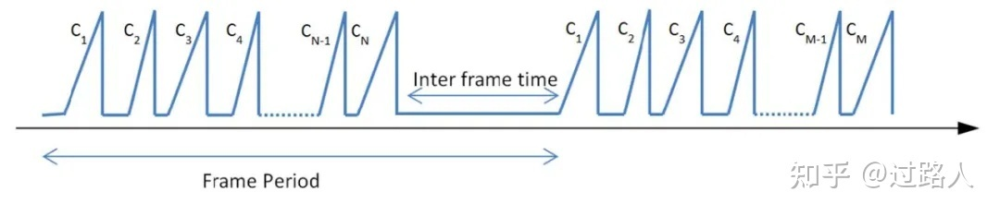
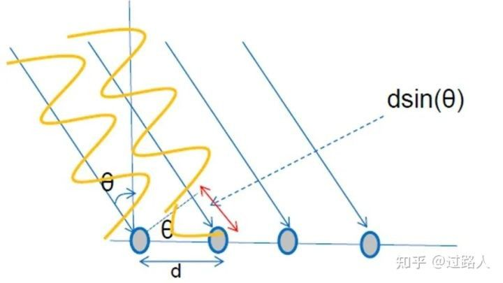
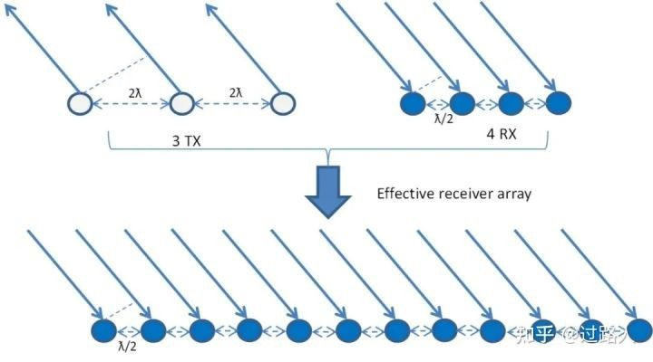
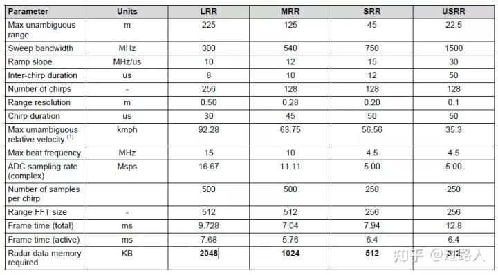

# 毫米波雷达基础知识

## 强烈推荐

- [成像算法（雷达、射频信号成像）](https://zhuanlan.zhihu.com/p/598993695)

- [FMCW Radar Part 1 – Ranging](https://wirelesspi.com/fmcw-radar-part-1-ranging/)

- [FMCW Radar Part 2 – Velocity, Angle and Radar Data Cube](https://wirelesspi.com/fmcw-radar-part-2-velocity-angle-and-radar-data-cube/)

- [FMCW Radar Part 3 – Design Guidelines](https://wirelesspi.com/fmcw-radar-part-3-design-guidelines/)

- [YouTube](https://www.youtube.com/@MarshallBrunerRF)

---

---

- [线性调频](#线性调频)
- [探测距离和距离分辨率](#探测距离和距离分辨率)
  - [最大测距](#最大测距)
  - [雷达距离分辨率](#雷达距离分辨率)
- [速度测量和速度分辨率](#速度测量和速度分辨率)
  - [最大不模糊速度](#最大不模糊速度)
  - [速度分辨率](#速度分辨率)
- [角度测量和角度分辨率](#角度测量和角度分辨率)
  - [最大不模糊角度](#最大不模糊角度)
  - [角分辨率](#角分辨率)
- [常见应用的 chirp 信号配置](#常见应用的-chirp-信号配置)
- [参考链接](#参考链接)

## 线性调频

线性 FMCW 雷达发射 (TX) 的是单音信号，其频率随时间线性变化。这种频率扫描通常称为“**chirp**”。一组 chirp 形成一个“帧”，帧（**Frame**）可以用作雷达信号处理的观察窗口。
线性调频斜坡的各种参数（如频率斜率、扫描带宽等）会影响系统性能。

上图描述了单个 chirp（线性调频）信号和相关的时序参数。下图显示了由一系列 chirp 信号和帧间时间组成的帧结构。这表示“快速 FMCW”调制，其中每个 chirp 的持续时间通常为 10 微秒。

## 探测距离和距离分辨率
在汽车自适应巡航控制（ACC，Adaptive Cruise Control）等应用中，能够查看远处物体（>150 m）非常重要。最远检测距离会受到接收信号的 SNR 和受雷达设备支持的 IF 带宽的限制。

### 最大测距
**毫米波雷达可探测的最大距离与 IF 带宽关系为：**

$$ R_{max} = \frac{c * IF_{max}}{2s}$$
$$ s = \frac{B}{T   } $$

> 式中， IFmax 为雷达能支持的最大中频带宽； c 为光速； S 为发射的 chirp 信号的斜率。

同时， **IF信号的最大带宽IFmax还取决于所使用的 ADC（模数转换）采样频率（ ADCsampling ）**。 一般情况下，IF带宽限制为0.9∗ADCsampling/2。

限制最大探测距离的另一个方面是接收器接收到的信号的信噪比（SNR）。这取决于：

- 雷达设备的射频性能，如 TX 输出功率Pt 、RX 噪声系数，以及单个 chirp 信号持续时间 Tr 和帧中的 chirp 个数 N 等 chirp 参数

- 天线参数，如探测方向上的 TX 和 RX 天线增益GTX、GRX

- 目标特性，如雷达散射截面积（RCS）。RCS 是物体反射回能量的量度。这决定了物体被雷达传感器检测到的程度

- 检测算法检测物体所需的最小 SNR（SNRmin）

雷达探测距离最大时，其与最小可检测信噪比关系为：

$$ R_{max} = \frac{P_t*G_{TX}*G_{RX}* \lambda * 2 \sigma * N * T_r * 4 \pi * 3 *k T *N_f*SNR_{min}}{4} $$

> 式中， λ 为波长， σ 为目标雷达散射截面积， k 为玻尔兹曼常数， T 为环境温度， $N_f$接收机噪声系数。

在许多应用中，重要的是能够将两个相距很近的目标解析为两个独立的对象，而不是将它们检测为一个。允许它们被检测为单独对象的两个目标之间的最小距离称为距离分辨率。这主要取决于雷达传感器可以提供的线性调频扫描带宽。扫描带宽越大，距离分辨率越好。TI的雷达设备支持4GHz扫描带宽，可实现低至约4cm的距离分辨率。

### 雷达距离分辨率

$$ R_{res} = \frac{c}{2B}$$

> 式中， c 为光速， B 表示线性调频信号的扫描带宽。

更好的距离分辨率还有助于检测非常靠近雷达的物体，从而提高最小检测距离。

## 速度测量和速度分辨率
与距离一样，目标的相对速度是一个重要参数。快速 FMCW 调制雷达中的最大可测量速度取决于线性调频信号周期，即两个连续线性调频信号开始之间的时间差。这又取决于频率扫描的执行速度和允许的最小线性调频间隔时间。

MMIC（单片微波集成电路）频率提升的速度越快，最大速度就越高。TI 的 MMIC 允许 100 MHz/μs 的快速斜坡。此外，闭环 PLL（锁相环，Phase Locked Loop）旨在支持频率斜坡的快速稳定。因此，VCO（压控振荡器）从斜坡频率的末端跳到重新启动下一个斜坡所需的时间非常短，并且允许更短的空闲时间（低至 2 微秒）。

### 最大不模糊速度

$$ V_{max} = \frac{\lambda}{4*T_c} $$

> 式中， Tc 为整个 chirp 信号时间，包括 chirp 信号时间及信号间的空闲时间， λ 为波长。

注：可以使用更高级别的算法将实际可测量的最大速度扩展到最大非模糊速度之外。

在应用程序中，如停车辅助，可能需要分离出速度差异很小的对象，为此需要良好的速度分辨率。速度分辨率主要取决于传输帧的持续时间，即增加一帧中的 chirp 信号数量可以提高速度分辨率。

### 速度分辨率
$$ V_{res} = \frac{\lambda}{2*N*T_c} $$

> 式中， N 为一帧中 chirp 信号的数目。

## 角度测量和角度分辨率

在二维空间中定位目标，需要知道目标的角度以及距离。在雷达系统中，通过使用多个间隔距离为“ d ”的接收器接收来自目标的反射信号，并以此来估计目标角度。如下图所示。

### 最大不模糊角度
$$ \theta_{res}=\frac{sin^{-1}}{\lambda*2d} $$

> 式中， d 为接收天线之间的距离， λ 为波长。

因此，对于的视场角，当接收器天线的间距应为 λ/2 ，可得到 ±90° 的最宽理论视场范围。

除了天线间距外，不同角度的可测量距离取决于天线增益模式（天线在不同角度的增益不同）。通常，天线在某一角度（大部分为 0°，即直接面向天线的正面）具有峰值增益，然后增益会随着角度的增加而降低。下图显示了一个天线方向图示例，其中 90° 角的增益比 0° 角的增益低 15 dB 以上。

除了视场角之外，分辨角度相近的两个目标也可能很重要，即具有良好的角分辨率。例如，在汽车雷达用例中，重要的是检测两条不同车道上相距较远的两辆车，而不是将它们检测为一辆车。通常，角分辨率取决于可用接收器天线的数量。天线数量越多，分辨率越好。

### 角分辨率

$$ \theta_{res}=\frac{\lambda}{d*N_{rx}*cos(\theta)} $$
> 式中， θ 为目标所在角度， NRX 为接收机天线数量。

使用多个发射器可以进一步提高角分辨率。如果有多个发射器可用，则每个发射器可以与一组接收器配对，从而创建虚拟接收阵列。例如，如果有 3 个 TX 和 4 个 RX，那么一个 MIMO 雷达系统可以产生 12 个虚拟通道的等效角分辨率。如下图所示。

## 常见应用的 chirp 信号配置

雷达在汽车领域最常见的应用包括短程雷达（通常安装在四个角）和中程或远程雷达（通常为前置）。下图显示通用 22m USRR（超短距雷达）、45m SRR（短距雷达）、125m MRR（中距雷达）和 225m LRR（长距雷达）所用 chirp 信号的配置。

