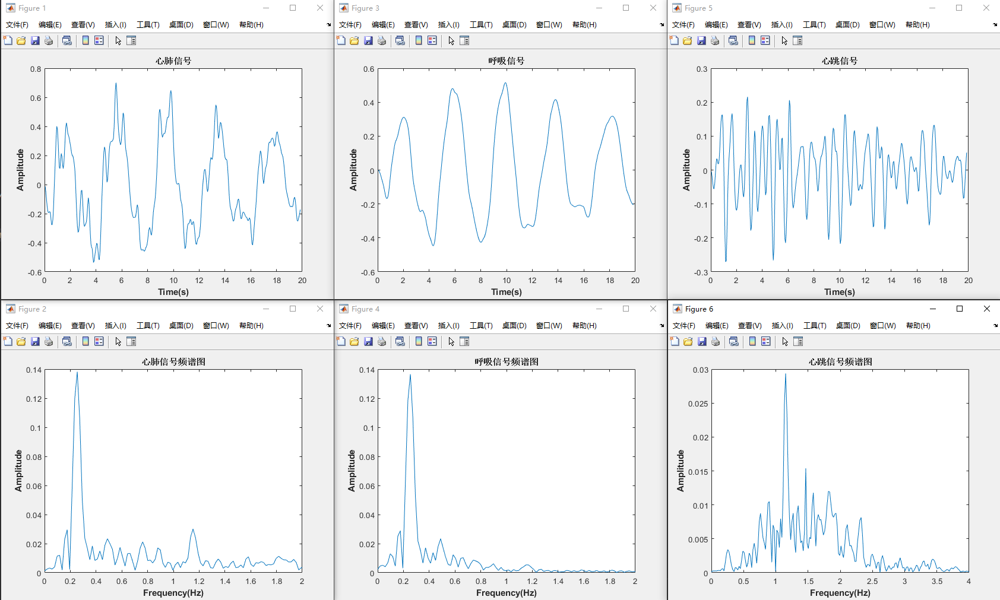

# 基于毫米波相位的生命体征提取算法总结（呼吸/心跳）

## 总览

- 输入：DCA1000 采集的原始复数 IQ 数据，按通道与 chirp 排列。
- 目标：从某一固定/动态距离单元的慢时间复数序列中，提取胸廓微动引起的相位变化，估计呼吸/心跳频率。
- 核心链路：
  1) 数据重排 → 2) 快时间加窗与 Range‑FFT → 3) 目标距离 bin 选择 → 4) 相位提取与展开 → 5) 差分与脉冲抑制 → 6) 生命体征带通 → 7) 一/二阶差分增强 → 8) 心跳带通 → 9) 频谱评估、路径选择 → 10) 自相关与频谱 → 11) 谐波一致性增强 → 12) 峰选与心率估计
- 采样与频率标定：
  - 帧周期 $T_f$（慢时间采样周期），采样率 $f_s=1/T_f$（示例为 20 Hz）。
  - FFT 点数 $N$（示例为 1024），单边谱频率轴 $f_k = k,\frac{f_s}{N},; k=0,\ldots,\lfloor N/2 \rfloor$ 。

---

## 流程图（文字版）

- 数据读取 → 重排为矩阵 `numADCSamples × numChirps`
- 加窗（Hamming） → Range‑FFT（对每个选定 chirp）
- 距离门内找峰 → 取该 bin 的复数值随慢时间形成序列
- 提取相位 `angle()` → `unwrap()` 相位展开
- **一阶差分去漂移 → 3 点脉冲噪声判别与线性插值替换**
- **IIR 带通（0.1–2 Hz）得到“生命体征序列”**
- 构造一阶/二阶差分增强 → 针对心跳的带通（0.9–2 Hz）
- 对“生命体征原始序列”做 FFT，判定使用一阶还是二阶差分路径
- 对选定路径：自相关 → FFT 得频谱 → 谐波一致性增强
- 0.9–2 Hz 内主峰频率 → 心率（BPM=60×Hz）
- 可选：低频 0.1–0.6 Hz 内主峰 → 呼吸率（BPM=60×Hz）

---

## 算法结果展示



## 步骤详解与原理

### 1) 数据读取与重排

- 将 DCA1000 的原始数据重排为 `numADCSamples × numChirps` 的矩阵，每列为一条 chirp 的快时间采样。
- 多 RX 通道可用于波束或相位差增强；此处示例仅用 RX1，且取奇数 chirp（常见于 TDM‑MIMO 的 TX1）。

### 2) 快时间加窗与 Range‑FFT（距离维）

- 目的：减少有限截断导致的谱泄漏，提升距离谱峰的可分辨性。
- 使用 Hamming 窗 $w[n]$：
  $$
  x_w[n] = x[n]\cdot w[n],\quad X[k] = \mathrm{FFT}\{x_w[n]\}
  $$
- 距离与拍频的关系（FMCW 单站）：
  $$
  R \approx \frac{c\,f_b}{2\,\text{slope}}\,,\quad f_b \leftrightarrow \text{Range‑FFT bin}
  $$

### 3) 距离门内找峰并抽取目标 bin

- 在预设距离门 $[r_\text{start},r_\text{end}]$ 内，寻找模值最大的 bin，认为是目标（人体）回波。
- 取该 bin 在每帧（慢时间）的复数值，得到慢时间复数序列：
  $$
  s[k] = X_{r^\*}[k],\quad k=1\ldots K
  $$
  这是后续生命体征分析的输入。

> 实务要点：动态“峰跟踪”能缓解人体距离轻微漂移；也可固定 bin 避免跳变。

### 4) 相位提取与相位展开（unwrap）

- 提取复数序列相位并展开：
  $$
  \phi[k] = \mathrm{unwrap}(\arg s[k])
  $$
- 相位与胸廓位移的物理关系（单站往返）：
  $$
  \Delta \phi = \frac{4\pi}{\lambda}\,\Delta x \;\;\Rightarrow\;\; \Delta x = \frac{\lambda}{4\pi}\,\Delta \phi
  $$
  因此相位的微小变化直接映射胸廓位移。

### 5) 一阶差分与脉冲噪声去除

- 去趋势/慢漂移的一阶差分：
  $$
  \Delta\phi[k] = \phi[k+1]-\phi[k]
  $$
- 3 点脉冲噪声抑制（函数 `filter_RemoveImpulseNoise` 原理）：
  - 设窗口点 $[y_{k}, y_{k+1}, y_{k+2}]$，若
    $$
    (y_{k+1}-y_k)\text{ 与 }(y_{k+1}-y_{k+2})\text{同号且都}>\text{阈值}
    $$
    判定中点为脉冲，用两端点的线性插值替代（此处等价于均值 $(y_k+y_{k+2})/2$）。
  - 否则保留原值。
- 结果是更鲁棒的差分序列，抑制偶发尖突。

### 6) IIR 带通（0.1–2 Hz）：生命体征总带

- 使用 4 阶巴特沃斯带通（采样率 $f_s=1/T_f$）滤除 DC 漂移（<0.1 Hz）与高频噪声（>2 Hz），保留呼吸与心跳主体频段。
- **巴特沃斯特性：通带最平坦、单调滚降；IIR 优点是低阶即可实现较陡过渡，计算量低**。

> 若离线处理，推荐 `filtfilt` 实现零相位；实时可用因果 `filter`。

### 7) 平滑差分增强（一阶/二阶）

- 为提升心跳可见度，使用对称加权的差分模板（7 点）：
  - 一阶导近似（“速度”）：
    $$
    d_1[k] = \frac{ 5(x_{k+1}-x_{k-1}) + 4(x_{k+2}-x_{k-2}) + (x_{k+3}-x_{k-3}) }{32\,T_f}
    $$
  - 二阶导近似（“加速度”）：
    $$
    d_2[k] = \frac{ 4x_k + (x_{k+1}+x_{k-1}) - 2(x_{k+2}+x_{k-2}) - (x_{k+3}+x_{k-3}) }{16\,T_f^2}
    $$
- 直观理解：对称模板兼顾去噪（平滑）与导数增强，二阶对低频呼吸抑制更强，常用于弱心跳增强。

### 8) 心跳带通（0.9–2 Hz）

- 分别对 $d_1[k]$ 与 $d_2[k]$ 通过心跳带通（0.9–2 Hz）：
  - 保留心跳主带，进一步抑制呼吸（<0.6 Hz）与高频噪声。

### 9) 频谱评估与路径选择（选一阶或二阶）

- 对“生命体征原始序列”做 FFT，取单边谱 $P_1$，若
  $$
  \max(P_1) > \theta \cdot \mathrm{mean}(P_1),\quad \theta \approx 6
  $$
  认为谱峰清晰、SNR 较高，选用一阶路径 $d_1$；否则使用二阶路径 $d_2$。

> 启发式选择：一阶保真度更高，二阶在低频干扰重时更稳。

### 10) 自相关增强周期性，再做 FFT

- 对选定的心跳时域信号 $x[k]$ 计算自相关：
  $$
  r_{xx}[m] = \sum_k x[k]\cdot x[k-m]
  $$
- 自相关能强化周期结构、抑制噪声；再对 $r_{xx}$ 做 FFT 得更稳的频谱，用于频率估计。

> 维纳–辛钦：自相关的傅里叶变换为功率谱；实作上增强窄带周期峰。

### 11) 谐波一致性检测与基频增强

- 在 0.9–2 Hz 频带找“基频峰”，在 1.8–4 Hz 找“二次谐波峰”。
- 若出现近似 $2{:}1$ 频率关系且基频峰已较强，则将基频峰幅度提升（如×2），避免把 2×HR 误判为 HR。
- 实务改进：用容差判断 $|f_{2}-2f_{0}|<\epsilon$ 而非严格相等；建议 $\epsilon$ 取决于频率分辨率 $f_s/N$。

### 12) 峰选与心率（及呼吸）估计

- 在心跳频带（0.9–2 Hz）取主峰频率 $f_\text{HR}$，得到心率：
  $$
  \mathrm{HR\,(BPM)} = 60 \times f_\text{HR}
  $$
- 可选：在呼吸频带（0.1–0.6 Hz）对未做心跳带通的“生命体征序列”做同样的峰选，得到呼吸率：
  $$
  \mathrm{RR\,(BPM)} = 60 \times f_\text{Resp}
  $$

---

## 涉及算法与概念简析

- **Hamming 窗**：加权截断，降低旁瓣泄漏，主瓣稍宽；适合一般谱估计与峰检测。
- **FFT 与单边谱**：对实序列（或自相关）取前半谱并对中间项×2，频率轴 $f_k=k\,f_s/N$。
- **相位展开（unwrap）**：消除 $\pm \pi$ 跳变，使相位随时间连续。
- **IIR 巴特沃斯带通**：通带平坦、单调滚降；低阶即可实现较好抑制。因果滤波存在非线性相位与群时延；离线可用 `filtfilt` 零相位。
- **对称差分模板**：用多点对称权重近似导数，同时起到平滑作用，提升弱周期成分的可见度。
- **自相关**：增强周期性、降低白噪声影响；与功率谱密切相关（维纳–辛钦定理）。
- **谐波一致性**：利用非正弦波形的谐波结构（2×、3×…）校验基频，有助于避免将谐波当基频。

---

## 关键参数与调优建议

- 距离门选择 $[r_\text{start}, r_\text{end}]$：避开近零杂散与远距离杂波；根据安装与人体距离设定。
- $T_f$ 与 $f_s=1/T_f$：需≥4–5 Hz 才能覆盖 2 Hz 心跳；示例 20 Hz 较为稳健。
- $N$：影响频率分辨率 $\Delta f=f_s/N$。示例 $N=1024$ 在 20 Hz 下分辨率约 0.0195 Hz。
- 带通参数：
  - 生命体征总带 0.1–2 Hz（可按人群适调），心跳带 0.9–2 Hz，呼吸带 0.1–0.6 Hz。
  - 阶数 4–8 足够；噪声重时可升阶，但注意瞬态与相位。
- 谱峰阈值：$\theta\approx 6$ 为经验值，依据数据 SNR 调整。
- 谐波容差：建议按 $\pm 1\sim 2$ 个频率 bin 设置 $\epsilon\approx (1\text{–}2)\,f_s/N$。

---

## 伪代码（紧凑版）

```matlab
% 输入：retVal, numADCSamples, numChirps, Tf, N, range_gate
Fs = 1/Tf;

% 1) 重排 + 取奇数chirp（TX1）
X = reshape(retVal(1,:), numADCSamples, numChirps);
K = floor(numChirps/2);

% 2) 加窗 + Range-FFT
win = hamming(numADCSamples);
for k=1:K
  s_r(:,k) = fft( X(:,2*k-1).*win );
end

% 3) 距离门内找峰，形成慢时间复序列
[r0,~] = argmax_in_gate(abs(s_r(:,1)), range_gate);
for k=1:K
  [rk,~] = argmax_in_gate(abs(s_r(:,k)), range_gate); % 可固定 r0 或动态跟踪
  s[k]   = s_r(rk,k);
end

% 4) 相位提取与展开
phi = unwrap(angle(s));

% 5) 一阶差分 + 脉冲去除（滑动3点）
dphi = diff(phi);
for k=1:K-3
  z[k] = remove_impulse(dphi(k), dphi(k+1), dphi(k+2), thresh);
end

% 6) 生命体征带通（0.1–2 Hz）
x = filter(bpf_vitalsign(), z);  % 或 filtfilt(...) 离线

% 7) 一/二阶差分增强（7点模板）
[d1, d2] = make_diff1_diff2(x, Tf);

% 8) 心跳带通（0.9–2 Hz）
y1 = filter(bpf_heart(), d1);
y2 = filter(bpf_heart(), d2);

% 9) 原始生命体征的谱质量评估，选路径
P1 = onesided_fft(abs(fft(x,N))/(N-1));
use_d1 = (max(P1) > theta*mean(P1));
y = y1; if ~use_d1, y = y2; end

% 10) 自相关 + FFT
r = xcorr(y);
S = onesided_fft(abs(fft(r,N))/(N-1));
f = (0:N/2)*(Fs/N);

% 11) 谐波一致性增强（0.9–2 vs 1.8–4 Hz）
S = harmonic_consistency_boost(S, f, baseBand=[0.9,2.0], harmBand=[1.8,4.0]);

% 12) 峰选与心率/呼吸率
f_HR = argmax_in_band(S, f, [0.9,2.0]); HR = 60*f_HR;
f_RR = argmax_in_band(S, f, [0.1,0.6]); RR = 60*f_RR; % 可选
```

---

## 复杂度与实时性

- 距离维 FFT：$64\sim256$ 点量级（依设备配置）；慢时间处理以 $f_s=20$ Hz 计，IIR 4–8 阶计算量极低。
- 主要代价在 FFT $N=1024$（偶发，用于频率估计），与自相关 $O(L)$（可按窗口分块）。
- 实时延迟：
  - 因果 IIR 有频率相关的群时延；若使用 `filtfilt` 零相位，需缓冲（非严格实时）。
  - 频率估计窗长度决定“收敛时间”（通常需数秒稳定估计心率）。

---

## 常见问题与改进

- 峰位抖动：对基频做抛物线或质心插值，提高频率精度。
- 谱峰误判为 2×HR：使用谐波一致性检测并给基频加权；比较 1×、2×、3×的调和能量总和。
- 目标距离跳变：对峰位做平滑跟踪或启用固定距离 bin。
- 呼吸/姿态大幅干扰：提高低截止（如 0.15 Hz）或加强二阶路径占比；亦可先做去趋势（滑动多项式）。

---

## 小结

这套算法利用 FMCW 距离谱从目标距离 bin 抽取慢时间复数回波，转为相位微动轨迹，通过差分、脉冲抑制、带通与导数增强，突出心跳周期；再借助自相关与谐波一致性增强，稳健估计心率（及可选的呼吸率）。整体计算轻量、参数直观，易于在嵌入式与 PC 环境落地。
