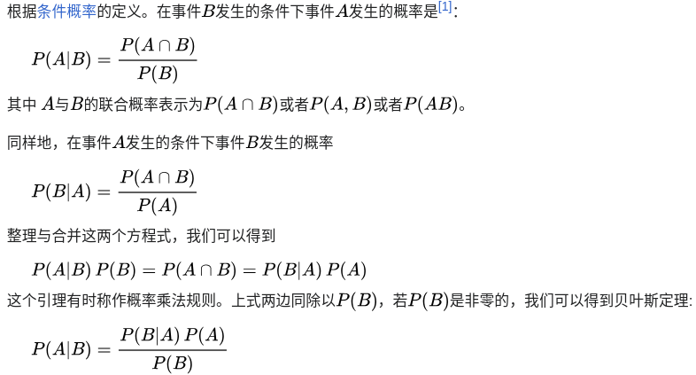
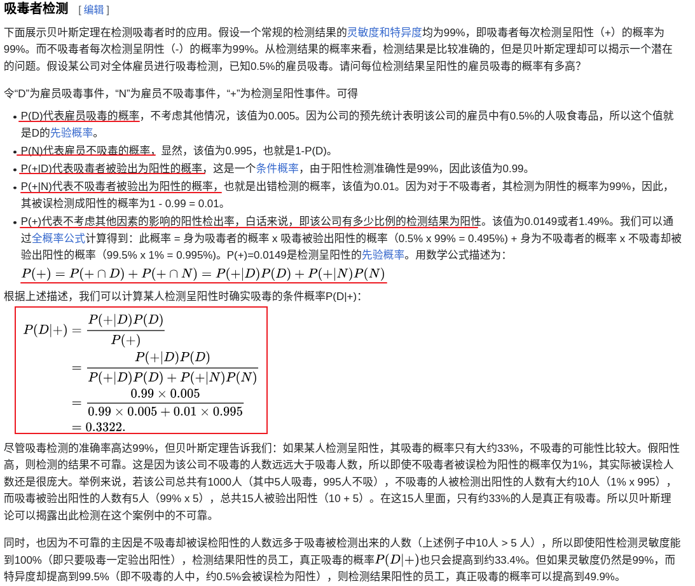
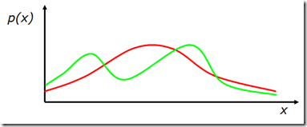

# 贝叶斯

- [贝叶斯定义](#贝叶斯定义)
  - [推导过程](#推导过程)
  - [案例](#案例)
- [贝叶斯推断](#贝叶斯推断)
  - [定义](#定义)
  - [介绍](#介绍)
    - [推理描述](#推理描述)
- [贝叶斯滤波](#贝叶斯滤波)
  - [基础回顾](#基础回顾)
  - [马尔可夫假设](#马尔可夫假设)
  - [贝叶斯滤波推导](#贝叶斯滤波推导)
    - [预测](#预测)
    - [更新](#更新)
    - [总结](#总结)
- [参考资料](#参考资料)

---

## 贝叶斯定义

贝叶斯定理是关于随机事件A和B的条件概率的一则定理。

$$P(A|B) = \frac{P(A)P(B|A)}{P(B)}$$

其中A以及B为随机事件, 且P(B)不为零。**P(A|B)是指在事件B发生的情况下事件A发生的概率。**

在贝叶斯定理中, 每个名词都有约定俗成的各称:

- P(A|B)是已知B发生后, A的条件概率。也称作A的事后概率。
- P(A)是A的**先验概率(**或**边缘概率**)。其不考虑任何B方面的因素。
- P(B|A)是已知A发生后, B的条件概率。也可称为B的后验概率。某些文献又称其为在特定B时，A的似然性，因为$P(B|A)=L(A|B)$。
- P(B)是B的先验概率。

按这些术语, 贝叶斯定理可表述为:

后验概率 = (似然性*先验概率)/标准化常量

也就是说, 后验概率与先验概率和相似度的乘积成正比。

另外, 比例$P(B|A)/P(B)$也有时被称作标准化的似然度 (standardised likelihood) , 贝叶斯定理可表述为:

**后验概率 = 标准似然度 * 先验概率**

由贝叶斯公式$P(θ|X)=P(θ)P(X|θ)/P(X)$可以看出, 这里面的θ是一个随机变量, 变量(因为θ有概率P(θ))。因为$P(θ|X)×P(θ)P(X|θ)$, 所以这也是贝叶斯估计和极大似然估计中要计的参数是一般变量, 而贝叶斯估计和极大似然估计的参数是一般随机变量。

### 推导过程

### 案例

> 如果对这15个人再测一次，阳性人员为真正吸毒者的概率是多少？
> 
> $P(D|+)=\frac{P(+|D)*P(D)}{P(+|D)*P(D)+P(+|N)*P(N)}=\frac{0.3322*0.99}{0.3322*0.99+(1-0.3322)*0.01}=0.98$

---

## 贝叶斯推断

### 定义

**贝叶斯推断将后验概率（考虑相关证据或数据后, 某一事件的条件概率）作为先验概率（考虑相关证据或数据前, 某一事件不确定性的概率）和似然函数（由观测数据的统计模型（概率模型）推导而得）这两个前因导出的结果**。贝叶斯推断根据贝叶斯定理计算后验概率：

$$  
P(H \mid E)=\frac{P(E \mid H) \cdot P(H)}{P(E)}  
$$

其中

- `|` 表示将某事件成立作为条件（因此 `(A | B)` 表示"假定 B 事件成立下, A 事件发生"）
- `H` 表示假说, 其概率可能会受实验数据（以下会称为证据）影响。一般来说会有许多互相矛盾的假说，任务是要确认哪一个假说可能性最高。
- `E` 表示证据。证据对应新的数据, 也就是还没用来计算先验概率的数据。
- `P(H)`，先验概率, 是观察到数据 `E`（目前证据）之前, 假说 `H` 的概率。
- `P(H | E)`，后验概率, 是在给定证据 `E` 之后, 假说 `H` 的概率, 是希望求得的资讯, 也就是在有目前证据时, 假说 `H` 的概率。
- `P(E | H)` 是假定 `H` 成立时, 观察到 `E` 的概率。在 `H` 不变时, 这是 `E` 的函数, 也是似然函数, 指出在给定假设下假说和证据的相容程度。似然函数是证据 `E` 的函数，而后验概率是假说 `H` 的函数。
- `P(E)` 有时会称为边缘似然率。此系数对所有可能的假说都是定值, 因此在判断不同假说的相对概率时, 不会用到这个系数中。

针对不同的 `H` 数值, 只有 `P(H)` 和 `P(E | H)`（都在分子）会影响 `P(H | E)` 的数值。假说的后验概率和其先验概率（固有似然率）和新产生的似然率（假说和新得到证据的相容性）乘积成正比。

贝叶斯定理也可以写成下式:

$$  
P(H \mid E)=\frac{P(E \mid H)}{P(E)} \cdot P(H)  
$$

其中系数 `P(E | H) / P(E)` 可以解释成 `E` 对 `H` 概率的影响。

### 介绍

- $x$ 是数据点, 可能是一个有许多数值形成的向量。
- $\theta$ 是数据点分布的参数, 也就是说 $x \sim p(x \mid \theta)$ 。这也有可能是参数形成的向量。
- $\alpha$ 是参数的超参数, 也就是说 $\theta \sim p(\theta \mid \alpha)$ 。这也有可能是超参数形成的向量。
- $\mathbf{X}$, 由观测到的 $n$ 个数据点组成的一组数据, $x_{1}, \ldots, x_{n}$。
- $\tilde{x}$ ，需预测分布的新数据点。

#### 推理描述 

- **先验分布**是在观测资料前的参数分布 $p(\theta \mid \alpha)$ 。
- 先验分布可能不容易确认,此时可以用杰佛里斯事前分配在更新较新的观测值时,先获得后验分布。
- 取样分布是以观测资料的条件, 其参数的分布 $p(\mathbf{X} \mid \theta)$ 。这也称为似然函数, 尤其是视为是参数的函数时, 有时会写成 $\mathrm{L}(\theta \mid \mathbf{X})=p(\mathbf{X} \mid \theta)$ 。
- **边缘似然率**（有时也称为证据）是观测资料在参数上的边缘分布 $p(\mathbf{X} \mid \alpha)=\int_{\theta} p(\mathbf{X} \mid \theta) p(\theta \mid \alpha) \mathrm{d} \theta$ 。
- **后验分布**是考虑观测资料后的参数分布。可以由贝叶斯定理确认,也是贝叶斯推断的核心:
$$
p(\theta \mid \mathbf{X}, \alpha)=\frac{p(\mathbf{X} \mid \theta) p(\theta \mid \alpha)}{p(\mathbf{X} \mid \alpha)} \propto p(\mathbf{X} \mid \theta) p(\theta \mid \alpha)
$$

若用文字表示,即为"后验和先验及似然率的乘积成正比",有时也会写成"**后验 = 先验 $\times$ 似然率**, 在有证据的情形下"。

## 贝叶斯滤波

### 基础回顾

1. $X$ : 表示一个随机变量, 如果它有有限个可能的取值 $\left\{x_{1}, x_{2}, \cdots, x_{n}\right\}$.  
2. $p\left(X=x_{i}\right)$ :表示变量 $X$ 的值为 $x_{i}$ 的概率。  
3. $p(\cdot)$ : 称为**概率质量函数**(probability mass function).  
例如: 一个家里有 3 个房间, 机器人在各个房间的概率为 $p($ room $)=\{0.1,0.3,0.6\}$.  
4. 如果 $X$ 在连续空间取值, $p(x)$ 称为**概率密度函数**(probability density function),

$$
p(x ∈ (a,b)) = {\int_a^b}p(x)dx
$$

> 注：概率质量函数针对的是离散变量，概率密度函数针对的是连续变量。

5. 联合概率: $p(X=x$ and $Y=y)=p(x, y)$, 称为联合概率密度分布。如果 $X$ 和 $Y$ 是相互独立的随机变量, $p(x, y)=p(x) p(y)$ 。  
   > 联合概率表示两个事件共同发生的概率。A与B的联合概率表示为$P(A \cap B)$，也可以表示为$P(A,B)$.
6. 条件概率: $p(X=x \mid Y=y)$ 是在已知 $Y=y$ 的条件下, 计算 $X=x$ 的概率。  
    $$  
    \begin{array}{c}  
    p(x \mid y)=p(x, y) / p(y) \\  
    p(x, y)=p(x \mid y) p(y)=p(y \mid x) p(x)  
    \end{array}  
    $$  
    
    如果 $x$ 和 $y$ 相互独立，则:  
    $$  
    p(x \mid y)=p(x)  
    $$  

    > **条件概率**就是事件A在事件B发生的条件下发生的概率。条件概率表示为$P(A|B)$，读作“A在B发生的条件下发生的概率”。
7. **全概率公式**:  
  
    **离散情况下**:  
    $$  
    p(x)=\sum_{y} p(x, y)=\sum_{y} p(x \mid y) p(y)  
    $$  
    
    **连续情况下**:  
    $$  
    p(x)=\int p(x, y) dy=\int p(x \mid y) p(y) dy  
    $$

### 马尔可夫假设
A state $x_t$ will be called complete if it is the best predictor of the future. Put differently, completeness entails that knowledge of past states, measurements, or controls carry no additional information that would help us to predict the future more accurately. It it important to notice that our definition of completeness does not require the future to be a deterministic function of the state. Temporal processes that meet these conditions are commonly known as Markov chains.

参考：Probabilistic Robotics, by Sebastian Thrun, 2.3.1 State

由马尔可夫假设可得到一些结论, 如:  

$$  
\begin{aligned}  
p\left(x_{t} \mid x_{0: t-1}, z_{1: t-1}, u_{1: t}\right) & =p\left(x_{t} \mid x_{t-1}, u_{t}\right) \\  
p\left(z_{t} \mid x_{0: t}, z_{1: t-1}, u_{1: t}\right) & =p\left(z_{t} \mid x_{t}\right)  
\end{aligned}  
$$  
  
注 1：**前一个式子表明系统当前状态仅和上一个状态及系统当前控制量有关**。  
注 2: **后一个式子表明系统的测量值仅和当前状态有关, 状态$x_{t}$足够预测$z_{t}$**。  
注 3：这两个式子右边都是系统参数（是已知的）, 其中 $p\left(x_{t} \mid x_{t-1}, u_{t}\right)$ 就是系统控制量模型参数, 而 $p\left(z_{t} \mid x_{t}\right)$ 是系统传感器模型参数。

### 贝叶斯滤波推导

#### 预测

第一步, 预测过程, 即由 $p\left(x_{t-1} \mid u_{1: t-1}, z_{1: t-1}\right)$ （也就是 $\left.\operatorname{bel}\left(x_{t-1}\right)\right)$ 推导出 $p\left(x_{t} \mid u_{1: t}, z_{1: t-1}\right)$ 。我们把 $p\left(x_{t} \mid u_{1: t}, z_{1: t-1}\right)$ 记作 $\overline{b e l}\left(x_{t}\right)$ 。**由全概率公式(Law of Total Probability)可得**:  
$$  
\begin{aligned}  
\overline{\operatorname{bel}}\left(x_{t}\right) & =p\left(x_{t} \mid u_{1: t}, z_{1: t-1}\right) \\  
& \stackrel{\text { Total Prob. }}{=} \int p\left(x_{t} \mid x_{t-1}, u_{1: t}, z_{1: t-1}\right) p\left(x_{t-1} \mid u_{1: t}, z_{1: t-1}\right) \mathrm{d} x_{t-1}  
\end{aligned}  
$$  
  
由**马尔可夫假设**, 有: 
$$
p\left(x_{t} \mid x_{t-1}, u_{1: t}, z_{1: t-1}\right)=p\left(x_{t} \mid x_{t-1}, u_{t}\right)
$$

观察上式中的 $p\left(x_{t-1} \mid u_{1: t}, z_{1: t-1}\right)$, 由于 $u_{t}$ 显然不会对过去的状态 $x_{t-1}$ 产生影响, 所以可以去掉它（因为如果 $A, B$ 相互独立, 有 $P(A \mid B)=P(A))$, 从而有: $p\left(x_{t-1} \mid u_{1: t}, z_{1: t-1}\right)=p\left(x_{t-1} \mid u_{1: t-1}, z_{1: t-1}\right)$综上, 有:  
$$  
\begin{aligned}  
\overline{\operatorname{bel}}\left(x_{t}\right) & =\int p\left(x_{t} \mid x_{t-1}, u_{1: t}, z_{1: t-1}\right) p\left(x_{t-1} \mid u_{1: t}, z_{1: t-1}\right) \mathrm{d} x_{t-1} \\  
& \stackrel{\text { Markov }}{=} \int p\left(x_{t} \mid x_{t-1}, u_{t}\right) p\left(x_{t-1} \mid u_{1: t}, z_{1: t-1}\right) \mathrm{d} x_{t-1} \\  
& =\int p\left(x_{t} \mid x_{t-1}, u_{t}\right) p\left(x_{t-1} \mid u_{1: t-1}, z_{1: t-1}\right) \mathrm{d} x_{t-1} \\  
& =\int p\left(x_{t} \mid x_{t-1}, u_{t}\right) \operatorname{bel}\left(x_{t-1}\right) \mathrm{d} x_{t-1}  
\end{aligned}  
$$

#### 更新

第二步, 更新过程, 即由 $p\left(x_{t} \mid u_{1: t}, z_{1: t-1}\right)$ 推导出 $p\left(x_{t} \mid u_{1: t}, z_{1: t}\right)$ （也就是 $\operatorname{bel}\left(x_{t}\right) ） 。$  
由**贝叶斯公式可以推导出** $p(x \mid y, z)=\frac{p(y \mid x, z) p(x \mid z)}{p(y \mid z)}$ （这个式子称为 Bayes Rule with Background Knowledge）, 利用这个结论可得: 

$$  
\begin{aligned}  
\operatorname{bel}\left(x_{t}\right) & =p\left(x_{t} \mid u_{1: t}, z_{1: t}\right) \\  
& =\frac{p\left(z_{t} \mid x_{t}, u_{1: t}, z_{1: t-1}\right) p\left(x_{t} \mid u_{1: t}, z_{1: t-1}\right)}{p\left(z_{t} \mid u_{1: t}, z_{1: t-1}\right)} \\  
& =\eta p\left(z_{t} \mid x_{t}, u_{1: t}, z_{1: t-1}\right) p\left(x_{t} \mid u_{1: t}, z_{1: t-1}\right)  
\end{aligned}  
$$  
  
其中, $\eta$ 可看做是归一化常数, 它当 $x_{t}$ 取不同可能状态时是不变的, 所以保证 $x_{t}$ 取所有可能状态时 $\operatorname{bel}\left(x_{t}\right)$ 相加为 1 即可。 

由**马尔可夫假设**, 有: $p\left(z_{t} \mid x_{t}, u_{1: t}, z_{1: t-1}\right)=p\left(z_{t} \mid x_{t}\right)$ ，所以：  

$$  
\begin{aligned}  
\operatorname{bel}\left(x_{t}\right) & =\eta p\left(z_{t} \mid x_{t}, u_{1: t}, z_{1: t-1}\right) p\left(x_{t} \mid u_{1: t}, z_{1: t-1}\right) \\  
& \stackrel{\text { Markov }}{=} \eta p\left(z_{t} \mid x_{t}\right) p\left(x_{t} \mid u_{1: t}, z_{1: t-1}\right) \\  
& =\eta p\left(z_{t} \mid x_{t}\right) \overline{\operatorname{bel}}\left(x_{t}\right)  
\end{aligned}  
$$  
  
#### 总结

结合第一步和第二步, 我们已经推导出贝叶斯滤波的递推公式为: 

$$  
\operatorname{bel}\left(x_{t}\right)=\eta p\left(z_{t} \mid x_{t}\right) \int p\left(x_{t} \mid x_{t-1}, u_{t}\right) \operatorname{bel}\left(x_{t-1}\right) \mathrm{d} x_{t-1}  
$$

> 后验 = 似然 *（转态转移 * 先验）

## 参考资料
- [Bayes Filter](https://aandds.com/blog/bayes-filter.html)