# Importance Sampling 重要性采样👍👍

YouTube：https://www.youtube.com/watch?v=C3p2wI4RAi8&t=25s

### 蒙特卡洛

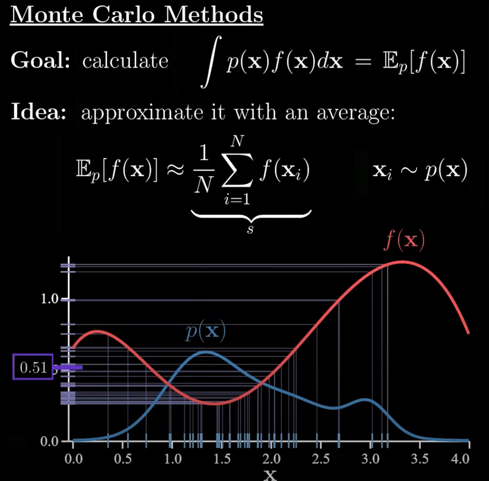

p(x)是关于变量x的概率密度分布函数，f(x)是关于变量x的普通函数。

1. 首先是取N个x，x的取值根据p(x)进行随机获取，从上图中可以看出，x在1.0~1.5之间的概率密度最大，所以很多x的采样样本分布在这区间;
2. 根据采样的$x = [x_1, x_2, ..., x_i]$，计算其$f(x_i)$对应的数值;
3. 对于所有的$f(x_i)$，求其均值$S =\frac{1}{N} \sum(f(x_i))$，来代表原本的数学期望。

由于每次都是随机采样N个点，因此每次计算得到的均值S都不会一样，当我们不断地尝试M次上述的采样方式，会得到如下的关于S和真实期望E的关系：

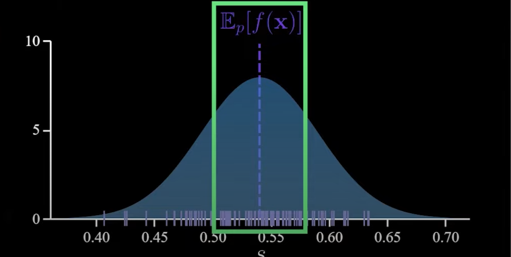

可以看到S是E的高斯分布（理论：中心极限定理），也就是说S的均值就是真实期望，所以S是真实期望E的五偏估计。

下面再看下方差的情况：

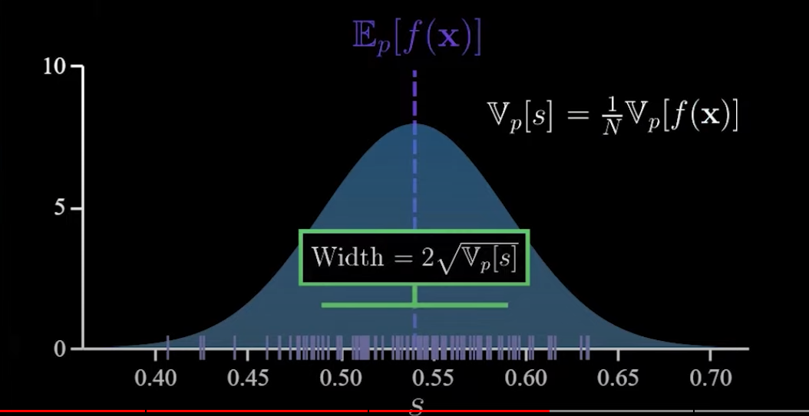

方差是原方差的$V_p[s] = \frac{1}{N}V_p[f(x)]$.

**中心极限定理：**

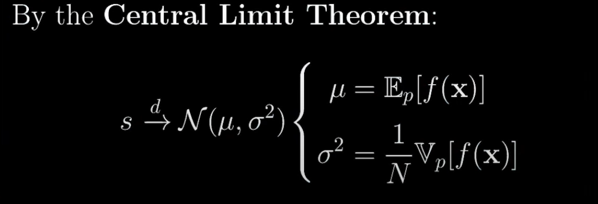

### 重要性采样

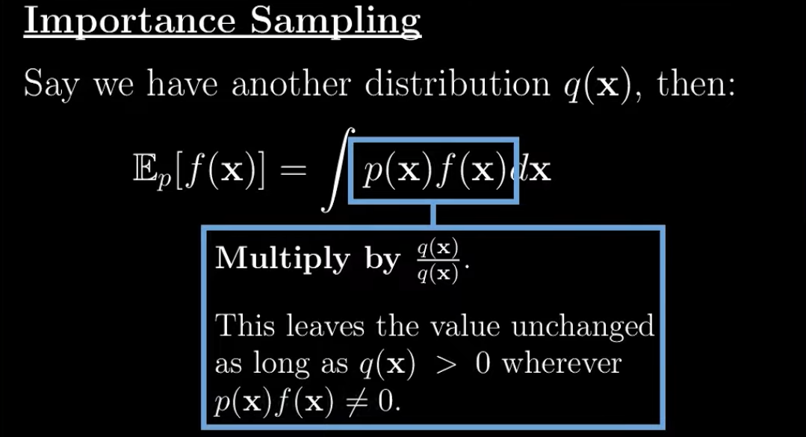

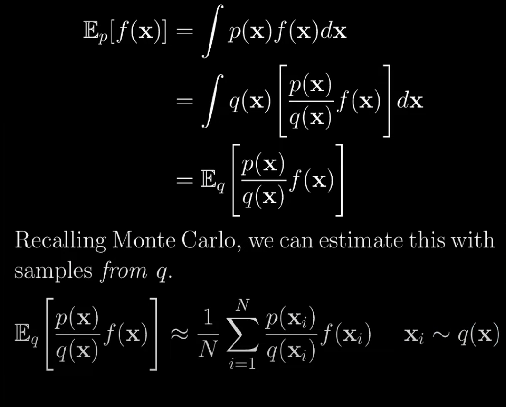

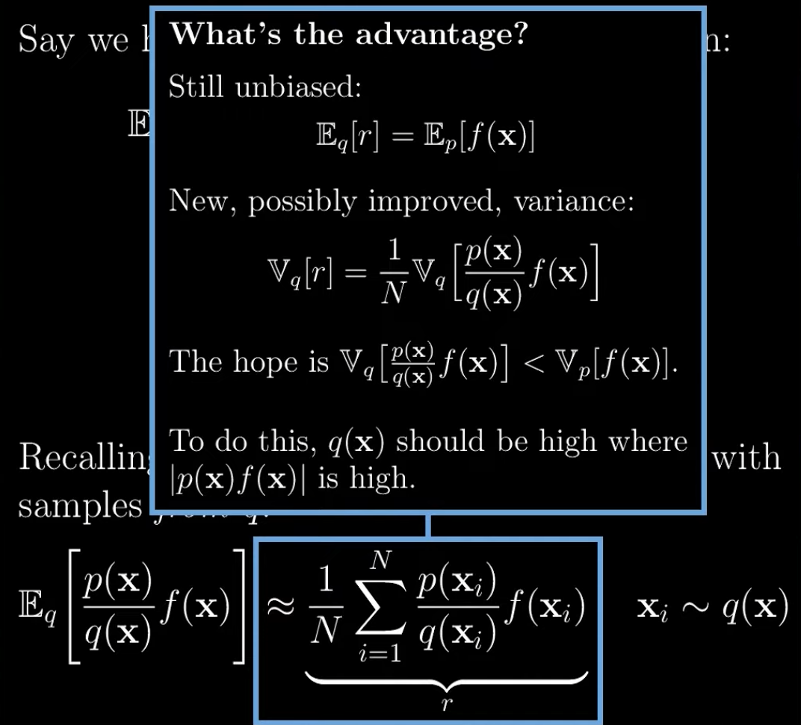

#### Example

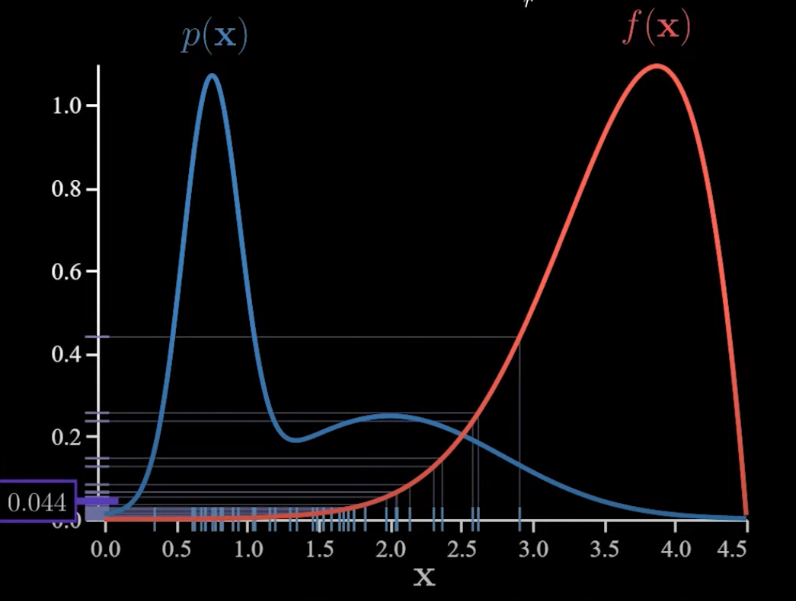

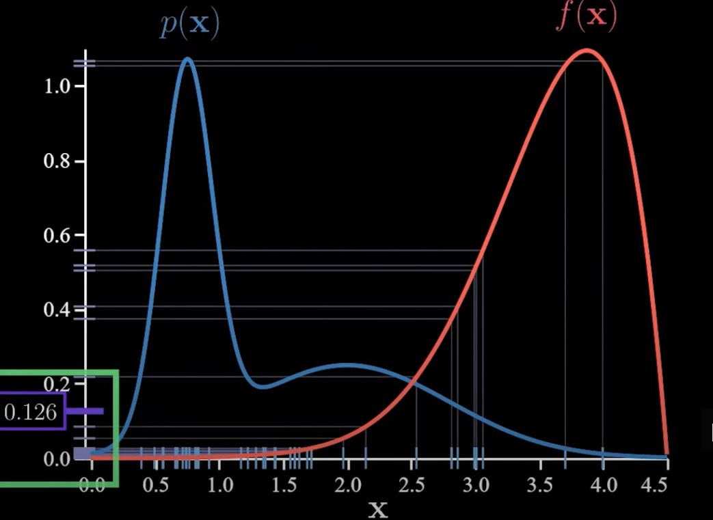

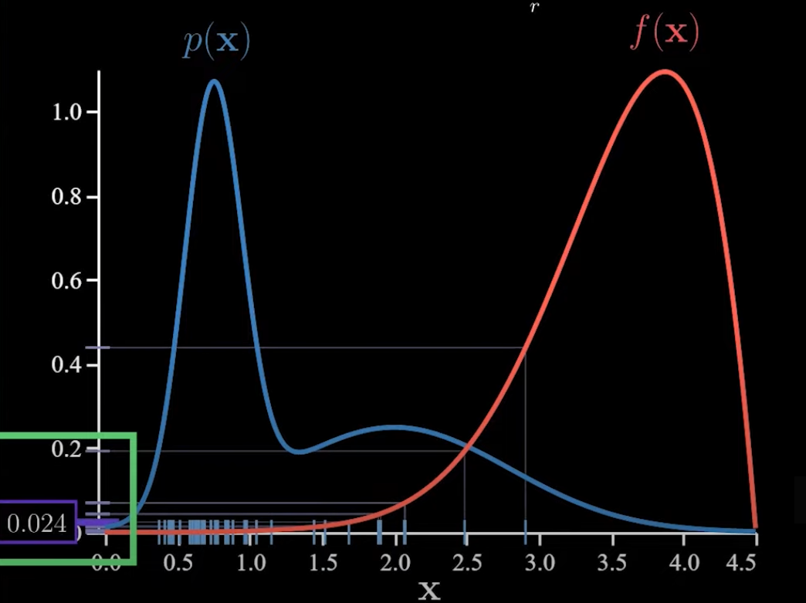

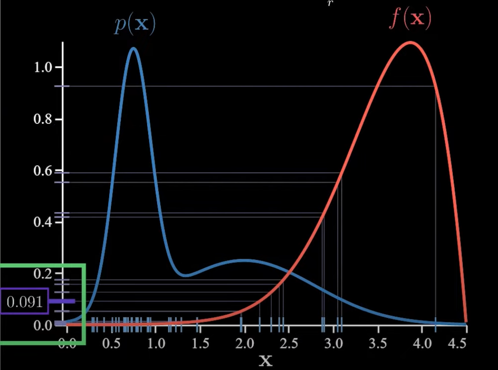

最终结果波动很大，也就表明方差很大。

现在引入$q(x)$

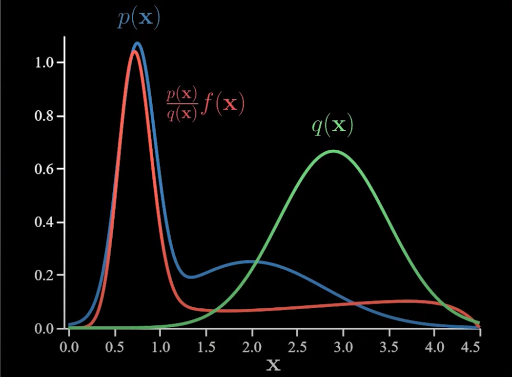

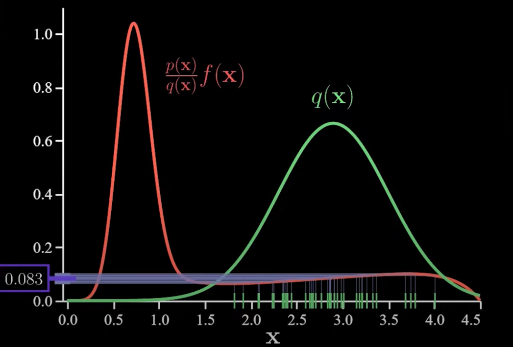

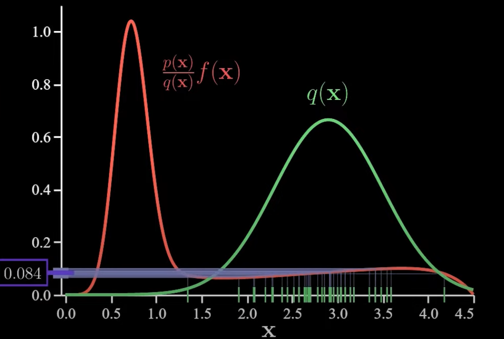

波动明显变小。

### 其他参考
[Youtube](https://www.youtube.com/watch?v=ivBtpzHcvpg&t=292s)