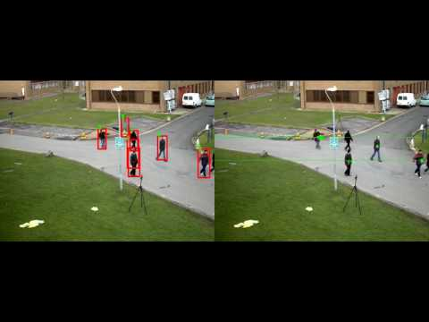
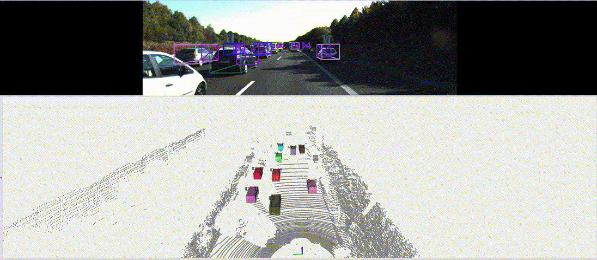
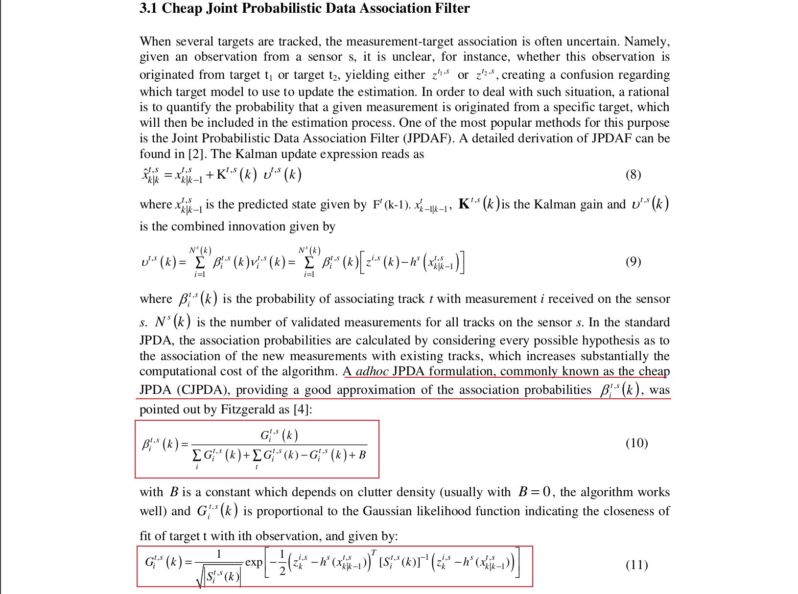

# JPDA系列

[直观深入理解Kalman滤波算法和数据关联算法（NN、PDA、JPDA、CJPDA、NNCJPDA）](https://blog.csdn.net/weixin_40106401/article/details/115921604)

## 工程仓库
[JPDAFTracker](https://github.com/apennisi/jpdaf_tracking)

[A fast object tracking method by using JPDA-IMM-UKF.](https://github.com/wangx1996/Multi-Object-Tracking?tab=readme-ov-file)

## Joint Probabilistic Data Association Filter
[JPDA算法](https://zhuanlan.zhihu.com/p/510692327)

## Cheap Joint Probabilistic Data Association Filter

