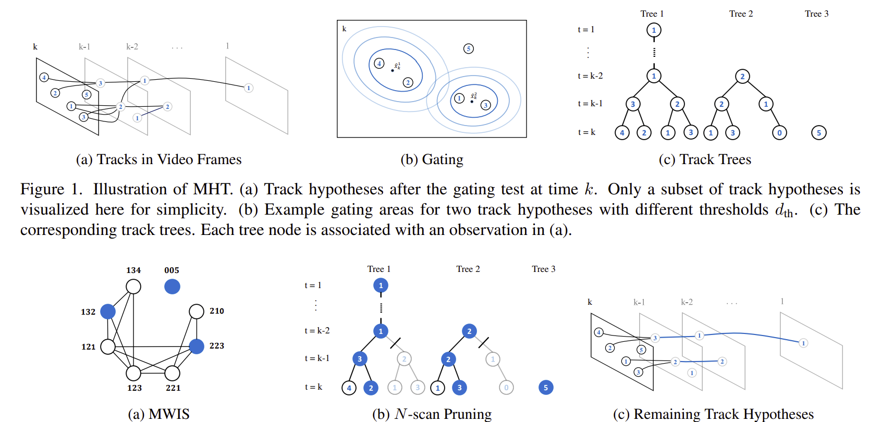

# MHT: Multiple Hypothesis Tracking



---

- [算法流程](#算法流程)
- [代码解析](#代码解析)
  - [Step1: 量测筛选](#step1-量测筛选)
  - [Step2: 未落入到任何假设任何分支的量测](#step2-未落入到任何假设任何分支的量测)
  - [Step3: 假设更新与权重计算](#step3-假设更新与权重计算)
  - [Step4: M-Best分配](#step4-m-best分配)
  - [Step5: 假设剪枝](#step5-假设剪枝)
  - [Step6: 假设发布与分支更新](#step6-假设发布与分支更新)
- [完整代码](#完整代码)

---

## 算法流程

 1. for each local hypothesis in each hypothesis tree:
     1.1. implement ellipsoidal gating;
 2. disconsider measurements that do not fall inside any local hypothesis gate
 3. for each local hypothesis in each hypothesis tree:
     3.1. calculate missed detection and predicted likelihood for each measurement inside the gate and make sure to save these for future use; 
     3.2. create updated local hypotheses and make sure to save how these connects to the old hypotheses and to the new the measurements for future use;
 4. for each predicted global hypothesis: 
     4.1. **create 2D cost matrix**; 
     4.2. **obtain M best assignments using a provided M-best 2D assignment solver**; 
     4.3. **update global hypothesis look-up table according to the M best assignment matrices obtained and use your new local hypotheses indexing**;
 5. normalise global hypothesis weights and implement hypothesis reduction technique: pruning and capping;
 6. prune local hypotheses that are not included in any of the global hypotheses;
 7. Re-index global hypothesis look-up table;
 8. extract object state estimates from the global hypothesis with the highest weight;
 9. predict each local hypothesis in each hypothesis tree.


## 代码解析

定义: 航迹定义为global, 航迹的内部分支假设称为local

### Step1: 量测筛选
```matlab
idx_z_ingate = cell(1,n);  % structure: {object}[meas, local hyp. for object i]
for i=1:n % 全局航迹个数
    n_i = length(old_H_i{i}); % 该航迹(树)的假设分支个数(枝)
    idx_z_ingate{i} = zeros(m,n_i);
    for lh=1:n_i
        % 量测关联
        [~, idx_z_ingate{i}(:,lh)] = obj.density.ellipsoidalGating(old_H_i{i}(lh), z, measmodel, obj.gating.size);
    end
end
```

### Step2: 未落入到任何假设任何分支的量测
```matlab
% 2. disconsider measurements that do not fall inside any local hypothesis gate
idx_clutter = sum(cell2mat(idx_z_ingate)') == 0;
z = z(:,~idx_clutter);
m = sum(~idx_clutter); % 被筛选进门限的量测总数(后续会产生m*分支个数的新假设)
idx_z_ingate = cellfun( @(idx_i) idx_i(~idx_clutter,:) ,idx_z_ingate, 'UniformOutput' ,false);     
```

这里目前是将没有被任何一个现在假设关联的量测直接删除(不进行后续计算), 在实际应用中,**此处应该视作为一个潜在的新假设**.

因为在实际情况中,我们并不知道环境中究竟有多少真实目标.


### Step3: 假设更新与权重计算
```matlab
H_i = cell(1,n);
log_w_i = cell(1,n);
for i=1:n % 全局航迹个数
    n_i = length(old_H_i{i});  % 该航迹(树)的假设分支个数(枝)                
    log_w_i{i} = -inf(1,n_i*(m+1));     % init vector with (log(0) = -Inf)
    for lh=1:n_i       % 该航迹(树)的假设分支个数(枝)
        for j=find(idx_z_ingate{i}(:,lh))'
            newidx = (lh-1)*(m+1) + j;  % index of the new local hypothesis
            
            % 计算本地假设分支与其筛选的量测的似然(代价)
            S_i_h    = measmodel.H(old_H_i{i}(lh).x) * old_H_i{i}(lh).P * measmodel.H(old_H_i{i}(lh).x).';
            zbar_i_h = measmodel.h(old_H_i{i}(lh).x);
            log_w_i{i}(newidx) = log(sensormodel.P_D/sensormodel.intensity_c) ...
                                -1/2*log(det(2*pi*S_i_h)) ...
                                -1/2*(z(:,j) - zbar_i_h).' / S_i_h * (z(:,j) - zbar_i_h);

            % 该分支状态更新
            H_i{i}(newidx) = obj.density.update(old_H_i{i}(lh), z(:,j) , measmodel);
        end

        % 需要再构造一个未关联到量测的假设分支
        newidx = (lh)*(m+1);
        log_w_i{i}(newidx) = log(1-sensormodel.P_D); % 权重
        H_i{i}(newidx) = old_H_i{i}(lh); % 状态
    end
end
```

经过上述计算后,**每个航迹会产生的大量的内部假设分支,并且,航迹与航迹之间存在很多分支关联同一个量测的情况,因此,接下来的第一步是进行分配算法**.


### Step4: M-Best分配

```matlab
log_w = [];
H     = [];
for h=1:size(old_H,1) % size(old_H,1)是上一时刻保留下来的假设个数, 每一个假设在进行此处后续分配算法,又生产obj.reduction.M(10)个新假设
    % 4.1. create 2D cost matrix;
    L = inf(n,m+n);
    for i=1:n
        % given a global hypothesis lets find the correspondent
        % local hypothesis weights in the vector for each object
        % 比如old_H现在是5个全局假设,其中第一个假设2个分支假设, 且关联到了10个量测,
        % 那么第一个分支假设的起点是1,终点是10
        % 第二个分支假设的起点是11,终点是20
        startingidx = (old_H(h,i)-1)*(m+1) +1; % 局部分支假设的起点
        finalidx    = old_H(h,i)*(m+1) -1;      % 局部分支假设的重点
        L(i,1:m) = -log_w_i{i}( startingidx:finalidx );     % must have size == m
        L(i,m+i) = -log_w_i{i}( finalidx+1 );               % size == 1 (misdetection hyp.)
    end

    % 4.2. obtain M best assignments using a provided M-best 2D assignment solver; 
    M = obj.reduction.M;    % number of hypothesis at each step
    [Theta,~,gain] = kBest2DAssign(L,M);
    M = length(gain);       % there might be not enough hypothesis available
    assert( all(gain~=-1), 'Assignment problem is unfeasible');

    % 4.3. update global hypothesis look-up table according to the M best assignment matrices obtained and use your new local hypotheses indexing;
    for iM =1:M
        tr_AL = sum(L(sub2ind(size(L),1:n,Theta(:,iM)')));     % same as trace(A'*L)
        % exp(-trace(A'*L)) gives in abs, but we want to keep w in log scale
        % this is equal to multiply each selected weights
        log_w(end+1,1) = old_log_w(h) + (-tr_AL);   % wnew = wold * w_i=1 * w_i=2 * ...
        
        Theta(Theta(:,iM)>m, iM) = m+1;     % set all misdetection hypothesis to the same index
        
        % update global hypothesis look-up table
        H(end+1,1:n) = zeros(1,n);
        for i=1:n
            H(end,i) = (old_H(h,i)-1)*(m+1) + Theta(i,iM);
        end
    end
end
```

经过上出算法后,现在一共至多有(10*10)*5个假设,(10是最大假设个数,也就是每次只保留最大10个假设,5是航迹个数),后续步骤就是一些剪枝操作.

### Step5: 假设剪枝

```matlab
% 5. normalise global hypothesis weights and implement hypothesis reduction technique: pruning and capping;
log_w = normalizeLogWeights(log_w);
% prune
[log_w, hyp] = hypothesisReduction.prune( log_w, 1:length(log_w), obj.reduction.w_min ); % 删除权重过小的假设分支
H = H(hyp,:);
log_w = normalizeLogWeights(log_w);
% cap
[log_w, hyp] = hypothesisReduction.cap( log_w, 1:length(log_w), obj.reduction.M ); % 取前M个最大权重假设
H = H(hyp,:);
log_w = normalizeLogWeights(log_w);

%% 重定义假设树的分支假设索引号
for i=1:n
    % 6. prune local hypotheses that are not included in any of the global hypotheses;
    hyp_keep = unique(H(:,i));
    H_i{i} = H_i{i}(hyp_keep);
    log_w_i{i} = log_w_i{i}(hyp_keep);
    log_w_i{i} = normalizeLogWeights(log_w_i{i});
    % 7. Re-index global hypothesis look-up table;
    for ri=1:numel(hyp_keep)
        H( H(:,i) == hyp_keep(ri), i) = ri;
    end
end
```


### Step6: 假设发布与分支更新
```matlab
% 8. 选择最大权重的假设作为发布假设
[~,idx_best] = max(log_w);
for i=1:n
    estimates_x{k}(:,i)   = H_i{i}( H(idx_best,i) ).x;
    estimates_P{k}(:,:,i) = H_i{i}( H(idx_best,i) ).P;
end

% 9. 预测.
for i=1:n
    H_i{i} = arrayfun(@(s) obj.density.predict(s,motionmodel), H_i{i} );
end
```


## 完整代码
[n_objectracker](./MOT_Course/MOT/HA02/n_objectracker.m)