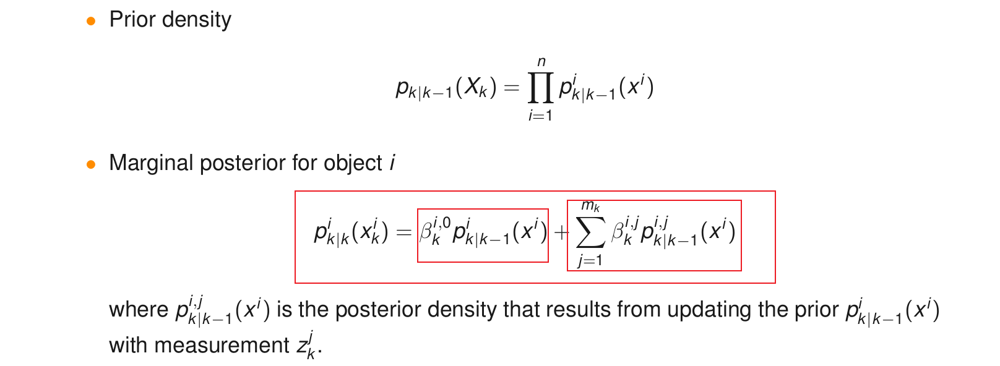
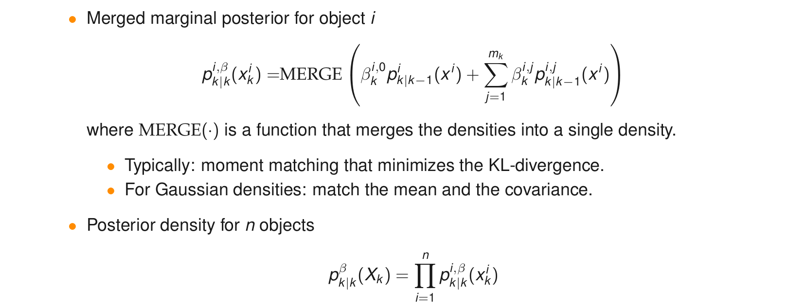
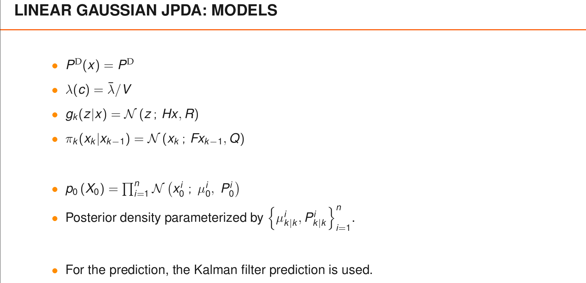
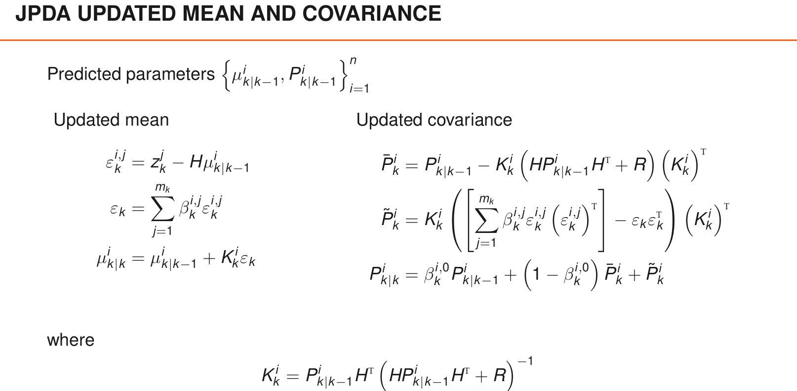

# Tracking n objects in clutter

[lecture](./lecture/Section%202%20Single-Object%20Tracking%20in%20Clutter/L2_handout_20190429.pdf)

---

- [背景知识](#背景知识)
- [GNN](#gnn)
  - [算法步骤](#算法步骤)
  - [实例代码](#实例代码)
- [JPDA](#jpda)
  - [算法步骤](#算法步骤-1)
    - [状态更新步骤](#状态更新步骤)
    - [总结](#总结)
  - [代码解析](#代码解析)
    - [量测筛选](#量测筛选)
    - [代价计算](#代价计算)
    - [M-Best分配](#m-best分配)
    - [状态更新](#状态更新)
  - [扩展](#扩展)
- [MHT](#mht)


## 背景知识

[[贪心分配] | [匈牙利分配] | [M-Best]](../../分配算法/assign_demo.cpp)

<div align=center>

</div>

<div align=center>

</div>

<div align=center>

</div>

## GNN
[完整代码](./HA02/n_objectracker.m)


### 算法步骤
**STEPS FOR GNN**

0. perform prediction of each prior
   
1. implement ellipsoidal gating for each predicted local hypothesis seperately, see Note below for details;
2. construct 2D cost matrix of size (number of objects, number of measurements that at least fall inside the gates + number of objects);
3. **find the best assignment matrix using a 2D assignment solver**;
4. create new local hypotheses according to the best assignment matrix obtained;
5. extract object state estimates;
6. predict each local hypothesis.

**GNN的核心是构造代价矩阵，然后执行最优分配。**

<div align=center>

</div>


### 实例代码

```matlab
function [estimates_x, estimates_P] = GNNfilter(obj, states, Z, sensormodel, motionmodel, measmodel)
    % number of time steps
    N = numel(Z);
    % number of objects
    n = numel(states); % 航迹个数
    % allocate memory
    estimates_x = cell(N,1);
    estimates_P = cell(N,1);

    for k=1:N
        % measurements at time t=k
        z = Z{k};
        % number of measurements
        m = size(z,2);

        % 1. implement ellipsoidal gating for each predicted local hypothesis seperately, see Note below for details; 
        idx_z_ingate = zeros(n,m); 
        for i=1:n
            [~, idx_z_ingate(i,:)] = obj.density.ellipsoidalGating(states(i), z, measmodel, obj.gating.size); % 每个航迹筛选落入门限的量测
        end
        % 1.1 disconsider measurements that do not fall inside any object gates
        idx_keep = sum(idx_z_ingate,1) > 0;
        z = z(:,idx_keep);
        idx_z_ingate = idx_z_ingate(:,idx_keep);
        m = sum(idx_keep);

        % 2. construct 2D cost matrix of size (number of objects, number of measurements that at least fall inside the gates + number of objects);
        L = inf(n,m+n); % 代码矩阵:(航迹个数*量测个数)
        for i=1:n
            for j = find(idx_z_ingate(i,:))
                S_i_h    = measmodel.H(states(i).x) * states(i).P * measmodel.H(states(i).x).';
                zbar_i_h = measmodel.h(states(i).x);
                % 似然计算(代价值计算)
                L(i,j) = -( log(sensormodel.P_D/sensormodel.intensity_c) ...
                                -1/2*log(det(2*pi*S_i_h)) ...
                                -1/2*(z(:,j) - zbar_i_h).' / S_i_h * (z(:,j) - zbar_i_h)  );
            end
            L(i,m+i) = - log(1-sensormodel.P_D); 
        end

        % 3. find the best assignment matrix using a 2D assignment solver;
        % Murty's algorithm 匈牙利分配
        [col4row,~,gain] = assign2D(L);
        assert(gain~=-1, 'Assignment problem is unfeasible');

        % 4. create new local hypotheses according to the best assignment matrix obtained;
        for i=1:n
            % if object i was assigned to a meas. => KALMAN UPDATE.
            % otherwise updated density = predicted density
            if col4row(i) <= m   
                states(i) = obj.density.update(states(i), z(:,col4row(i)), measmodel);
            end
        end

        % 5. extract object state estimates;
        for i=1:n
            estimates_x{k}(:,i) = states(i).x;
            estimates_P{k}(:,:,i) = states(i).P;
        end

        % 6. predict each local hypothesis.
        states = arrayfun(@(s) obj.density.predict(s,motionmodel), states );
    end
end
```

## JPDA

### 算法步骤

**STEPS FOR JPDA**

1. implement ellipsoidal gating for each local hypothesis seperately;
   
2. construct 2D cost matrix of size (number of objects, number of measurements that at least fall inside the gates + number of objects);
3. find the M best assignment matrices using a M-best 2D assignment solver;
4. normalise the weights of different data association hypotheses;
5. prune assignment matrices that correspond to data association hypotheses with low weights and renormalise the weights;
6. create new local hypotheses for each of the data association results;
7. merge local hypotheses that correspond to the same object by moment matching;
8. extract object state estimates;
9. predict each local hypothesis.

与GNN相同，JPDA算法首先也是计算代价矩阵，不同的是，其不再执行最优分配，而是**计算M-BEST分配**。


<div align=center>

</div>


#### 状态更新步骤
<div align=center>

</div>

<div align=center>

</div>


#### 总结
<div align=center>

</div>

<div align=center>

</div>


### 代码解析

#### 量测筛选
依旧是根据马式距离以及chi2分布判定目标是否落入航迹关联门

```matlab
% 1. implement ellipsoidal gating for each predicted local hypothesis seperately, see Note below for details; 
idx_z_ingate = zeros(n,mk);
for i=1:n
    [~, idx_z_ingate(i,:)] = obj.density.ellipsoidalGating(states(i), z, measmodel, obj.gating.size);
end
% 1.1 disconsider measurements that do not fall inside any object gates
idx_keep = sum(idx_z_ingate,1) > 0;
z = z(:,idx_keep);
idx_z_ingate = idx_z_ingate(:,idx_keep);
mk = sum(idx_keep);
```


#### 代价计算

```matlab
% 2. construct 2D cost matrix of size (number of objects, number of measurements that at least fall inside the gates + number of objects);
L = inf(n,mk+n);
for i=1:n
    for j = find(idx_z_ingate(i,:))
        S_i_h    = measmodel.H(states(i).x) * states(i).P * measmodel.H(states(i).x).';
        zbar_i_h = measmodel.h(states(i).x);

        % 似然(代价)
        L(i,j) = -( log(sensormodel.P_D/sensormodel.intensity_c) ...
                        -1/2*log(det(2*pi*S_i_h)) ...
                        -1/2*(z(:,j) - zbar_i_h).' / S_i_h * (z(:,j) - zbar_i_h)  );
    end
    L(i,mk+i) = - log(1-sensormodel.P_D);
end
```

#### M-Best分配
```matlab

% 3. find the best assignment matrix using a 2D assignment solver (Murty's algorithm);
M = obj.reduction.M;    % number of hypothesis at each step
[Theta,~,gain] = kBest2DAssign(L,M);
M = length(gain);       % there might be not enough hypothesis available
assert( all(gain~=-1), 'Assignment problem is unfeasible');

% 3.1 calculate weight for each hypothesis
log_w = zeros(M,1);
for iM =1:M
    tr_AL = sum(L(sub2ind(size(L),1:n,Theta(:,iM)')));     % same as trace(A'*L)
    % exp(-trace(A'*L)) gives in abs, but we want to keep w in log scale
    % this is equal to multiply each selected weights
    log_w(iM) = -tr_AL;    
end
Theta( Theta > mk ) = mk+1; % set misdetection hypothesis to index = mk+1

% 4. normalise the weights of different data association hypotheses;
log_w = normalizeLogWeights(log_w); % 每个假设分配的权重归一化

% 5. prune assignment matrices that correspond to data association hypotheses with low weights and renormalise the weights;
hyp = 1:M;  % indices for hypothesis (each column in col4row is one hypothesis)
[log_w, hyp] = hypothesisReduction.prune( log_w, hyp, obj.reduction.w_min ); % 假设筛选
% remove pruned hypothesis
Theta = Theta(:,hyp);       % each column is a hypothesis
log_w = normalizeLogWeights(log_w); % 重新归一化
```

#### 状态更新
```matlab
% 6. create new local hypotheses for each of the data association results;
beta = zeros(n,mk+1);   % marg. prob that a object i=1:n is associated to meas. j=0:m
for i=1:n
    for i_Theta = 1:size(Theta,2)
        j = Theta(i,i_Theta);      % j=1 means ass. to meas. 1, j=mk+1 means misdetection
        beta(i,j) = beta(i,j) + exp( log_w(i_Theta)  );
    end
end
% sanity check: sum of beta over j = 1 (each row should sum 1)

% 7. merge local hypotheses that correspond to the same object by moment matching;  
for i=1:n
    P_pred = states(i).P;
    x_pred = states(i).x;
    H = measmodel.H(x_pred);
    S = H * P_pred * H' + measmodel.R;
    K = P_pred * H' / S;
    ksi_ij = cell(mk,1);            % innovation mean
    ksi_i  = zeros(size(z,1),1);    % expected innovation for each object
    aux    = zeros(size(z,1),size(z,1));
    for j=1:mk
        ksi_ij{j} = z(:,j) - measmodel.h( x_pred );
        ksi_i = ksi_i + beta(i,j) * ksi_ij{j};
        aux = aux + beta(i,j) * ksi_ij{j} * ksi_ij{j}';
    end
    % update mean
    states(i).x = x_pred + K * ksi_i;
    states(i).P = beta(i,mk+1) * P_pred + ...
                    (1 - beta(i,mk+1)) * P_pred - K * S * K' + ...
                    K * ( aux - ksi_i*ksi_i' ) * K';
end

% 8. extract object state estimates;
for i=1:n
    estimates_x{k}(:,i) = states(i).x;
    estimates_P{k}(:,:,i) = states(i).P;
end
```


### 扩展
[Cheap-JPDA](../../JPDA_CJPDA.md)

## MHT
[MHT笔记](../../MHT.md)
