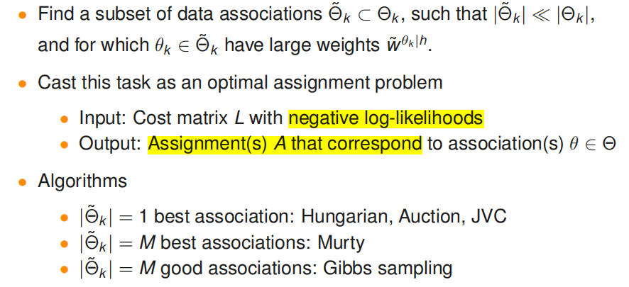
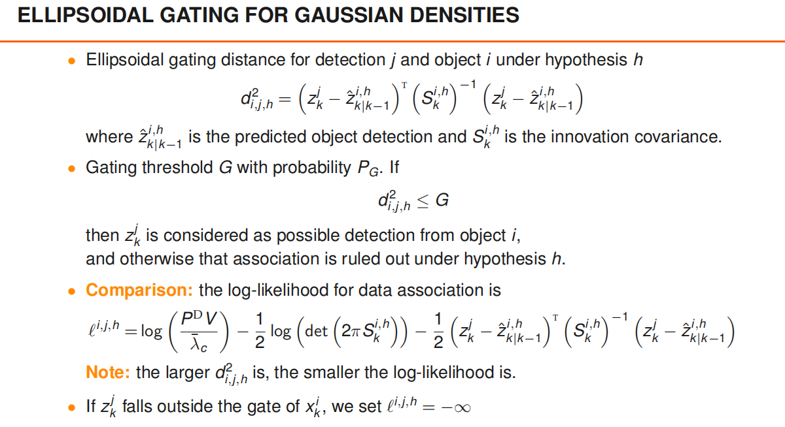
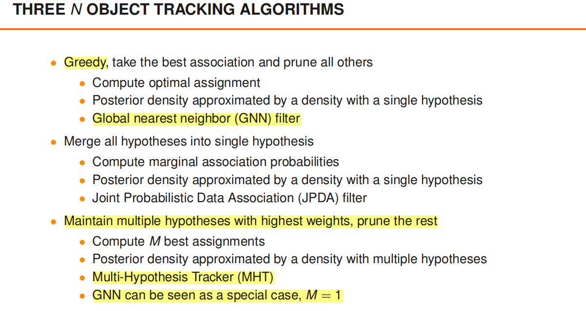
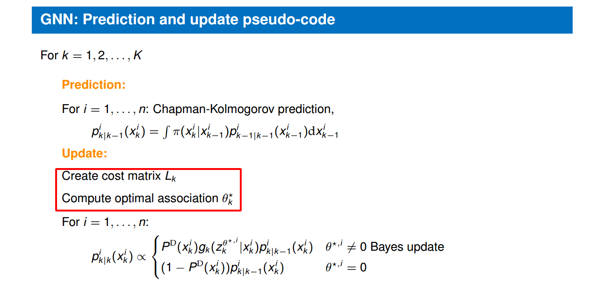
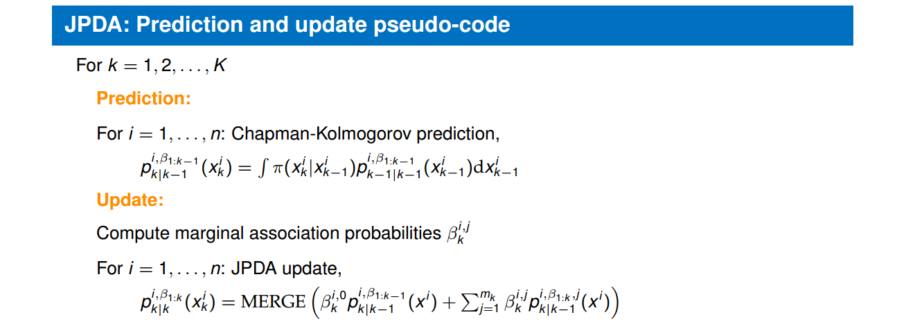

# Tracking n objects in clutter

[lecture](./lecture/Section%202%20Single-Object%20Tracking%20in%20Clutter/L2_handout_20190429.pdf)

---

## 背景知识

[[贪心分配] | [匈牙利分配] | [M-Best]](../../分配算法/assign_demo.cpp)

## GNN
[CODE](./HA02/n_objectracker.m)

**STEPS FOR GNN**

0. perform prediction of each prior
   
1. implement ellipsoidal gating for each predicted local hypothesis seperately, see Note below for details;
2. construct 2D cost matrix of size (number of objects, number of measurements that at least fall inside the gates + number of objects);
3. **find the best assignment matrix using a 2D assignment solver**;
4. create new local hypotheses according to the best assignment matrix obtained;
5. extract object state estimates;
6. predict each local hypothesis.

**GNN的核心是构造代价矩阵，然后执行最优分配。**

## JPDA

**STEPS FOR JPDA**

1. implement ellipsoidal gating for each local hypothesis seperately;
   
2. construct 2D cost matrix of size (number of objects, number of measurements that at least fall inside the gates + number of objects);
3. find the M best assignment matrices using a M-best 2D assignment solver;
4. normalise the weights of different data association hypotheses;
5. prune assignment matrices that correspond to data association hypotheses with low weights and renormalise the weights;
6. create new local hypotheses for each of the data association results;
7. merge local hypotheses that correspond to the same object by moment matching;
8. extract object state estimates;
9. predict each local hypothesis.

与GNN相同，JPDA算法首先也是计算代价矩阵，不同的是，其不再执行最优分配，而是**计算M-BEST分配**。

## MHT