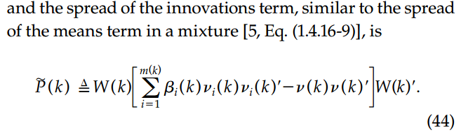

# PDA: Probabilistic Data Association

[概率数据关联（PDA）算法解析](https://zhuanlan.zhihu.com/p/176851546)

[Probabilistic data association tutorial](https://stonesoup.readthedocs.io/en/v0.1b9/auto_tutorials/07_PDATutorial.html)

[PDAHypothesiser](https://stonesoup.readthedocs.io/en/v0.1b9/stonesoup.hypothesiser.html#stonesoup.hypothesiser.probability.PDAHypothesiser)

<div align=center>

</div>

## 重点解析

### 数据关联

<div align=center>

</div>


### 状态估计

<div align=center>

</div>

<div align=center>

</div>


### 关键代码

```python
hypotheses = list() # 假设列表
validated_measurements = 0
measure = SquaredMahalanobis(state_covar_inv_cache_size=None)

prediction = self.predictor.predict(track, timestamp=timestamp, **kwargs) # 状态预测

probability = Probability(1 - self.prob_detect*self.prob_gate) # 未检测到量测的假设

hypotheses.append(
    SingleProbabilityHypothesis(
        prediction,
        MissedDetection(timestamp=timestamp),
        probability
        ))

# 遍历所有量测，若量测落入门限，就视作为一个新假设
for detection in detections:
    # Re-evaluate prediction
    prediction = self.predictor.predict(
        track, timestamp=detection.timestamp, **kwargs)
    # Compute measurement prediction and probability measure
    measurement_prediction = self.updater.predict_measurement(
        prediction, detection.measurement_model, **kwargs)
    # Calculate difference before to handle custom types (mean defaults to zero)
    # This is required as log pdf coverts arrays to floats
    log_prob = multivariate_normal.logpdf(
        (detection.state_vector - measurement_prediction.state_vector).ravel(),
        cov=measurement_prediction.covar)
    probability = Probability(log_prob, log_value=True)

    # 判定是否落入门限
    if measure(measurement_prediction, detection) \
            <= self._gate_threshold(self.prob_gate, measurement_prediction.ndim):
        validated_measurements += 1
        valid_measurement = True
    else:
        # Will be gated out unless include_all is set
        valid_measurement = False

    if self.include_all or valid_measurement: # 落入门限的量测都认为是一个新的假设
        probability *= self.prob_detect
        if self.clutter_spatial_density is not None:
            probability /= self.clutter_spatial_density

        # True detection hypothesis
        hypotheses.append(
            SingleProbabilityHypothesis(
                prediction,
                detection,
                probability,
                measurement_prediction))

if self.clutter_spatial_density is None: # 杂波密度（超参）
    for hypothesis in hypotheses[1:]:  # Skip missed detection
        hypothesis.probability *= self._validation_region_volume(
            self.prob_gate, hypothesis.measurement_prediction) / validated_measurements

return MultipleHypothesis(hypotheses, normalise=True, total_weight=1)
```

### 完整代码
[完整代码](./Stone_Soup/07_PDATutorial.ipynb)