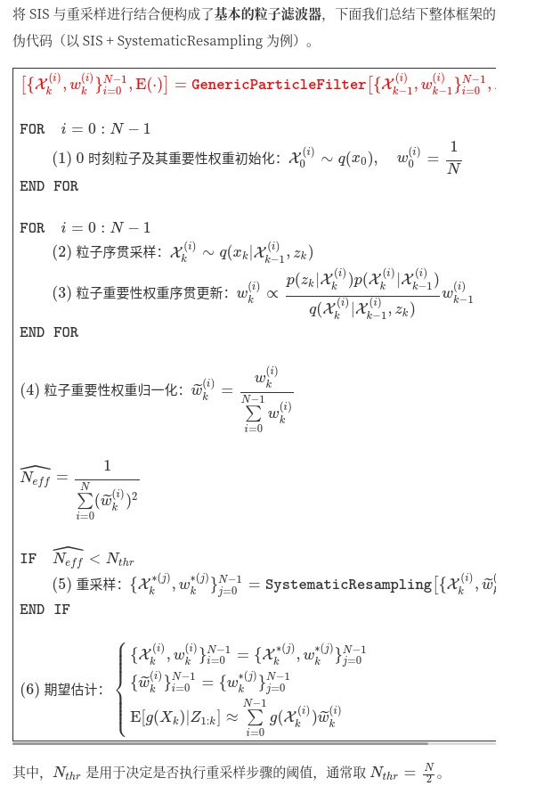
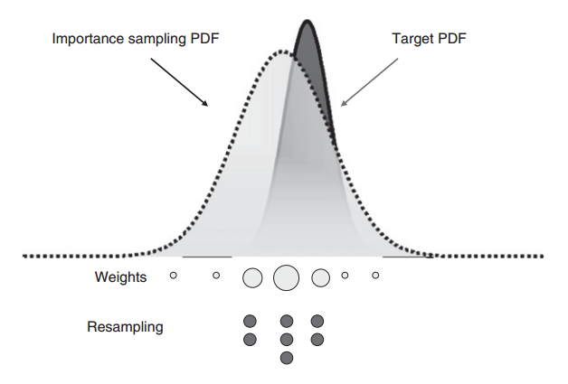
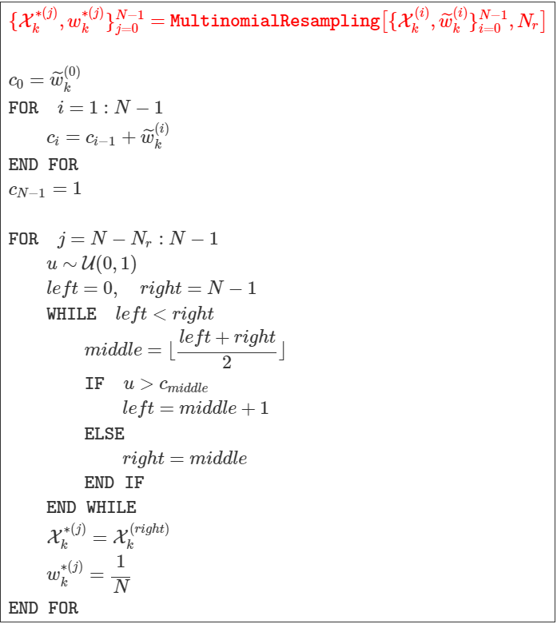
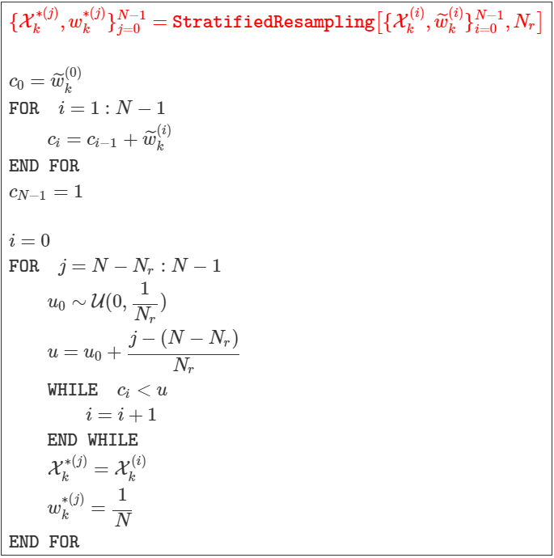
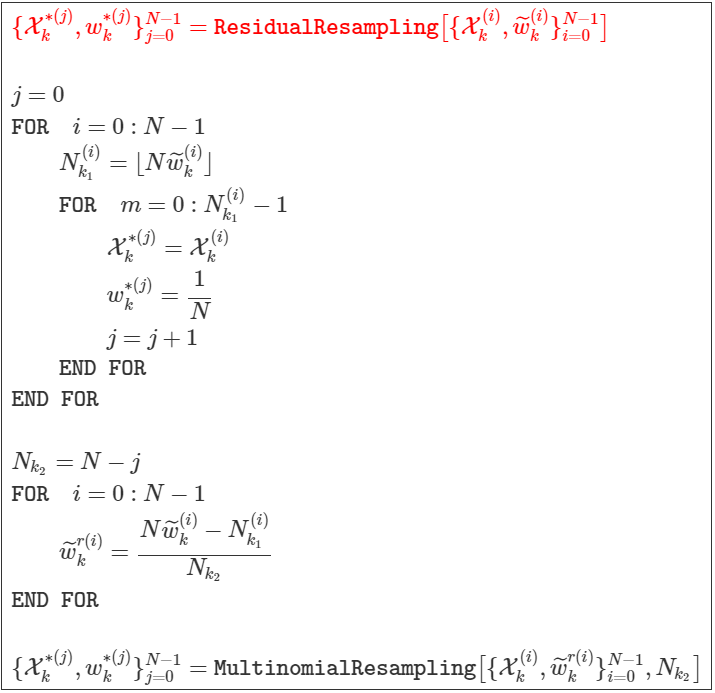

# Particle filter 🔥🔥
[粒子滤波算法笔记(一):算法概述](https://zhi-ang.github.io/2019/08/13/pf/)

[从贝叶斯滤波到粒子滤波(有C++代码实现)👍👍](https://blog.shipengx.com/archives/f3c9e219.html)

[Particle Filter Tutorial 粒子滤波：从推导到应用（一）](https://heyijia.blog.csdn.net/article/details/40899819)

[Particle Filter Tutorial 粒子滤波：从推导到应用（二）](https://blog.csdn.net/heyijia0327/article/details/40929097)

---

- [概念](#概念)
  - [蒙特卡洛方法](#蒙特卡洛方法)
- [基本步骤](#基本步骤)
  - [粒子退化](#粒子退化)
  - [粒子重采样](#粒子重采样)
    - [MultinomialResampling 多项式重采样](#multinomialresampling-多项式重采样)
    - [StratifiedResampling 分层重采样](#stratifiedresampling-分层重采样)
    - [SystematicResampling 系统重采样](#systematicresampling-系统重采样)
    - [ResidualResampling 残差重采样](#residualresampling-残差重采样)
- [工程示范](#工程示范)
  - [状态初始化](#状态初始化)
  - [状态预测](#状态预测)
  - [粒子更新](#粒子更新)
    - [粒子权重更新](#粒子权重更新)
    - [粒子权重归一化](#粒子权重归一化)
    - [粒子重采样](#粒子重采样-1)
---


## 概念

粒子滤波是贝叶斯滤波的一种非参数实现，所谓非参数，即不对滤波状态量的后验概率密度作任何假设。粒子滤波的主要思想是用一系列从后验得到的带权重的随机采样表示后验。从采样的角度考虑，粒子滤波与无迹卡尔曼滤波相似，区别在于，无迹卡尔曼滤波使用 sigma 确定性采样，通过无迹变换计算 sigma 样本点的位置与权重；而粒子滤波使用蒙特卡罗随机采样从建议分布中得到样本（粒子），并通过观测值更新粒子权重，针对粒子的权值退化问题，还涉及粒子的重采样步骤。粒子滤波算法广泛用于解决无人车的定位问题。

### 蒙特卡洛方法

假设存在某一连续型随机变量$x$，其概率密度函数为$p(x)$，则$X$的数学期望为:

$$
\begin{equation}
E(X) = \int_{-\infty}^{\infty} xp(x) dx
\end{equation}
$$

若存在另一连续型随机变量$y$，满足$Y=g(X)$，则$Y$的数学期望为:
$$
\begin{equation}
E(Y) = \int_{-\infty}^{\infty} g(x) p(x) dx
\end{equation}
$$

蒙特卡罗（Monte Carlo）方法告诉我们，可以**通过对随机变量的概率密度进行随机采样，并对样本进行加权求和来近似随机变量的期望**，如此一来，**积分问题便转化为有限样本点的求和问题.**

## 基本步骤

粒子滤波是一种基于蒙特卡洛方法的递归滤波算法，用于估计非线性、非高斯系统的状态。它通过一组带权重的随机样本（粒子）来表示随机事件的后验概率，从含有噪声或不完整的观测序列中估计出动力系统的状态。

粒子滤波是贝叶斯滤波的一种非参数实现，所谓非参数，即不对滤波状态量的后验概率密度作任何假设。粒子滤波的主要思想是用一系列从后验得到的带权重的随机采样表示后验。从采样的角度考虑，粒子滤波与无迹卡尔曼滤波相似，区别在于，无迹卡尔曼滤波使用 sigma 确定性采样，通过无迹变换计算 sigma 样本点的位置与权重；而粒子滤波使用蒙特卡罗随机采样从建议分布中得到样本（粒子），并通过观测值更新粒子权重，针对粒子的权值退化问题，还涉及粒子的重采样步骤。粒子滤波算法广泛用于解决无人车的定位问题。


**粒子滤波算法包括以下步骤：**

1. 初始化：从状态空间中随机采样N个粒子，并赋予每个粒子相同的权重。
   
2. 预测：根据系统状态方程，预测每个粒子的下一时刻状态。
   
3. 更新：根据观测方程和观测值，计算每个粒子的权重。
   
4. 重采样：**根据粒子权重，重新采样N个粒子，并赋予每个粒子相同的权重**。
   
5. 重复：从步骤2开始，重复上述步骤，直到达到迭代终止条件。

<div align=center>

</div>


### 粒子退化
SIS 算法在经历次多次迭代后，粒子重要性权重的方差可能将变得很大，从而引发粒子退化问题（Particle Degeneracy Problem）。

所谓粒子退化，指的是大量粒子中只有少数粒子具有较高权重，而绝大多数粒子的权重都很小甚至接近于 0，导致计算加权均值时大量的运算资源被浪费在了小权重粒子上。粒子退化问题发生的根本原因是建议分布与真实分布的不匹配。

### 粒子重采样

重采样也可有效抑制粒子退化问题。所谓重采样，指的是在得到当前时刻的粒子集及每个粒子归一化的重要性权重${X(i)k,w˜(i)k}N−1i=0$后，根据每个粒子的权重需要进行重新采样，粒子权重越高，被重新采样到的概率也越高，这意味着，某些粒子在重采样后可能会被复制多份，而某些粒子在重采样后可能直接不存在了，如下图所示:

<div align=center>

</div>


#### MultinomialResampling 多项式重采样
<div align=center>

</div>


#### StratifiedResampling 分层重采样

<div align=center>

</div>


#### SystematicResampling 系统重采样
<div align=center>

</div>


#### ResidualResampling 残差重采样

<div align=center>

</div>


## 工程示范

### 状态初始化
```c++
void ParticleFilter::Init(const double &x, const double &y, const double &theta,
                          const double std_pos[])
{
    if (!IsInited())
    {
        // create normal distributions around the initial gps measurement values
        std::default_random_engine gen;
        std::normal_distribution<double> norm_dist_x(x, std_pos[0]);
        std::normal_distribution<double> norm_dist_y(y, std_pos[1]);
        std::normal_distribution<double> norm_dist_theta(theta, std_pos[2]);

        // initialize particles one by one
        // 这里是用的随机采样，前面定义好每个状态分量的均值和方差
        for (size_t i = 0; i < n_p; ++i)
        {
            particles(0, i) = norm_dist_x(gen);
            particles(1, i) = norm_dist_y(gen);
            particles(2, i) = norm_dist_theta(gen);
        }

        // initialize weights to 1 / n_p
        weights_nonnormalized.fill(1 / n_p);
        weights_normalized.fill(1 / n_p);

        is_inited = true;
    }
}
```


### 状态预测

模型采用CTRV。CTRV是CV的一般形式，当ω=0时，CTRV退化为CV。

<div align=center>

</div>


```c++
/**
 * @brief Predict new state of particle according to the system motion model.
 *
 * @param velocity Velocity of car [m/s]
 * @param yaw_rate Yaw rate of car [rad/s]
 * @param delta_t delta time between last timestamp and current timestamp [s]
 * @param std_pos Array of dimension 3 [standard deviation of x [m],
 *   standard deviation of y [m], standard deviation of yaw [rad]]
 */
void ParticleFilter::Predict(const double &velocity, const double &yaw_rate,
                             const double &delta_t, const double std_pos[])
{
    if (!IsInited())
        return;

    // create process noise's normal distributions of which the mean is zero
    std::default_random_engine gen;
    std::normal_distribution<double> norm_dist_x(0, std_pos[0]);
    std::normal_distribution<double> norm_dist_y(0, std_pos[1]);
    std::normal_distribution<double> norm_dist_theta(0, std_pos[2]);

    // predict state of particles one by one
    for (size_t i = 0; i < n_p; ++i)
    {
        double theta_last = particles(2, i);

        Eigen::Vector3d state_trans_item_motion;
        Eigen::Vector3d state_trans_item_noise;

        // 随机生成粒子
        state_trans_item_noise << norm_dist_x(gen), norm_dist_y(gen), norm_dist_theta(gen);

        // 运动估计
        if (std::fabs(yaw_rate) > 0.001) // CTRV model
        {
            state_trans_item_motion << velocity / yaw_rate * (sin(theta_last + yaw_rate * delta_t) - sin(theta_last)),
                velocity / yaw_rate * (-cos(theta_last + yaw_rate * delta_t) + cos(theta_last)),
                yaw_rate * delta_t;
        }
        else // approximate CV model
        {
            state_trans_item_motion << velocity * cos(theta_last) * delta_t,
                velocity * sin(theta_last) * delta_t,
                yaw_rate * delta_t;
        }

        // predict new state of the ith particle
        // 对每一个粒子进行状态预测
        particles.col(i) = particles.col(i) + state_trans_item_motion + state_trans_item_noise;

        // normalize theta
        NormalizeAngle(particles(2, i));
    }
}
```

### 粒子更新
观测状态仅为二维位置信息。

这里还涉及到不同坐标系的变化以及量测关联。

在这儿主要关注粒子滤波的过程，所以此处省略，直接进到粒子滤波的状态更新部分。

#### 粒子权重更新
<div align=center>

</div>

```c++
/**
 * @brief For each observed landmark with an associated landmark, calculate
 *   its' weight contribution, and then multiply to particle's final weight.
 *
 * @param lmrks_trans2map Observed landmarks transformed from local ego vehicle
 *   coordinate to global map coordinate.
 * @param lmrks_map All map landmarks.
 * @param std_lmrks Array of dimension 2 [Landmark measurement uncertainty
 *   [x [m], y [m]]]
 * @param weight Non-normalized weight of particle.
 */
void ParticleFilter::UpdateWeight(const std::vector<LandMark_Map> &lmrks_trans2map,
                                  const std::vector<LandMark_Map> &lmrks_map,
                                  const double std_lmrks[],
                                  double &weight)
{
    double likelyhood_probability_particle = 1.0;
    double sigma_x = std_lmrks[0];
    double sigma_y = std_lmrks[1];

    for (auto &landmark_trans2map : lmrks_trans2map)
    {
        double x = landmark_trans2map.x;
        double y = landmark_trans2map.y;
        double ux = lmrks_map.at(landmark_trans2map.id - 1).x;
        double uy = lmrks_map.at(landmark_trans2map.id - 1).y;
        double exponent = -(std::pow(x - ux, 2) / (2 * std::pow(sigma_x, 2)) +
                            std::pow(y - uy, 2) / (2 * std::pow(sigma_y, 2)));
        double likelyhood_probability_landmark = 1.0 / (2 * M_PI * sigma_x * sigma_y) *
                                                 std::exp(exponent);
        likelyhood_probability_particle *= likelyhood_probability_landmark;
    }

    weight *= likelyhood_probability_particle;
}
```

这里的`lmrks_trans2map`可以理解为关联到的量测个数，对每个量测计算`似然`并求和得到`最终似然`。

`通过最终似然来更新每个粒子的权重。`

#### 粒子权重归一化

 ```c++
 /**
 * @brief Normalize the weights of particles.
 *
 * @param w_nonnormalized Weights to be normalized.
 * @param w_normalized Weights which have been normalized.
 */
inline void NormalizeWeights(const Eigen::VectorXd &w_nonnormalized,
                             Eigen::VectorXd &w_normalized)
{
    w_normalized = w_nonnormalized / w_nonnormalized.sum();
}
 ```

#### 粒子重采样
完成粒子权重归一化后，我们需要对粒子集进行重采样。对于重采样步骤，大多数基于 Udacity 工程框架的开源项目使用了 C++ 标准库中的离散分布模板类 std::discrete_distribution ，这里我们“舍近求远”，手工实现 3.3.1 节中介绍的四种重采样算法，以加深对重采样的理解，随机数的生成我们通过模板类 std::uniform_real_distribution 实现。

1. **多项式重采样**

    ```c++
    /**
     * @brief Multinomial resampling method.
     *
     * @param particles_ori Particles before resampling.
     * @param weights_ori_norm Normalized weights before resampling.
     * @param particles_resampled Particles after resampling.
     * @param weights_resampled Weights after resampling.
     * @param N_r Number of particles to resample.
     */
    void ParticleFilter::MultinomialResampling(const Eigen::MatrixXd &particles_ori,
                                            const Eigen::VectorXd &weights_ori_norm,
                                            Eigen::MatrixXd &particles_resampled,
                                            Eigen::VectorXd &weights_resampled,
                                            uint32_t N_r)
    {
        uint32_t N = weights_ori_norm.size();
        uint32_t left, right, middle;

        Eigen::VectorXd weights_cum_sum = CalcWeightsCumSum(weights_ori_norm);

        for (size_t j = N - N_r; j < N; ++j)
        {
            // produces random values u, uniformly distributed on the interval [0.0, 1.0)
            std::random_device rd;
            std::mt19937 gen(rd());
            std::uniform_real_distribution<> uniform_dist(0.0, 1.0);
            double u = uniform_dist(gen);

            // select the resampled particle using binary search
            left = 0;
            right = N - 1;
            while (left < right)
            {
                middle = std::floor((left + right) / 2);
                if (u > weights_cum_sum(middle))
                    left = middle + 1;
                else
                    right = middle;
            }

            particles_resampled(j) = particles_ori(right);
            weights_resampled(j) = 1 / N;
        }
    }
    ```


2. 分层重采样:

    ```c++
    /**
    * @brief Stratified resampling method.
    *
    * @param particles_ori Particles before resampling.
    * @param weights_ori_norm Normalized weights before resampling.
    * @param particles_resampled Particles after resampling.
    * @param weights_resampled Weights after resampling.
    * @param N_r Number of particles to resample.
    */
   void ParticleFilter::StratifiedResampling(const Eigen::MatrixXd &particles_ori,
                                             const Eigen::VectorXd &weights_ori_norm,
                                             Eigen::MatrixXd &particles_resampled,
                                             Eigen::VectorXd &weights_resampled,
                                             uint32_t N_r)
   {
       uint32_t N = weights_ori_norm.size();

       Eigen::VectorXd weights_cum_sum = CalcWeightsCumSum(weights_ori_norm);

       uint32_t i = 0;

       for (size_t j = N - N_r; j < N; ++j)
       {
           // produces random values u0, uniformly distributed on the interval [0.0, 1.0 / N_r)
           // then calculate u = u0 + (j - (N - N_r)) / N_r
           std::random_device rd;
           std::mt19937 gen(rd());
           std::uniform_real_distribution<> uniform_dist(0.0, 1 / N_r);
           double u0 = uniform_dist(gen);
           double u = u0 + (j - (N - N_r)) / N_r;

           // select the resampled particle
           while (weights_cum_sum(i) < u)
               ++i;

           particles_resampled(j) = particles_ori(i);
           weights_resampled(j) = 1 / N;
       }
   }
    ```


3. 系统重采样:

    ```c++
    /**
    * @brief Systematic resampling method.
    *
    * @param particles_ori Particles before resampling.
    * @param weights_ori_norm Normalized weights before resampling.
    * @param particles_resampled Particles after resampling.
    * @param weights_resampled Weights after resampling.
    * @param N_r Number of particles to resample.
    */
    void ParticleFilter::SystematicResampling(const Eigen::MatrixXd &particles_ori,
                                            const Eigen::VectorXd &weights_ori_norm,
                                            Eigen::MatrixXd &particles_resampled,
                                            Eigen::VectorXd &weights_resampled,
                                            uint32_t N_r)
    {
        uint32_t N = weights_ori_norm.size();

        Eigen::VectorXd weights_cum_sum = CalcWeightsCumSum(weights_ori_norm);

        uint32_t i = 0;

        // produces random values u0, uniformly distributed on the interval [0.0, 1.0 / N_r)
        std::random_device rd;
        std::mt19937 gen(rd());
        std::uniform_real_distribution<> uniform_dist(0.0, 1 / N_r);
        double u0 = uniform_dist(gen);

        for (size_t j = N - N_r; j < N; ++j)
        {
            // calculate u = u0 + (j - (N - N_r)) / N_r
            double u = u0 + (j - (N - N_r)) / N_r;

            // select the resampled particle
            while (weights_cum_sum(i) < u)
                ++i;

            particles_resampled(j) = particles_ori(i);
            weights_resampled(j) = 1 / N;
        }
    }
    ```

4. 残差重采样
   ```c++
   /**
    * @brief Residual resampling method.
    *
    * @param particles_ori Particles before resampling.
    * @param weights_ori_norm Normalized weights before resampling.
    * @param particles_resampled Particles after resampling.
    * @param weights_resampled Weights after resampling.
    */
   void ParticleFilter::ResidualResampling(const Eigen::MatrixXd &particles_ori,
                                           const Eigen::VectorXd &weights_ori_norm,
                                           Eigen::MatrixXd &particles_resampled,
                                           Eigen::VectorXd &weights_resampled)
   {
       uint32_t N = weights_ori_norm.size();
       uint32_t j = 0;
       Eigen::VectorXi N_k1(N);

       // step1: deterministic copy sampling
       for (size_t i = 0; i < N; ++i)
       {
           N_k1(i) = std::floor(N * weights_ori_norm(i));

           for (size_t m = 0; m < N_k1(i); ++m)
           {
               particles_resampled(j) = particles_ori(i);
               weights_resampled(j) = 1 / N;
               ++j;
           }
       }

       // step2: residual random sampling
       uint32_t N_k2 = N - j;
       Eigen::VectorXd weights_residual_norm = (N * weights_ori_norm - N_k1) / N_k2;
       MultinomialResampling(particles_ori, weights_residual_norm, particles_resampled,
                             weights_resampled, N_k2);
   }
   ```