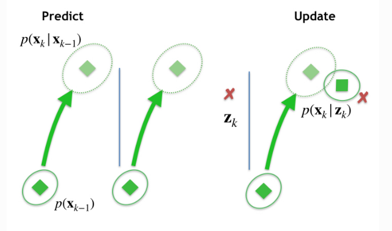

# Kalman

[参考](https://stonesoup.readthedocs.io/en/v0.1b9/auto_tutorials/01_KalmanFilterTutorial.html#sphx-glr-auto-tutorials-01-kalmanfiltertutorial-py)

## Kalman filter
### 算法步骤
The Kalman filter is described extensively elsewhere [#]_, [#]_, so for the
moment we just assert that the prediction step proceeds as:

$$
\begin{align}\mathbf{x}_{k|k-1} &= F_{k}\mathbf{x}_{k-1} + B_{k}\mathbf{u}_{k}\\
                P_{k|k-1} &= F_{k}P_{k-1}F_{k}^T + Q_{k},\end{align}
$$

$B_k \mathbf{u}_k$ is a control term which we'll ignore for now (we assume we don't
influence the target directly).

The update step is:
$$
\begin{align}\mathbf{x}_{k} &= \mathbf{x}_{k|k-1} + K_k(\mathbf{z}_k - H_{k}\mathbf{x}_{k|k-1})\\
      P_{k} &= P_{k|k-1} - K_k H_{k} P_{k|k-1}\\\end{align}
$$
where,
$$
\begin{align}K_k &= P_{k|k-1} H_{k}^T S_k^{-1}\\
      S_k &= H_{k} P_{k|k-1} H_{k}^T + R_{k}\end{align}
$$

$\mathbf{z}_k - H_{k}\mathbf{x}_{k|k-1}$ is known as the ***innovation*** and $S_k$ the
***innovation covariance***; $K_k$ is the ***Kalman gain***.


<div align=center>

</div>


### 范例代码
[code](./Stone_Soup/01_KalmanFilterTutorial.ipynb)

## Extended Kalman filter

Recall that the Kalman filter makes the following linear assumptions of the predicted state and
predicted measurement:
$$
\begin{align}\mathbf{x}_{k|k-1} &= F_{k} \mathbf{x}_{k-1} + B_{k}\mathbf{u}_{k}\\
      \mathbf{z}_{k|k-1} &= H_{k} \mathbf{x}_{k|k-1}\end{align}
$$
The EKF gets round the fact that $f(\cdot)$ and $h(\cdot)$ are not of this form by
making linear approximations about $\mathbf{x}_{k−1} = \boldsymbol{\mu}_{k−1}$ or
$\mathbf{x}_{k|k−1} = \boldsymbol{\mu}_{k|k−1}$. It does this by way of a Taylor expansion,
$$
\begin{align}g(\mathbf{x})\rvert_{\mathbf{x}=\boldsymbol{\mu}} \approx \sum\limits_{|\alpha| \ge 0}
      \frac{(\mathbf{x} - \boldsymbol{\mu})^{\alpha}}{\alpha !}
      (\mathcal{D}^{\alpha} g)(\boldsymbol{\mu})\end{align}
$$
This is usually truncated after the first term, meaning that either
$\tilde{F}(\mathbf{x}_{k-1}) \approx J(f)\rvert_{\mathbf{x}=\boldsymbol{\mu}_{k-1}}$ or
$\tilde{H}(\mathbf{x}_{k|k-1}) \approx J(h)\rvert_{\mathbf{x}=\boldsymbol{\mu}_{k|k-1}}$
or both, **where $J(\cdot)$ is the Jacobian matrix**. The calculation of the covariances,
including the innovation covariance, then proceeds in exactly the same way as in the Kalman
filter using these approximations,
$$
\begin{align}\mathbf{x}_{k|k-1} &= f_{k}(\mathbf{x}_{k-1}) \\
      P_{k|k-1} &= \tilde{F}_{k}P_{k-1}\tilde{F}_{k}^T + Q_{k}\\
      \mathbf{x}_{k} &= \mathbf{x}_{k|k-1} +
                        \tilde{K}_k(\mathbf{z}_k - h_k(\mathbf{x}_{k|k-1}))\\
      P_{k} &= P_{k|k-1} - \tilde{K}_k \tilde{H}_{k} P_{k|k-1}\\\end{align}
$$
where,
$$
\begin{align}\tilde{K}_k &= P_{k|k-1} \tilde{H}_{k}^T \tilde{S}_k^{-1}\\
      \tilde{S}_k &= \tilde{H}_{k} P_{k|k-1} \tilde{H}_{k}^T + R_{k}\end{align}
$$


求解雅可比矩阵代码：

```python
import sympy
from IPython.display import display
sympy.init_printing(use_latex='mathjax')

x, y, vx, vy, ax, ay = sympy.symbols('x, y, vx, vy, ax, ay')

H = sympy.Matrix([x, y, (x*vx+y*vy) / sympy.sqrt(x**2 + y**2)])

state = sympy.Matrix([x, y, vx, vy, ax, ay])
J = H.jacobian(state) # 求解雅克比矩阵

display(state)
display(J)
```

### 范例代码
[code](./Stone_Soup/02_ExtendedKalmanFilterTutorial.ipynb)


## unscented Kalman filter

Limited detail on how Stone Soup does the UKF is provided below. See Julier et al. (2000) [#]_
for fuller, better details of the UKF.

For dimension $D$, a set of $2 D + 1$ **sigma points are calculated at**:
$$
\begin{align}\mathbf{s}_j &= \mathbf{x}, \ \ j = 0 \\
          \mathbf{s}_j &= \mathbf{x} + \alpha \sqrt{\kappa} A_j, \ \ j = 1, ..., D \\
          \mathbf{s}_j &= \mathbf{x} - \alpha \sqrt{\kappa} A_j, \ \ j = D + 1, ..., 2 D\end{align}
$$
where $A_j$ is the $j$ th column of $A$, a *square root matrix* of the
covariance, $P = AA^T$, of the state to be approximated, and $\mathbf{x}$ is its
mean.

Two sets of weights, mean and covariance, are calculated:
$$
\begin{align}W^m_0 &= \frac{\lambda}{c} \\
          W^c_0 &= \frac{\lambda}{c} + (1 - \alpha^2 + \beta) \\
          W^m_j &= W^c_j = \frac{1}{2 c}\end{align}
$$
where $c = \alpha^2 (D + \kappa)$, $\lambda = c - D$. The parameters
$\alpha, \ \beta, \ \kappa$ are user-selectable parameters with default values of
$0.5, \ 2, \ 3 - D$.

After the sigma points are transformed $\mathbf{s^{\prime}} = f( \mathbf{s} )$, the
distribution is reconstructed as:
$$
\begin{align}\mathbf{x}^\prime &= \sum\limits^{2 D}_{0} W^{m}_j \mathbf{s}^{\prime}_j \\
          P^\prime &= (\mathbf{s}^{\prime} - \mathbf{x}^\prime) \, diag(W^c) \,
          (\mathbf{s}^{\prime} - \mathbf{x}^\prime)^T + Q\end{align}
$$
The posterior mean and covariance are accurate to the 2nd order Taylor expansion for any non-linear model.


### Sigma点与UT变换范例代码
 <details> <summary>View Code</summary>

```python
def gauss2sigma(state, alpha=1.0, beta=2.0, kappa=None):
    ndim_state = np.shape(state.state_vector)[0]

    if kappa is None:
        kappa = 3.0 - ndim_state

    # Compute Square Root matrix via Colesky decomp.
    sqrt_sigma = np.linalg.cholesky(state.covar)

    # Calculate scaling factor for all off-center points
    alpha2 = np.power(alpha, 2)
    lamda = alpha2 * (ndim_state + kappa) - ndim_state
    c = ndim_state + lamda

    # Calculate sigma point locations
    sigma_points = StateVectors([state.state_vector for _ in range(2 * ndim_state + 1)])

    # Cast dtype from int to float to avoid rounding errors
    if np.issubdtype(sigma_points.dtype, np.integer):
        sigma_points = sigma_points.astype(float)

    # Can't use in place addition/subtraction as casting issues may arise when mixing float/int
    # 构造不同的sigma point
    sigma_points[:, 1:(ndim_state + 1)] = \
        sigma_points[:, 1:(ndim_state + 1)] + sqrt_sigma*np.sqrt(c)
    sigma_points[:, (ndim_state + 1):] = \
        sigma_points[:, (ndim_state + 1):] - sqrt_sigma*np.sqrt(c)

    # Put these sigma points into s State object list
    sigma_points_states = []
    for sigma_point in sigma_points:
        state_copy = copy.copy(state)
        state_copy.state_vector = StateVector(sigma_point)
        sigma_points_states.append(state_copy)

    # Calculate weights
    mean_weights = np.ones(2 * ndim_state + 1) # Wm
    mean_weights[0] = lamda / c
    mean_weights[1:] = 0.5 / c
    covar_weights = np.copy(mean_weights)  # Wc
    covar_weights[0] = lamda / c + (1 - alpha2 + beta)

    return sigma_points_states, mean_weights, covar_weights
```

```python
# 通过sigma点计算均值和协方差
def sigma2gauss(sigma_points, mean_weights, covar_weights, covar_noise=None):
    mean = np.average(sigma_points, axis=1, weights=mean_weights)

    points_diff = sigma_points - mean

    covar = points_diff@(np.diag(covar_weights))@(points_diff.T)
    if covar_noise is not None:
        covar = covar + covar_noise
    return mean.view(StateVector), covar.view(CovarianceMatrix)

# UT变换过程
def unscented_transform(sigma_points_states, mean_weights, covar_weights,
                        fun, points_noise=None, covar_noise=None):
    # Reconstruct the sigma_points matrix
    sigma_points = StateVectors([
        sigma_points_state.state_vector for sigma_points_state in sigma_points_states])

    # Transform points through f
    if points_noise is None:
        sigma_points_t = StateVectors([
            fun(sigma_points_state) for sigma_points_state in sigma_points_states])
    else:
        sigma_points_t = StateVectors([
            fun(sigma_points_state, points_noise)
            for sigma_points_state, point_noise in zip(sigma_points_states, points_noise.T)])

    # Calculate mean and covariance approximation
    mean, covar = sigma2gauss(sigma_points_t, mean_weights, covar_weights, covar_noise)

    # Calculate cross-covariance
    cross_covar = (
        (sigma_points-sigma_points[:, 0:1]) @ np.diag(covar_weights) @ (sigma_points_t-mean).T
    ).view(CovarianceMatrix)

    return mean, covar, cross_covar, sigma_points_t, mean_weights, covar_weights

```

</details>

### UKF参数
[ReadMe](./目标跟踪基础知识/卡尔曼系列/UKF参数.md)


### 完整代码
[ReadMe](./Stone_Soup/03_UnscentedKalmanFilterTutorial.ipynb)


## 其他参考
[从贝叶斯滤波到卡尔曼滤波](https://blog.shipengx.com/archives/3bb74af.html)

[从贝叶斯滤波到扩展卡尔曼滤波](https://blog.shipengx.com/archives/ea375326.html)

[从贝叶斯滤波到无迹卡尔曼滤波](https://blog.shipengx.com/archives/cfd8b171.html)