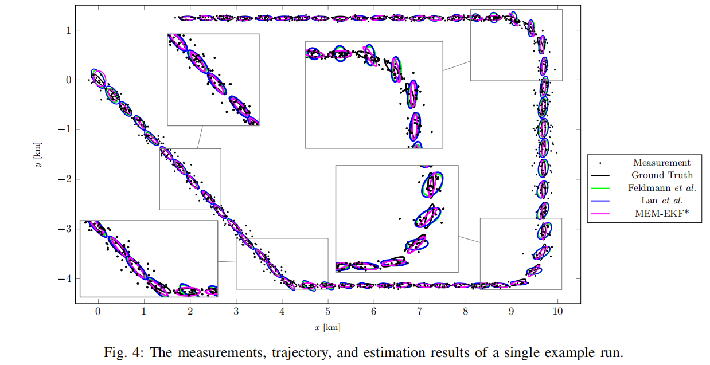
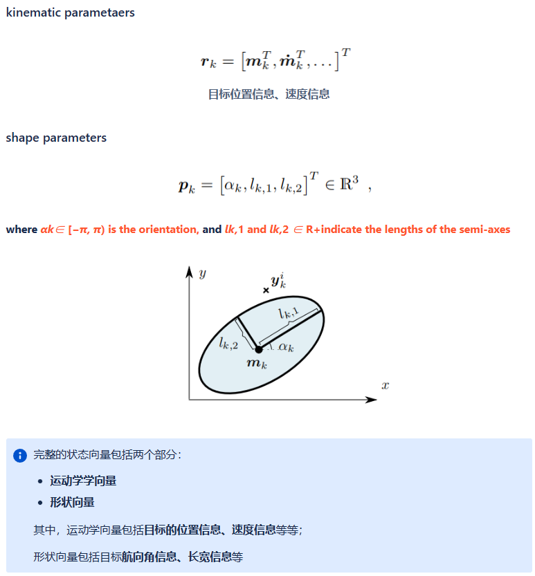
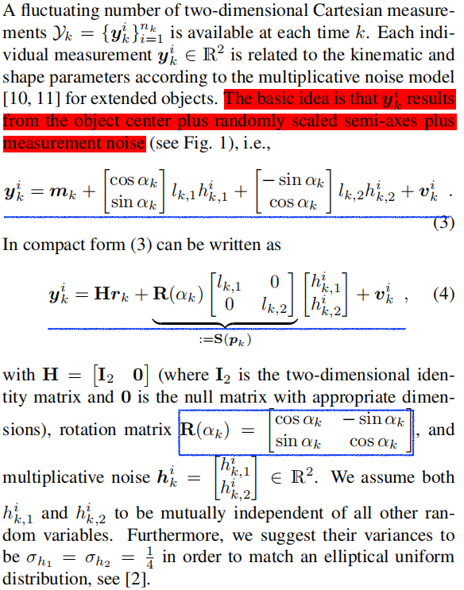
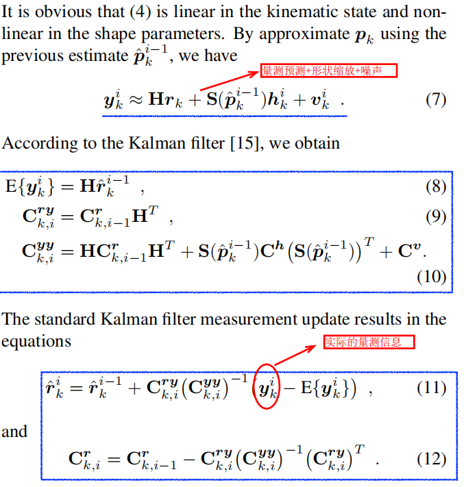
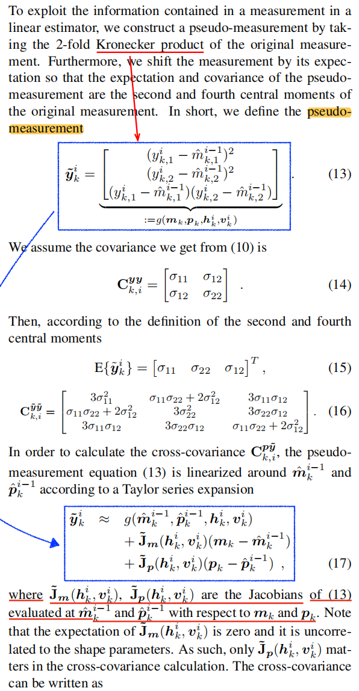
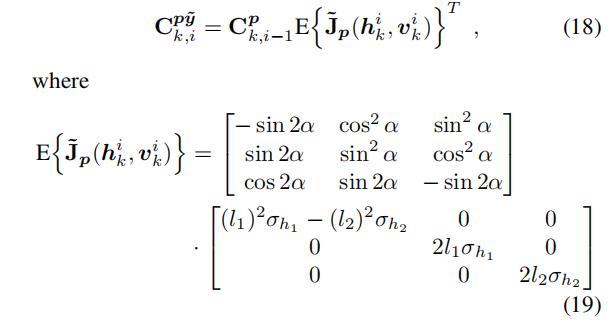
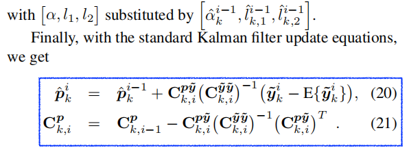
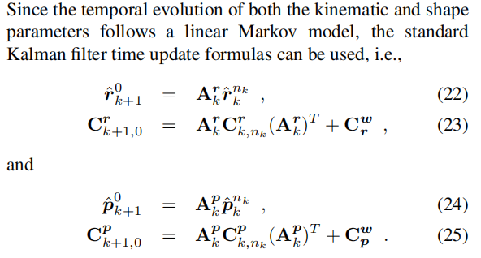

# 扩展目标跟踪-EKF算法

- [算法步骤一览](#算法步骤一览)
  - [状态向量 State Vector](#状态向量-state-vector)
  - [量测模型 Measure Model](#量测模型-measure-model)
  - [状态更新](#状态更新)
  - [扩展信息更新](#扩展信息更新)
  - [后验状态更新 Time Update](#后验状态更新-time-update)
- [参考论文](#参考论文)

## 算法步骤一览

### 状态向量 State Vector

### 量测模型 Measure Model

> 量测 = 目标中心位置+距离缩放+噪声

### 状态更新

> 公式（10）中的S可以理解为旋转矩阵和长宽信息的乘积，实际上也是为了计算这个角度上的corner point。
> 
> 公式（11）可以理解为，对每个真实量测的残差$(y_k-E_{yk})$进行加权作用到$r_k$中。

### 扩展信息更新

### 后验状态更新 Time Update

## 参考论文
- [Tracking the Orientation and Axes Lengths of an Elliptical Extended Object]()
- [Extended Kalman filter for extended object tracking]()