# 扩展目标跟踪-随机矩阵 Random Matrix

- [算法步骤一览](#算法步骤一览)
- [回顾Bayesian Extended Object Tracking](#回顾bayesian-extended-object-tracking)
- [高斯模型定义](#高斯模型定义)
- [核心1-威沙特分布](#核心1-威沙特分布)
- [核心2-逆威沙特分布](#核心2-逆威沙特分布)
- [滤波过程](#滤波过程)
  - [改进的量测似然](#改进的量测似然)
  - [改进的运动学状态更新](#改进的运动学状态更新)
  - [扩展状态更新](#扩展状态更新)
- [状态预测](#状态预测)
  - [运动状态预测](#运动状态预测)
  - [扩展状态预测](#扩展状态预测)
- [量测置信区间（NOT FINISHED）](#量测置信区间not-finished)
- [扩展链接](#扩展链接)
- [参考论文](#参考论文)

---

## 算法步骤一览

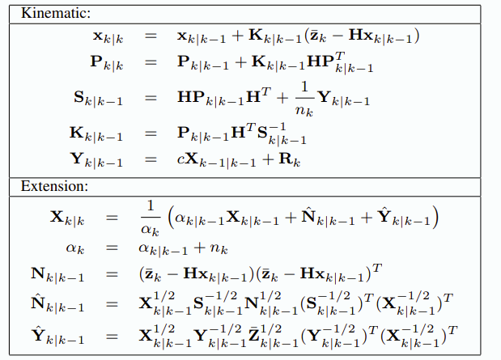

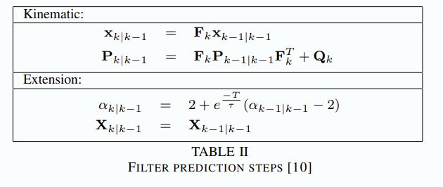

## 回顾Bayesian Extended Object Tracking

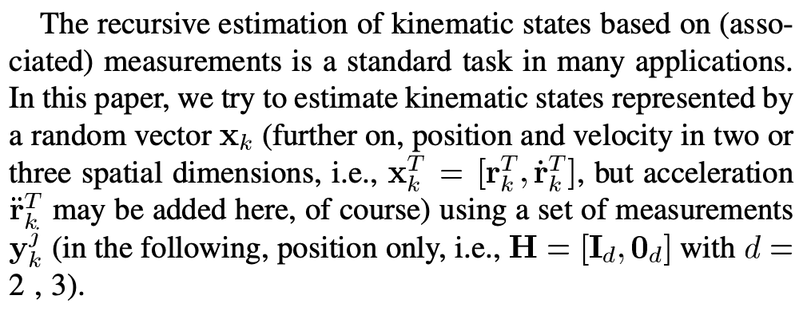

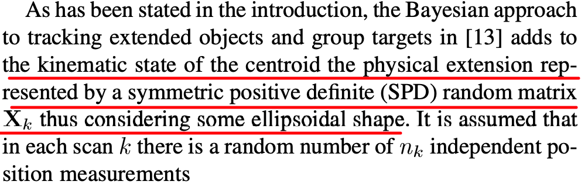

> **扩展目标不同于传统的点目标跟踪，除了基础的目标运动属性（位置、速度、加速度等）外，还将目标形状信息进行建模为椭圆模型，加入到跟踪器中。**

## 高斯模型定义

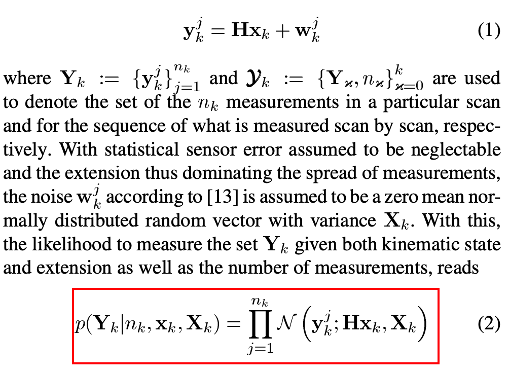

> 式（2）将量测建模成目标运动状态和扩展信息共同构成的高斯分布。
> 高斯分布的均值为目标运动学（位置）中心，方差为扩展信息。

## 核心1-威沙特分布

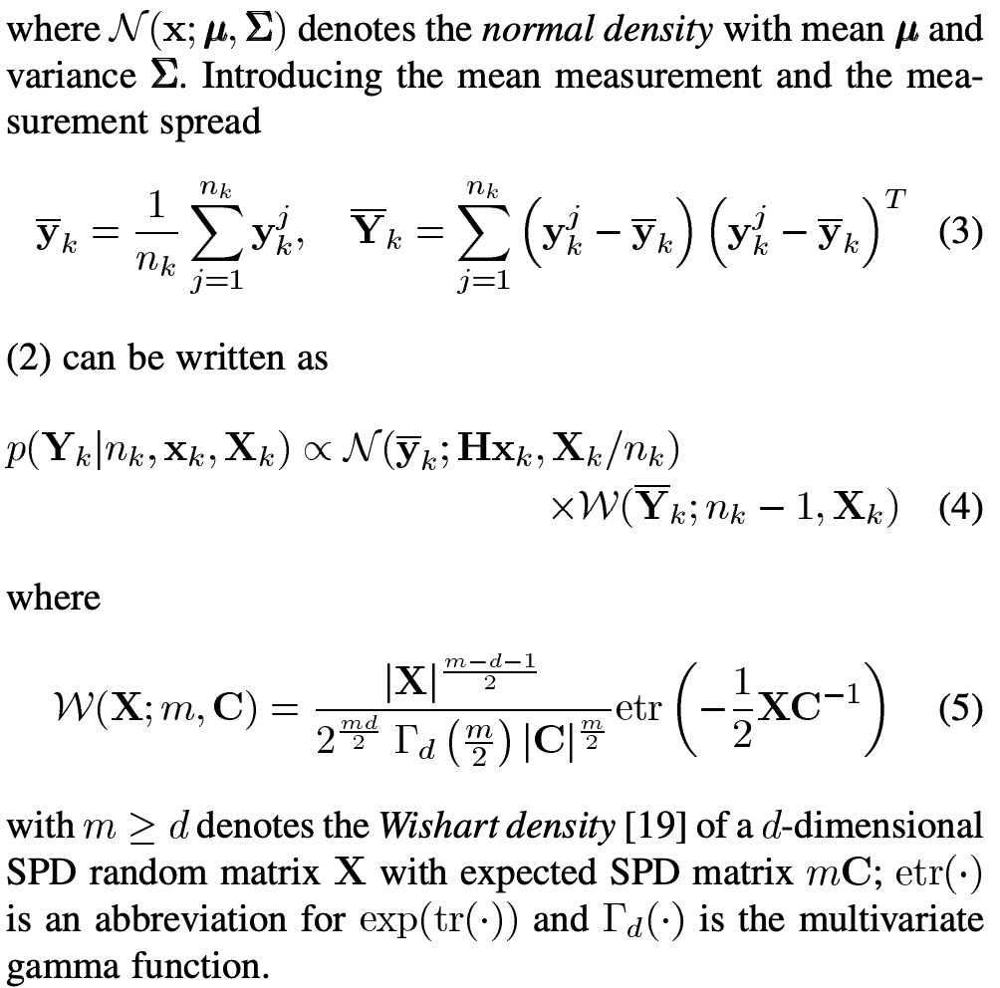

> **将高斯模型近似为【高斯x威沙特分布】**

> 由式（3、5）可知，**威沙特分布由量测个数-量测中心-量测方差计算得到。**

## 核心2-逆威沙特分布

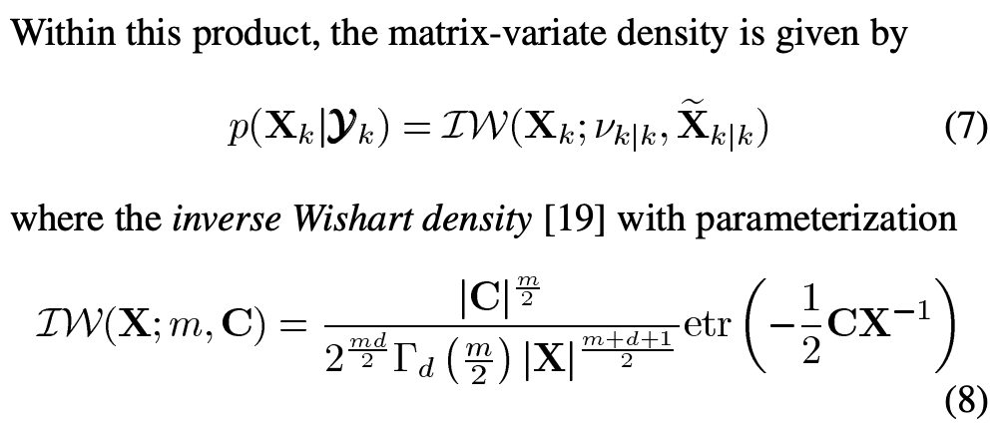

>在贝叶斯滤波过程中，量测分布建模成逆威沙特分布。

## 滤波过程

### 改进的量测似然

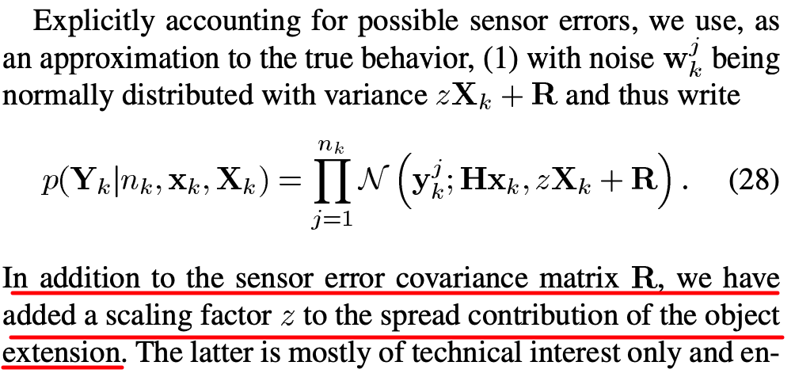

> 修正后的量测似然模型中，除了传统的量测噪声R，**还增加目标扩展信息的空间分布。**

### 改进的运动学状态更新

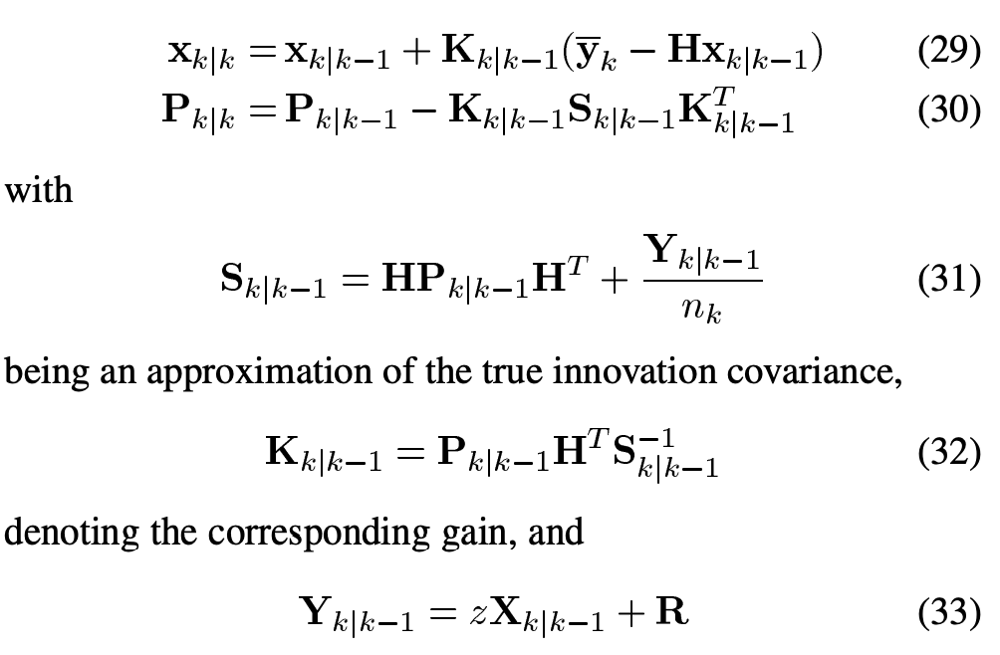

> **可以看到式（31）中对S的计算增加了空间分布噪声（式（33））。**

其中：

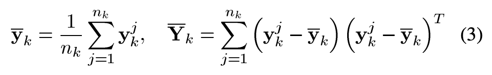

### 扩展状态更新

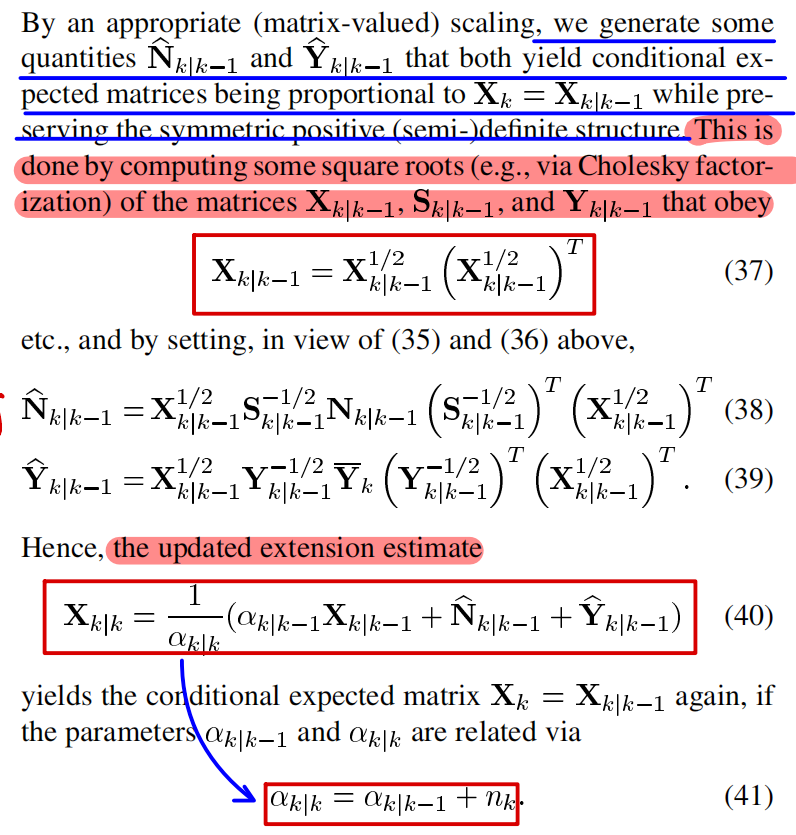

**核心公式（40、41）**

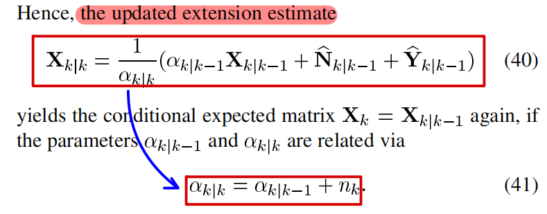

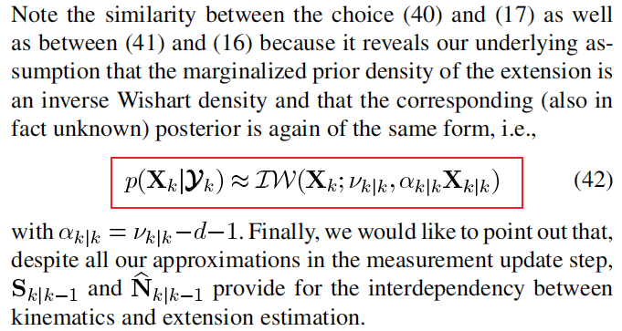

> 此处再次出现逆威沙特分布。

## 状态预测

### 运动状态预测
运动状态更新步骤和标准卡尔曼一致。

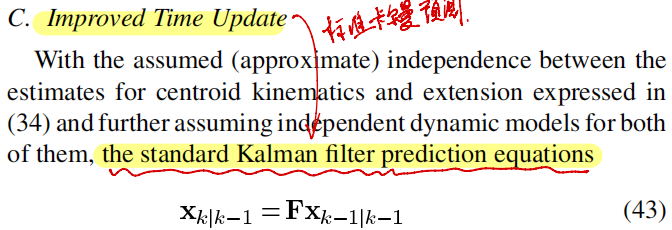

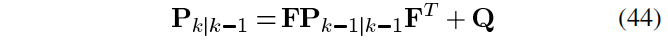

### 扩展状态预测

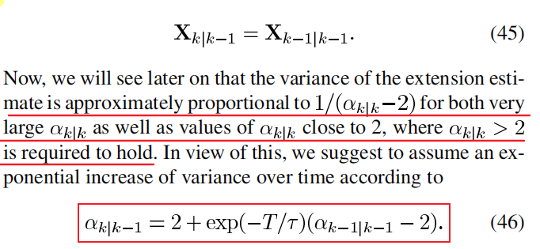

## 量测置信区间（NOT FINISHED）
> In addition to a good estimate, a useful estimator is also required to deliver a **reliable quality measure**, typically in form of
the corresponding MSE.

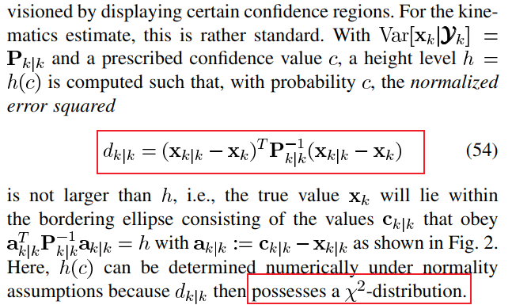

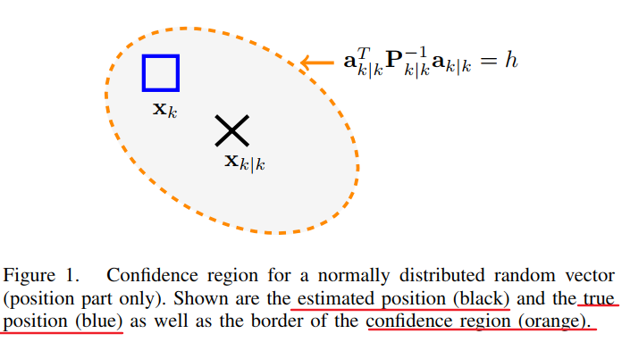

> 观测值和真实值存在$\chi^2$分布特性。

那么在本文的SPD前提下，将得到如下几种情况：

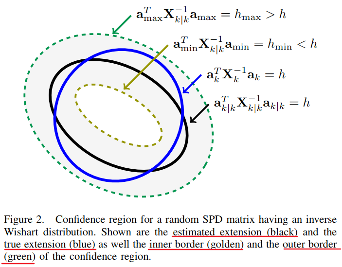

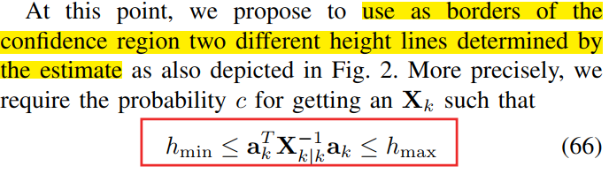

## 扩展链接
- [威沙特和逆威沙特分布](../数学/威沙特和逆威沙特分布.md)
- [$\chi^2$分布]()

## 参考论文
- [Tracking of Extended Objects and Group Targets Using Random Matrices](./pdfs/random_matrice_00.pdf)
- [Tracking of Extended Object or Target Group Using Random Matrix: New Model and Approach]
- [Advances on Tracking of Extended Objects and Group Targets using Random Matrices]