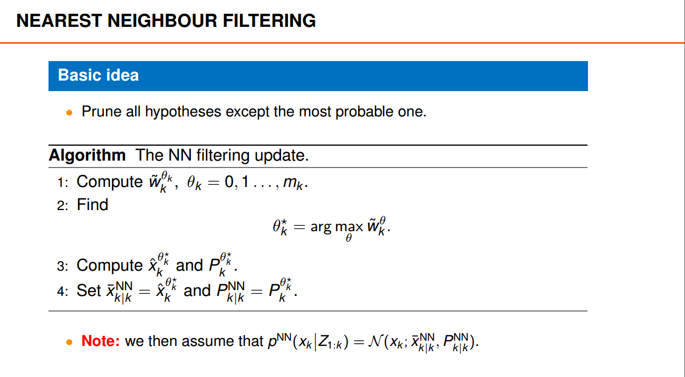
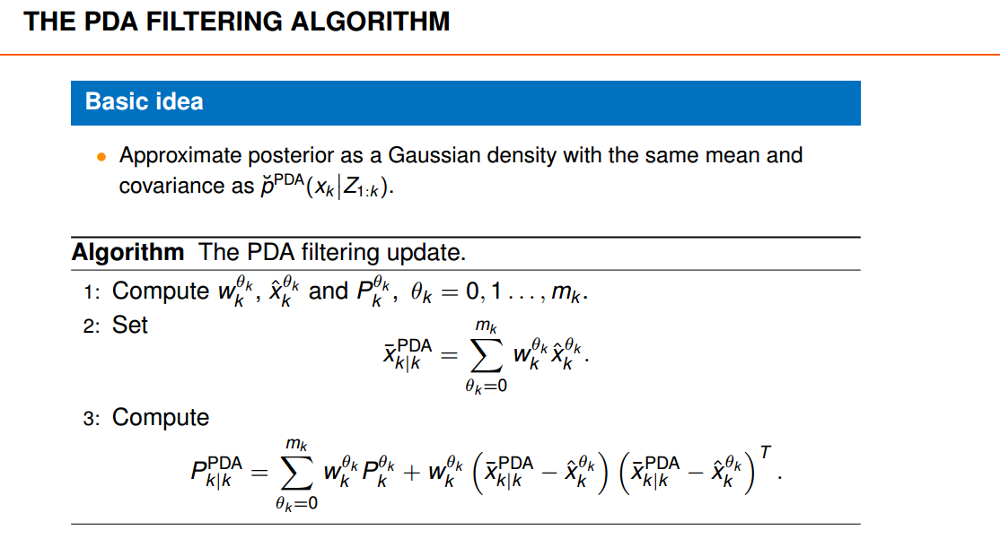
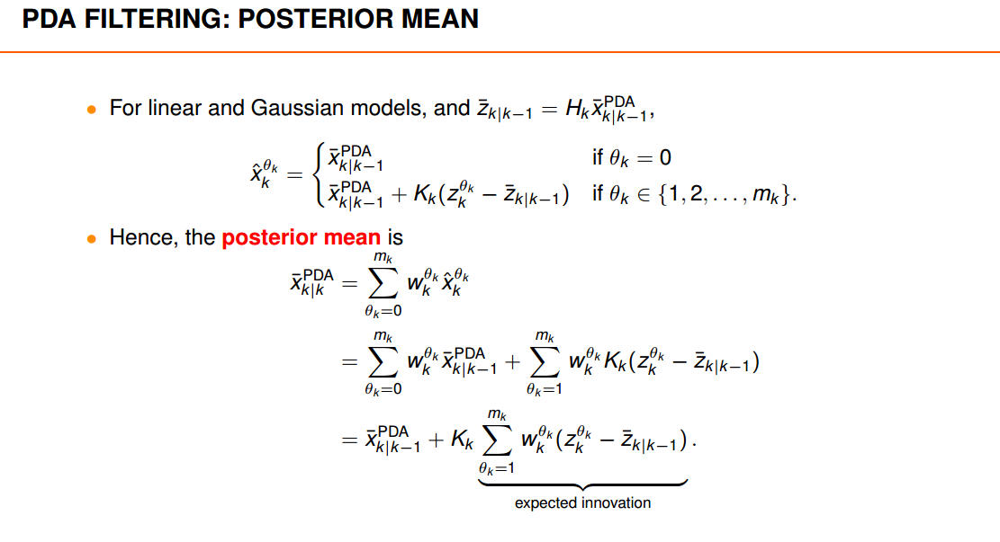
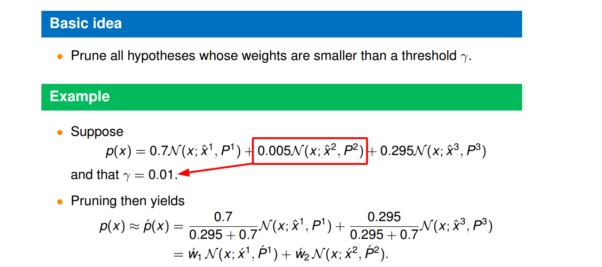
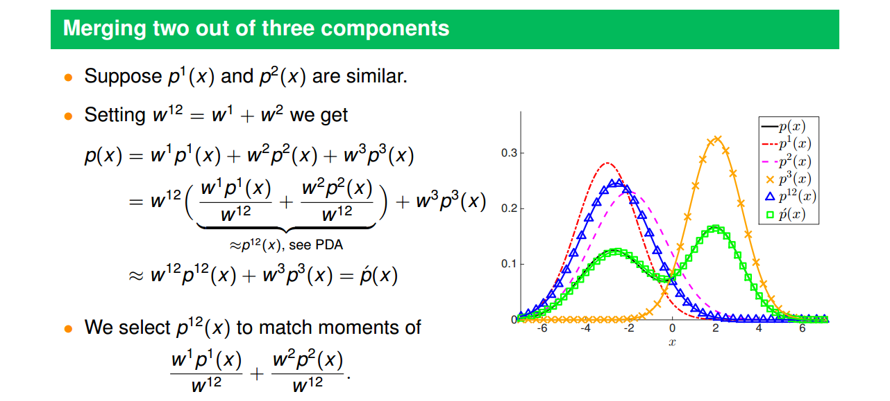
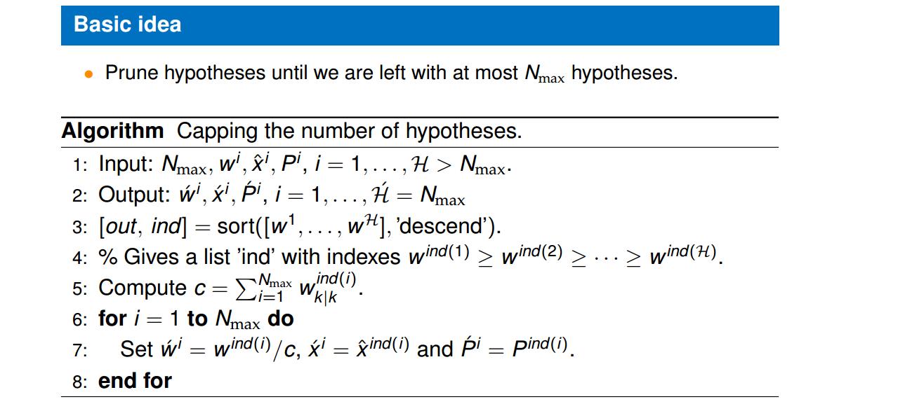

<!--
 * @Author: CharlesHAO hcheng1005@gmail.com
 * @Date: 2024-03-06 20:33:31
 * @LastEditors: CharlesHAO hcheng1005@gmail.com
 * @LastEditTime: 2024-03-06 20:59:26
 * @FilePath: \about_Radar\数据处理篇\目标跟踪篇\目标跟踪基础知识\卡尔曼系列\code\MOT\HA01_Note.md
 * @Description: 这是默认设置,请设置`customMade`, 打开koroFileHeader查看配置 进行设置: https://github.com/OBKoro1/koro1FileHeader/wiki/%E9%85%8D%E7%BD%AE
-->
# Single-Object Tracking in Clutter

[lecture](./lecture/Section%202%20Single-Object%20Tracking%20in%20Clutter/L2_handout_20190429.pdf)

---

> 高斯、线性模型

## Nearest neighbour filtering
>  **Basic idea: Prune all hypotheses except the most probable one**

## Probabilistic data association filtering
> **各meas加权**

## Gaussian sum filtering
> **Basic idea: approximate the posterior as a Gaussian mixture with a few components.**

### Pruning 
> **剪枝： 删除小于给定阈值的假设分支。**

### Merging
> **合并相似的假设分支。**

### Capping
> **只保留前N个最大假设分支。**

### Summary
> **以上几个步骤都是为了控制假设分支的数量。**

### Code
**Gaussian sum filtering算法比较经典，其中涉及到的假设合并、删除在后续其他算法中均有涉及，这部分代码应该熟读理解。**

1、[hypothesisReduction](./HA01/hypothesisReduction.m)

2、[Merging](./HA01/GaussianDensity.m)