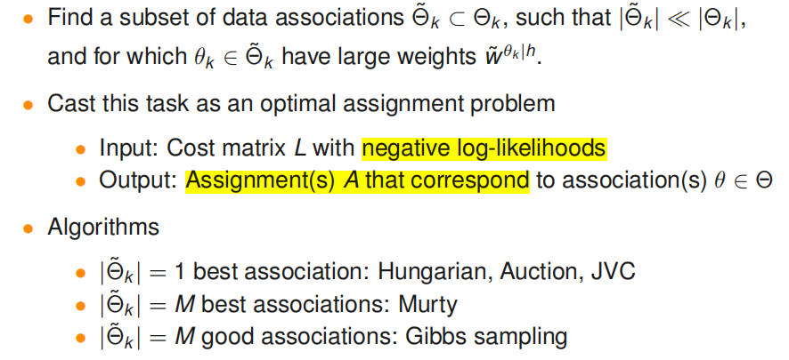
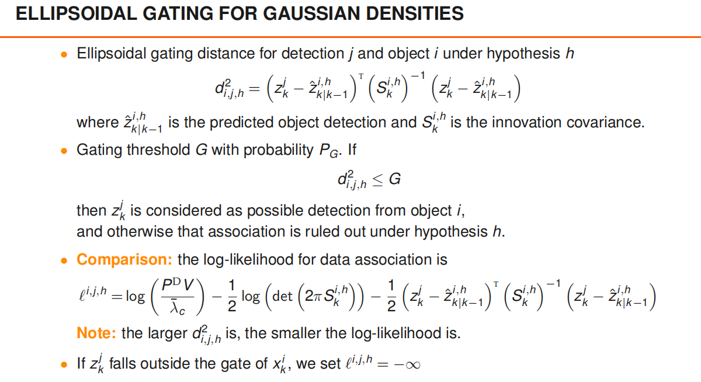
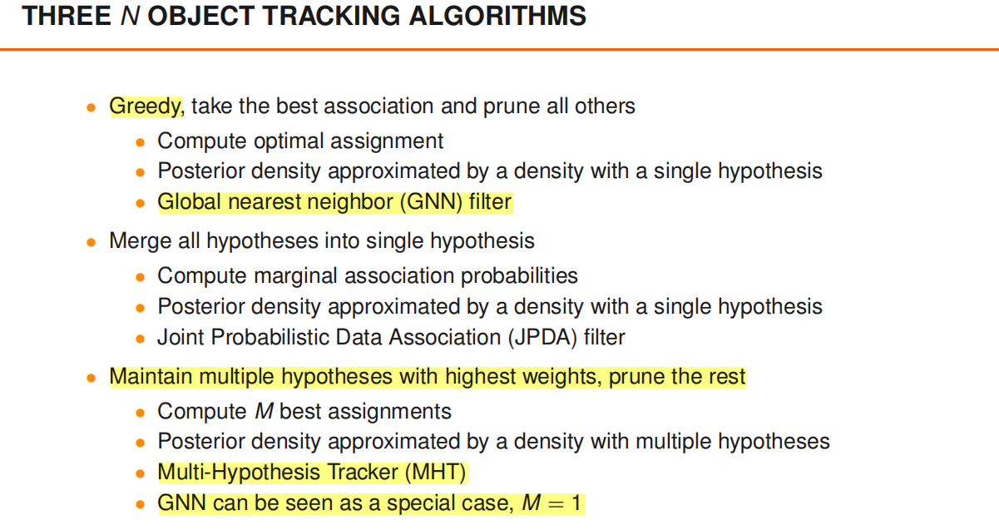

# Tracking n objects in clutter

[lecture](./lecture/Section%202%20Single-Object%20Tracking%20in%20Clutter/L2_handout_20190429.pdf)

---

## 背景知识

[[贪心分配] | [匈牙利分配] | [M-Best]](../../分配算法/assign_demo.cpp)

## GNN

## JPDA

## MHT