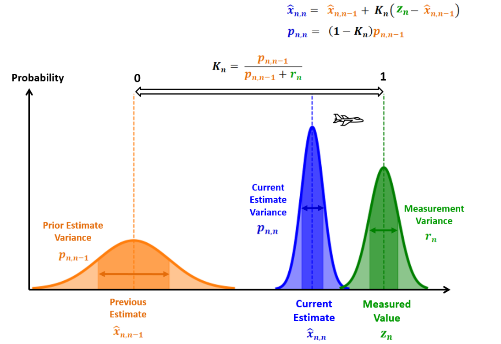
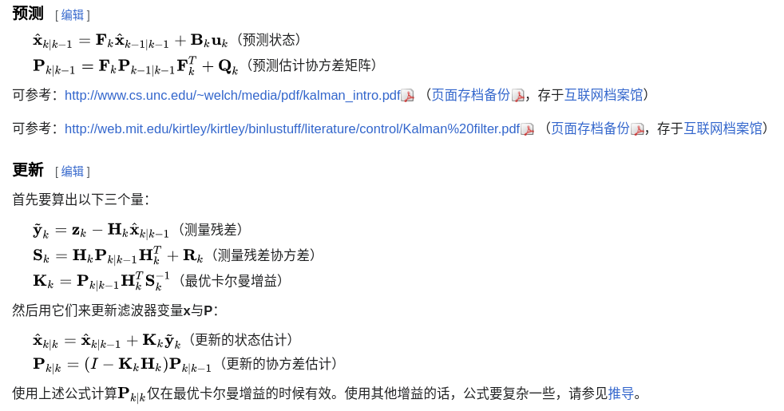
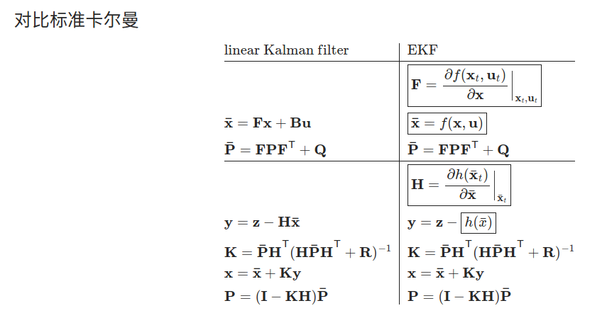
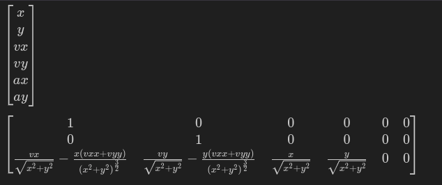
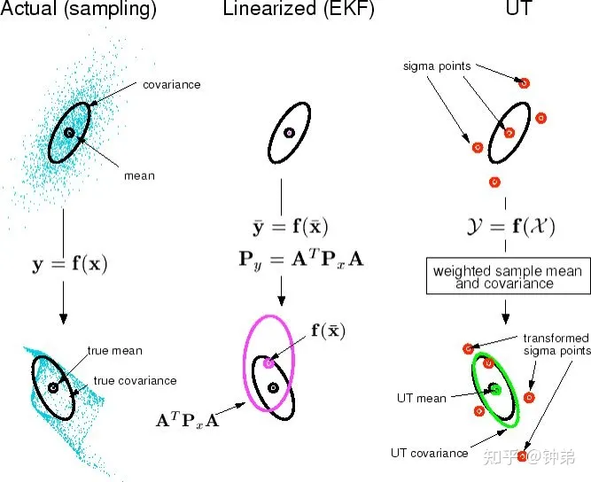

## 卡尔曼系列

<div align=center>

</div>


### 标准卡尔曼

**五步经典公式**

<div align=center>

</div>

---

### EKF

> 运动矩阵或观测矩阵的雅可比矩阵求解

<div align=center>

</div>

---

求解雅可比矩阵代码：

```python
import sympy
from IPython.display import display
sympy.init_printing(use_latex='mathjax')

x, y, vx, vy, ax, ay = sympy.symbols('x, y, vx, vy, ax, ay')

H = sympy.Matrix([x, y, (x*vx+y*vy) / sympy.sqrt(x**2 + y**2)])

state = sympy.Matrix([x, y, vx, vy, ax, ay])
J = H.jacobian(state) # 求解雅克比矩阵

display(state)
display(J)
```

<div align=center>

</div>

**扩展：**[常见的运动模型及其雅可比矩阵](./运动模型.md)

---

### UKF
参考： [paper](./file/Lecture-9-EKF-UKF.pdf)

<div align=center>

</div>


### 粒子滤波
[粒子滤波算法笔记(一):算法概述](https://zhi-ang.github.io/2019/08/13/pf/)

---

### 参考资料

[卡尔曼滤波](https://www.kalmanfilter.net/CN/kalman1d_cn.html)

[卡尔曼滤波算法(with python code)](https://yunyang1994.gitee.io/2021/07/10/%E5%8D%A1%E5%B0%94%E6%9B%BC%E6%BB%A4%E6%B3%A2%E7%AE%97%E6%B3%95-%E6%B0%B8%E8%BF%9C%E6%BB%B4%E7%A5%9E/)

[Interacting Multiple Models(IMM) for Prediction](https://note.yongcong.wang/Self-Driving/Prediction/imm-for-prediction/#interacting-multiple-model)

[SLAM中的EKF，UKF，PF原理简介](https://www.cnblogs.com/gaoxiang12/p/5560360.html)


### 参考代码
- [Multidimensional Kalman-Filter (Python)](https://github.com/balzer82/Kalman/tree/master)

- [Kalman and Bayesian Filters in Python](https://github.com/rlabbe/Kalman-and-Bayesian-Filters-in-Python)

- [Kalman Filter Library](https://github.com/mherb/kalman/tree/master)
    > This is a header-only C++11 library implementing common variants of the well-known Kalman-Filter. 
    > Currently implementations of these filter variants are included: 
    > - Extended Kalman Filter (**EKF**)
    > - Square Root Extended Kalman Filter (**SR-EKF**)
    > - Unscented Kalman Filter (**UKF**)
    > - Square Root Unscented Kalman Filter (**SR-UKF**)

- [PythonRobotics](https://github.com/AtsushiSakai/PythonRobotics)
    > **机器人的集成大仓库**
    > https://atsushisakai.github.io/PythonRobotics/index.html

### 其他

[卡尔曼滤波(Kalman filter) 含详细数学推导](https://zhuanlan.zhihu.com/p/134595781)
  
[卡尔曼滤波最完整公式推导](https://zhuanlan.zhihu.com/p/341440139)
  
[卡尔曼是最小均方差估计吗](https://blog.csdn.net/sinat_16643223/article/details/106296843)
  
[非线性系统通过雅克比矩阵线性化的过程如何的实现？](https://www.zhihu.com/question/62144735)

[非线性模型线性化的意义是什么?](https://www.zhihu.com/question/269604284)

