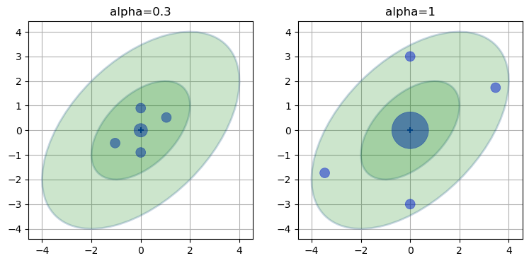
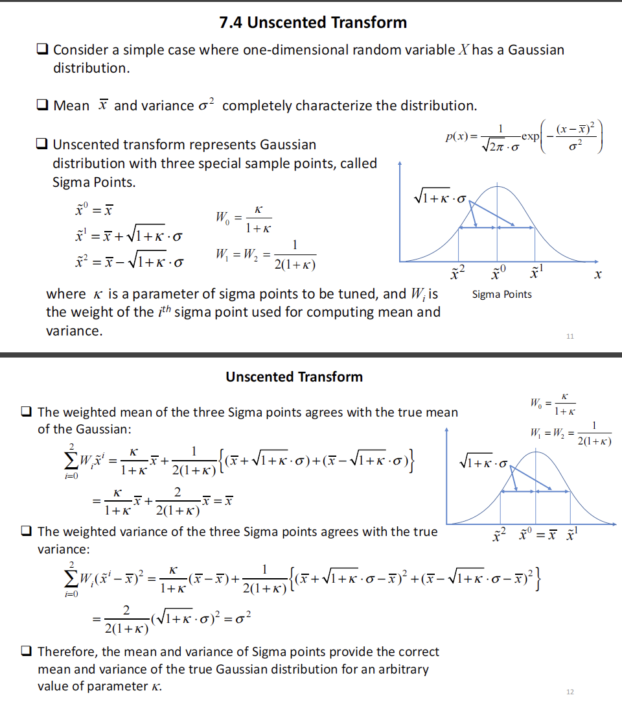
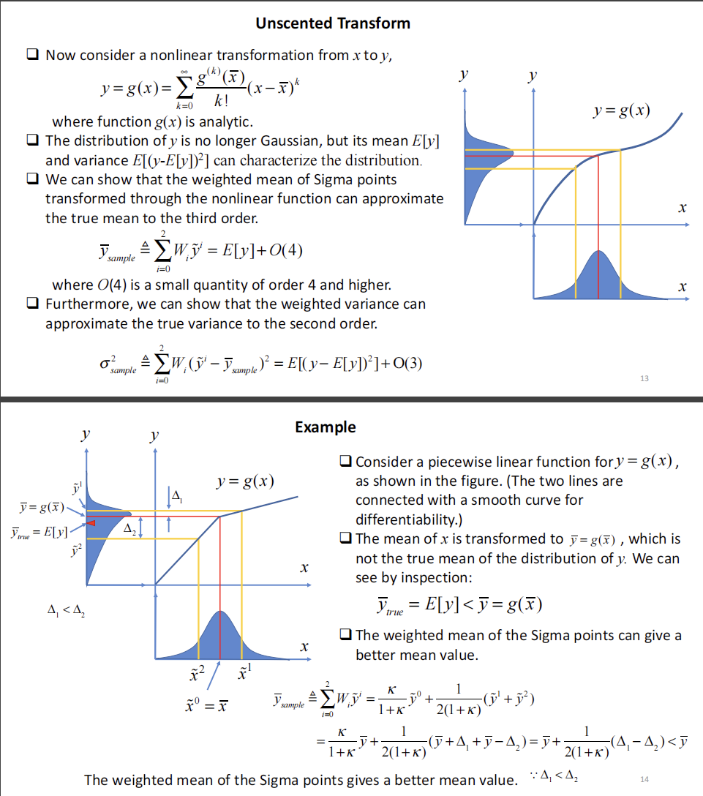
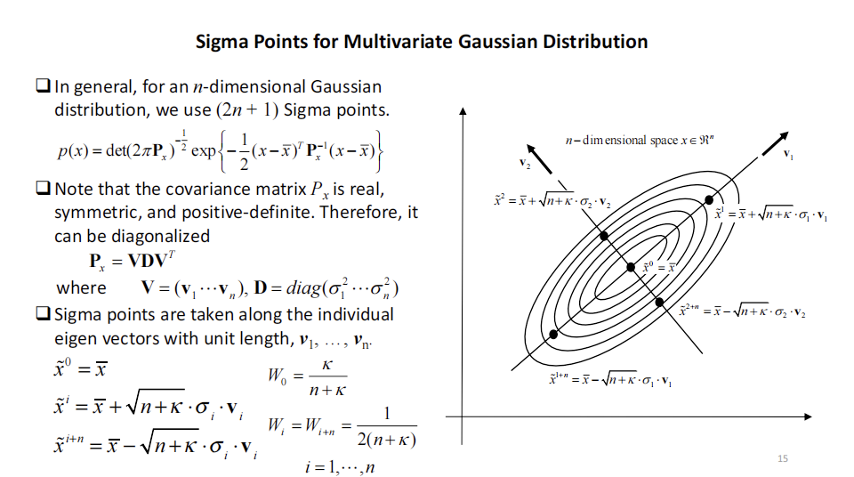
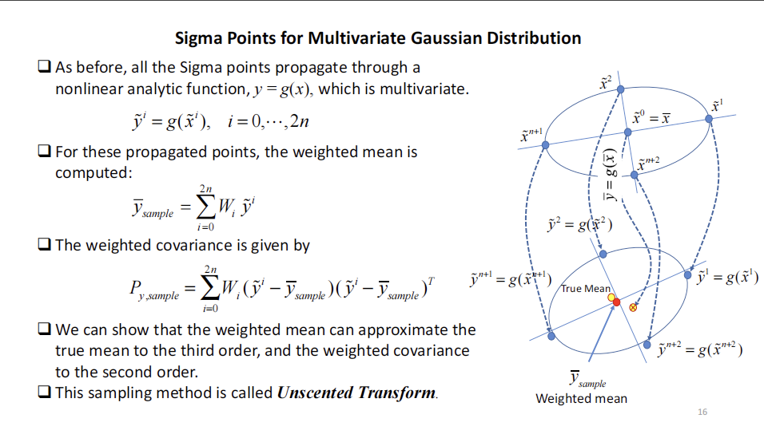

<!--
 * @Author: charles hcheng1005@gmail.com
 * @Date: 2023-03-15 22:07:10
 * @LastEditors: CharlesHAO hao.cheng@wuzheng.com
 * @LastEditTime: 2024-03-05 17:03:42
 * @FilePath: /about_Radar/数据处理篇/目标跟踪篇/目标跟踪基础知识/卡尔曼系列/UKF参数.md
 * @Description: 这是默认设置,请设置`customMade`, 打开koroFileHeader查看配置 进行设置: https://github.com/OBKoro1/koro1FileHeader/wiki/%E9%85%8D%E7%BD%AE
-->
# UKF参数篇

- [sigma-point](#sigma-point)
- [回顾sigma-point计算](#回顾sigma-point计算)
- [回顾权重计算](#回顾权重计算)

---

首先回顾下UKF滤波器

$$\begin{array}{l|l}
\textrm{Kalman Filter} & \textrm{Unscented Kalman Filter} \\
\hline 
& \boldsymbol{\mathcal Y} = f(\boldsymbol\chi) \\
\mathbf{\bar x} = \mathbf{Fx} & 
\mathbf{\bar x} = \sum w^m\boldsymbol{\mathcal Y}  \\
\mathbf{\bar P} = \mathbf{FPF}^\mathsf T+\mathbf Q  & 
\mathbf{\bar P} = \sum w^c({\boldsymbol{\mathcal Y} - \mathbf{\bar x})(\boldsymbol{\mathcal Y} - \mathbf{\bar x})^\mathsf T}+\mathbf Q \\
\hline 
& \boldsymbol{\mathcal Z} =  h(\boldsymbol{\mathcal{Y}}) \\
& \boldsymbol\mu_z = \sum w^m\boldsymbol{\mathcal{Z}} \\
\mathbf y = \mathbf z - \mathbf{Hx} &
\mathbf y = \mathbf z - \boldsymbol\mu_z \\
\mathbf S = \mathbf{H\bar PH}^\mathsf{T} + \mathbf R & 
\mathbf P_z = \sum w^c{(\boldsymbol{\mathcal Z}-\boldsymbol\mu_z)(\boldsymbol{\mathcal{Z}}-\boldsymbol\mu_z)^\mathsf{T}} + \mathbf R \\ 
\mathbf K = \mathbf{\bar PH}^\mathsf T \mathbf S^{-1} &
\mathbf K = \left[\sum w^c(\boldsymbol{\mathcal Y}-\bar{\mathbf x})(\boldsymbol{\mathcal{Z}}-\boldsymbol\mu_z)^\mathsf{T}\right] \mathbf P_z^{-1} \\
\mathbf x = \mathbf{\bar x} + \mathbf{Ky} & \mathbf x = \mathbf{\bar x} + \mathbf{Ky}\\
\mathbf P = (\mathbf{I}-\mathbf{KH})\mathbf{\bar P} & \mathbf P = \bar{\mathbf P} - \mathbf{KP_z}\mathbf{K}^\mathsf{T}
\end{array}$$

## sigma-point

> We can see that the sigma points lie between the first and second standard deviation, and that `the larger $\alpha$ spreads the points out`. Furthermore, `the larger $\alpha$ weights the mean (center point) higher than the smaller $\alpha$,` and weights the rest less. This should fit our intuition - the further a point is from the mean the less we should weight it. We don't know how these weights and sigma points are selected yet, but the choices look reasonable. 

**上述传达两个信息：**
- $\alpha$越大，点分散的越开
- 分散的越开，均值（中心点）的权重就越大

---

## 回顾sigma-point计算

$$
\begin{cases}
\mathcal{X}_0 = \mu \\
\mathcal{X}_i = \mu +  \left[\sqrt{(n+\lambda)\Sigma} \right]_i, & \texttt{for i=1..n} \\
\mathcal{X}_i = \mu - \left[\sqrt{(n+\lambda)\Sigma}\right]_{i-n} & \texttt{for i=(n+1)..2n}
\end{cases}
$$

其中 $\lambda = \alpha^2(n+\kappa)-n$

## 回顾权重计算
$$
\begin{aligned}
\lambda&=\alpha^2(n+\kappa)-n \\ 
W^m_0 &= \frac{\lambda}{n+\lambda} \\
W^c_0 &= \frac{\lambda}{n+\lambda} + 1 -\alpha^2 + \beta \\
W^m_i = W^c_i &= \frac{1}{2(n+\lambda)}\;\;\;i=1..2n
\end{aligned}
$$

> Now let's look at the change in the weights. When we have $k+n=3$ the weights were 0.6667 for the mean, and 0.1667 for the two outlying sigma points. On the other hand, when $\alpha=200$ the mean weight shot up to 0.99999 and the outlier weights were set to 0.000004. Recall the equations for the weights:

$$\begin{aligned}
W_0 &= \frac{\lambda}{n+\lambda} \\
W_i &= \frac{1}{2(n+\lambda)}
\end{aligned}$$

> We can see `that as $\lambda$ gets larger the fraction for the weight of the mean ($\lambda/(n+\lambda)$) approaches 1, and the fraction for the weights of the rest of the sigma points approaches 0.` This is invariant on the size of your covariance. So as we sample further and further away from the mean we end up giving less weight to those samples, and if we sampled very close to the mean we'd give very similar weights to all.

> However, the advice that Van der Merwe gives is to constrain $\alpha$ in the range $0 \gt \alpha \ge 1$. He suggests $10^{-3}$ as a good value. Let's try that.

# 参考链接
- [Kalman-and-Bayesian-Filters-in-Python/10-Unscented-Kalman-Filter.ipynb](https://github.com/rlabbe/Kalman-and-Bayesian-Filters-in-Python/blob/master/10-Unscented-Kalman-Filter.ipynb)

- [Kalman-and-Bayesian-Filters-in-Python](https://github.com/rlabbe/Kalman-and-Bayesian-Filters-in-Python)

# 附录

