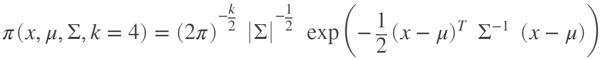

# Analyse Single-Object Tracking in Clutter Code 

- [nearestNeighbourFilter](#nearestneighbourfilter)
  - [流程](#流程)
    - [**Step1：椭圆门限筛选**](#step1椭圆门限筛选)
    - [**Step2：计算量测似然**](#step2计算量测似然)
    - [**Step3：状态更新**](#step3状态更新)
  - [完整代码](#完整代码)
- [probDataAssocFilter](#probdataassocfilter)
  - [流程](#流程-1)
    - [**Step1：椭圆门限筛选**](#step1椭圆门限筛选-1)
    - [**Step2：计算量测似然并计算权重**](#step2计算量测似然并计算权重)
    - [**Step3：假设剪枝**](#step3假设剪枝)
- [GaussianSumFilter](#gaussiansumfilter)

---

## nearestNeighbourFilter

### 流程

从所有落入门限的量测中，选择**似然最大**的作为最终更新状态的量测。

#### **Step1：椭圆门限筛选**

```matlab
diag( (zk-z)'*inv(S)*(zk-z)) < gating_size % 计算马氏距离
```

#### **Step2：计算量测似然**

[参考:Why do we need to work with the logarithm of the mathematical objective functions?](https://www.cdslab.org/paramonte/notes/examples/matlab/mlx/working_with_logarithm_of_objective_function.html)

标准的量测似然如下：

<div align=center>

</div>

如此计算会存在很大或很小的数值，因此工程上一般采用log(mvn)的方式计算：

```matlab
NDIM = 4;  % the number of dimensions of the domain of the objective function
MEAN = [-10; 15.; 20.; 0.0]; % This is the mean of the multivariate normal (MVN) distribution. THIS IS A COLUMN VECTOR.
COVMAT = [ 1.0,.45,-.3,0.0 ... 
         ; .45,1.0,0.3,-.2 ...
         ; -.3,0.3,1.0,0.6 ...
         ; 0.0,-.2,0.6,1.0 ...
         ]; % This is the covariance matrix of the MVN distribution.
INVCOV = inv(COVMAT); % This is the inverse of the covariance matrix of the MVN distribution.
MVN_COEF = NDIM * log( 1. / sqrt(2.*pi) ) + log( sqrt(det(INVCOV)) ); % This is the log of the coefficient used in the definition of the MVN.
getLogFuncStandard = @(point) MVN_COEF - 0.5 * ( dot((MEAN-point)', INVCOV * (MEAN-point)) ); % return the logarithm of the objective function: log(MVN)
```

#### **Step3：状态更新**

选择最大似然的量测-->卡尔曼状态更新。


### 完整代码
 <details> <summary>View Code</summary>

``` matlab
        function [estimates_x, estimates_P] = nearestNeighbourFilter(obj, state, Z, sensormodel, motionmodel, measmodel)
            %NEARESTNEIGHBOURFILTER tracks a single object using nearest
            %neighbor association 
            %INPUT: state: a structure with two fields:
            %                x: object initial state mean --- (object state
            %                dimension) x 1 vector 
            %                P: object initial state covariance --- (object
            %                state dimension) x (object state dimension)
            %                matrix  
            %       Z: cell array of size (total tracking time, 1), each
            %       cell stores measurements of  
            %            size (measurement dimension) x (number of
            %            measurements at corresponding time step) 
            %OUTPUT:estimates: cell array of size (total tracking time, 1),
            %       each cell stores estimated object state of size (object
            %       state dimension) x 1   
            
            N = numel(Z);
            
            % allocate memory
            estimates_x = cell(N,1);
            estimates_P = cell(N,1);
            
            % first predicted state is the prior distribution
            state_pred = state;
            
            % this N meas total steps, not meas number!
            for i=1:N
                z = Z{i};
                % Apply gating
                [z_ingate, ~] = obj.density.ellipsoidalGating(state_pred, z, measmodel, obj.gating.size);
                
                % number of hypothesis
                mk = size(z_ingate,2) + 1;
                
                % calculate predicted likelihood = N(z; zbar, S) => scalar value
                predicted_likelihood = exp(obj.density.predictedLikelihood(state_pred,z_ingate,measmodel));
                
                % EVALUATE HYPOTHESIS
                % detection
                w_theta_k = sensormodel.P_D * predicted_likelihood / sensormodel.intensity_c;
                % missdetection
                w_theta_0 = 1 - sensormodel.P_D;
                
                % UPDATE
                [max_w_theta, max_theta] = max(w_theta_k);
                if mk==1 || w_theta_0 > max_w_theta
                    state_upd = state_pred;
                else
                    z_NN = z_ingate(:,max_theta);    % nearest neighbour measurement
                    state_upd = obj.density.update(state_pred, z_NN, measmodel);
                end
                
                % ESTIMATES
                estimates_x{i} = state_upd.x;
                estimates_P{i} = state_upd.P;
                
                % PREDICTION
                state_pred = obj.density.predict(state_upd, motionmodel);
            end
        end
```

</details>


## probDataAssocFilter

### 流程

PDA算法不同与最近邻法，它假设落入门限(gate)的量测均有可能是真实量测（前提：每次只有一个真实量测，其余为杂波），然后计算各个量测的权重，加权得到最终的状态估计。

#### **Step1：椭圆门限筛选**

```matlab
diag( (zk-z)'*inv(S)*(zk-z)) < gating_size % 计算马氏距离
```

#### **Step2：计算量测似然并计算权重**

第一步同样是计算每个量测似然，第二步需额外计算每个量测的权重(weight)，另外，还需要假设本次所有量测均为杂波，也就是未关联到量测的情况。

```matlab
% Update
for i_old = 1:mk_old
    % for each hypothesis, perform ellipsoidal gating and only 
    % create object detection hypotheses for detections inside the gate;
    [z_ingate, ~] = obj.density.ellipsoidalGating(p_old(i_old), z, measmodel, obj.gating.size);
    mk_new = size(z_ingate,2) + 1;
    for i_new = 1:mk_new-1
        pred_likelihood_log = obj.density.predictedLikelihood(p_old(i_old),z_ingate(:,i_new),measmodel); % 计算量测似然
        w_new(end+1,1) = w_old(i_old) + pred_likelihood_log + log(sensormodel.P_D/sensormodel.intensity_c); % 计算量测权重
        p_new(end+1,1) = obj.density.update(p_old(i_old), z_ingate(:,i_new), measmodel); % 使用该量测更新状态估计以及状态协方差
    end
    % for each hypothesis, create missed detection hypothesis;
    w_new(end+1,1) = w_old(i_old) + log(1 - sensormodel.P_D); % 非关联到量测的假设
    p_new(end+1,1) = p_old(i_old);
end
```

#### **Step3：假设剪枝**

1. 权重归一化
2. 删除低权重假设
3. 合并相似假设
   1. 计算两假设之间相似度
       ```matlab
        for i = I
            temp = states(i).x-states(j).x;
            val = diag(temp.'*(states(j).P\temp)); % 相似度计算
            %Find other similar components in the sense of small
            %Mahalanobis distance 
            if val < threshold
                Ij= [ Ij i ];
            end
        end
       ```
   2. 状态和协方差合并
      ```matlab
        state.x = 0;
        for i=1:mk
            state.x = state.x + w(i).*states(i).x; % 状态和并
        end

        state.P = zeros(dim);
        for i=1:mk
            state.P = state.P + w(i).*states(i).P + w(i) * (state.x-states(i).x) * (state.x-states(i).x)'; % 协方差合并
        end
      ```
4. 保留前N个最大假设


## GaussianSumFilter