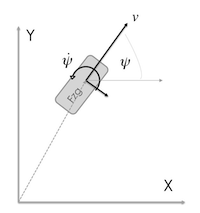

# 运动模型汇总

- [CV](#cv)
  - [Motion State](#motion-state)
  - [Observation Model](#observation-model)
  - [Process Noise Q](#process-noise-q)
- [CA](#ca)
  - [Motion State](#motion-state-1)
  - [Update](#update)
- [CTRV](#ctrv)
  - [Motion State](#motion-state-2)
  - [运动雅可比矩阵](#运动雅可比矩阵)
- [CTRA](#ctra)
  - [Motion State](#motion-state-3)
  - [Update](#update-1)
- [如何计算雅可比矩阵](#如何计算雅可比矩阵)


## CV
> Constant Velocity Model for Ego Motion

### Motion State
$$x_k=  \begin{bmatrix}  x \\ y \\ \dot x \\ \dot y \end{bmatrix} = \begin{bmatrix} \text{Position X} \\ \text{Position Y} \\ \text{Velocity in X} \\ \text{Velocity in Y}\end{bmatrix}$$

Formal Definition (Motion of Law):

$$x_{k+1} = \textbf{A} \cdot x_{k}$$

which is

$$x_{k+1} = \begin{bmatrix}1 & 0 & \Delta t & 0 \\ 0 & 1 & 0 & \Delta t \\ 0 & 0 & 1 & 0 \\ 0 & 0 & 0 & 1 \end{bmatrix} \cdot \begin{bmatrix} x \\ y \\ \dot x \\ \dot y \end{bmatrix}_{k}$$

### Observation Model

$$y = \textbf{H} \cdot x$$

which is
$$y = \begin{bmatrix}0 & 0 & 1 & 0 \\ 0 & 0 & 0 & 1 \end{bmatrix} \cdot x $$
means: You observe the velocity directly in the correct unit

### Process Noise Q

$$
\left[\begin{matrix}\frac{\Delta t^{6}}{36} & \frac{\Delta t^{5}}{12} & \frac{\Delta t^{4}}{6}\\\frac{\Delta t^{5}}{12} & \frac{\Delta t^{4}}{4} & \frac{\Delta t^{3}}{2}\\\frac{\Delta t^{4}}{6} & \frac{\Delta t^{3}}{2} & \Delta t^{2}\end{matrix}\right]
$$


## CA 

### Motion State
Formal Definition:

$$x_{k+1} = A \cdot x_{k} + B \cdot u$$

Hence, we have no control input $u$:

### Update

$$x_{k+1} = \begin{bmatrix}1 & 0 & \Delta t & 0 & \frac{1}{2}\Delta t^2 & 0 \\ 0 & 1 & 0 & \Delta t & 0 & \frac{1}{2}\Delta t^2 \\ 0 & 0 & 1 & 0 & \Delta t & 0 \\ 0 & 0 & 0 & 1 & 0 & \Delta t \\ 0 & 0 & 0 & 0 & 1 & 0  \\ 0 & 0 & 0 & 0 & 0 & 1\end{bmatrix} \cdot \begin{bmatrix} x \\ y \\ \dot x \\ \dot y \\ \ddot x \\ \ddot y\end{bmatrix}_{k}$$

$$y = H \cdot x$$

Just the acceleration ($\ddot x$ & $\ddot y$) is measured.

$$y = \begin{bmatrix}0 & 0 & 0 & 0 & 1 & 0 \\ 0 & 0 & 0 & 0 & 0 & 1\end{bmatrix} \cdot x$$

## CTRV
<div align=center>

</div>

### Motion State
$$x_k= \begin{bmatrix}  x \\ y \\ \psi \\ v \\ \dot\psi \end{bmatrix}  = \begin{bmatrix} \text{Position X} \\ \text{Position Y} \\ \text{Heading} \\ \text{Velocity} \\ \text{Yaw Rate} \end{bmatrix} $$

状态更新：

$$ x_{k+1}=\left[\begin{matrix}x + \frac{v \left(- \sin{\left(\psi \right)} + \sin{\left(T \dot\psi + \psi \right)}\right)}{\dot\psi}\\y + \frac{v \left(\cos{\left(\psi \right)} - \cos{\left(T \dot\psi + \psi \right)}\right)}{\dot\psi}\\T \dot\psi + \psi\\v\\\dot\psi\end{matrix}\right] $$

### 运动雅可比矩阵

$$ 
\left[\begin{matrix}1 & 0 & \frac{v \left(- \cos{\left(\psi \right)} + \cos{\left(T \dot\psi + \psi \right)}\right)}{\dot\psi} & \frac{- \sin{\left(\psi \right)} + \sin{\left(T \dot\psi + \psi \right)}}{\dot\psi} & \frac{T v \cos{\left(T \dot\psi + \psi \right)}}{\dot\psi} - \frac{v \left(- \sin{\left(\psi \right)} + \sin{\left(T \dot\psi + \psi \right)}\right)}{\dot\psi^{2}}\\0 & 1 & \frac{v \left(- \sin{\left(\psi \right)} + \sin{\left(T \dot\psi + \psi \right)}\right)}{\dot\psi} & \frac{\cos{\left(\psi \right)} - \cos{\left(T \dot\psi + \psi \right)}}{\dot\psi} & \frac{T v \sin{\left(T \dot\psi + \psi \right)}}{\dot\psi} - \frac{v \left(\cos{\left(\psi \right)} - \cos{\left(T \dot\psi + \psi \right)}\right)}{\dot\psi^{2}}\\0 & 0 & 1 & 0 & T\\0 & 0 & 0 & 1 & 0\\0 & 0 & 0 & 0 & 1\end{matrix}\right]
$$

## CTRA
### Motion State

$$ 
x_k= \begin{bmatrix} x \\ y \\ \psi \\ v \\ \dot\psi \\ a \end{bmatrix}  =  \begin{bmatrix} \text{Position X} \\ \text{Position Y} \\ \text{Heading} \\ \text{Velocity} \\ \text{Yaw Rate} \\ \text{longitudinal acceleration} \end{bmatrix} 
$$

### Update
$$
\left[\begin{matrix}x + \frac{- \dot\psi v \sin{\left(\psi \right)} - a \cos{\left(\psi \right)} + a \cos{\left(T \dot\psi + \psi \right)} + \left(T \dot\psi a + \dot\psi v\right) \sin{\left(T \dot\psi + \psi \right)}}{\dot\psi^{2}}\\y + \frac{\dot\psi v \cos{\left(\psi \right)} - a \sin{\left(\psi \right)} + a \sin{\left(T \dot\psi + \psi \right)} + \left(- T \dot\psi a - \dot\psi v\right) \cos{\left(T \dot\psi + \psi \right)}}{\dot\psi^{2}}\\T \dot\psi + \psi\\T a + v\\\dot\psi\\a\end{matrix}\right]
$$

$$
\left[\begin{matrix}1 & 0 & \frac{- \dot\psi v \cos{\left(\psi \right)} + a \sin{\left(\psi \right)} - a \sin{\left(T \dot\psi + \psi \right)} + \left(T \dot\psi a + \dot\psi v\right) \cos{\left(T \dot\psi + \psi \right)}}{\dot\psi^{2}} & \frac{- \dot\psi \sin{\left(\psi \right)} + \dot\psi \sin{\left(T \dot\psi + \psi \right)}}{\dot\psi^{2}} & \frac{- T a \sin{\left(T \dot\psi + \psi \right)} + T \left(T \dot\psi a + \dot\psi v\right) \cos{\left(T \dot\psi + \psi \right)} - v \sin{\left(\psi \right)} + \left(T a + v\right) \sin{\left(T \dot\psi + \psi \right)}}{\dot\psi^{2}} - \frac{2 \left(- \dot\psi v \sin{\left(\psi \right)} - a \cos{\left(\psi \right)} + a \cos{\left(T \dot\psi + \psi \right)} + \left(T \dot\psi a + \dot\psi v\right) \sin{\left(T \dot\psi + \psi \right)}\right)}{\dot\psi^{3}} & \frac{T \dot\psi \sin{\left(T \dot\psi + \psi \right)} - \cos{\left(\psi \right)} + \cos{\left(T \dot\psi + \psi \right)}}{\dot\psi^{2}}\\0 & 1 & \frac{- \dot\psi v \sin{\left(\psi \right)} - a \cos{\left(\psi \right)} + a \cos{\left(T \dot\psi + \psi \right)} - \left(- T \dot\psi a - \dot\psi v\right) \sin{\left(T \dot\psi + \psi \right)}}{\dot\psi^{2}} & \frac{\dot\psi \cos{\left(\psi \right)} - \dot\psi \cos{\left(T \dot\psi + \psi \right)}}{\dot\psi^{2}} & \frac{T a \cos{\left(T \dot\psi + \psi \right)} - T \left(- T \dot\psi a - \dot\psi v\right) \sin{\left(T \dot\psi + \psi \right)} + v \cos{\left(\psi \right)} + \left(- T a - v\right) \cos{\left(T \dot\psi + \psi \right)}}{\dot\psi^{2}} - \frac{2 \left(\dot\psi v \cos{\left(\psi \right)} - a \sin{\left(\psi \right)} + a \sin{\left(T \dot\psi + \psi \right)} + \left(- T \dot\psi a - \dot\psi v\right) \cos{\left(T \dot\psi + \psi \right)}\right)}{\dot\psi^{3}} & \frac{- T \dot\psi \cos{\left(T \dot\psi + \psi \right)} - \sin{\left(\psi \right)} + \sin{\left(T \dot\psi + \psi \right)}}{\dot\psi^{2}}\\0 & 0 & 1 & 0 & T & 0\\0 & 0 & 0 & 1 & 0 & T\\0 & 0 & 0 & 0 & 1 & 0\\0 & 0 & 0 & 0 & 0 & 1\end{matrix}\right]
$$

## 如何计算雅可比矩阵
```python
import sympy
from IPython.display import display
sympy.init_printing(use_latex='mathjax')

x, y, vx, vy, ax, ay = sympy.symbols('x, y, vx, vy, ax, ay')

H = sympy.Matrix([x, y, (x*vx+y*vy) / sympy.sqrt(x**2 + y**2)])

state = sympy.Matrix([x, y, vx, vy, ax, ay])
J = H.jacobian(state)

display(state)
display(J)
```