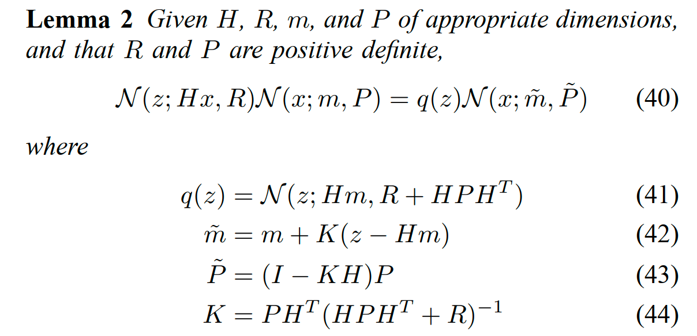

# GMPHD -- The Gaussian Mixture Probability Hypothesis Density Filter

- [什么是混合高斯分布](#什么是混合高斯分布)
- [GMPHD总览](#gmphd总览)
  - [概率密度预测](#概率密度预测)
  - [概率密度更新](#概率密度更新)
  - [两个定理](#两个定理)
    - [Lemma 1: 高斯分布的状态转移](#lemma-1-高斯分布的状态转移)
    - [Lemma 1: 两个多维高斯分布相乘](#lemma-1-两个多维高斯分布相乘)
- [GMPHD算法步骤详解](#gmphd算法步骤详解)
  - [滤波步骤](#滤波步骤)
  - [目标剪枝](#目标剪枝)
- [扩展目标跟踪](#扩展目标跟踪)
- [THE GAUSSIAN INVERSE WISHART PHD FILTER](#the-gaussian-inverse-wishart-phd-filter)
  - [扩展目标状态定义](#扩展目标状态定义)
  - [概率密度定义](#概率密度定义)
  - [状态预测与更新](#状态预测与更新)
- [GGIW](#ggiw)
  - [状态定义](#状态定义)
- [相关内容](#相关内容)
  - [量测分割](#量测分割)
  - [分布](#分布)
- [参考论文](#参考论文)

## 什么是混合高斯分布

$$ P(X_i = x) = \sum_{k=1}^K \pi_kP(X_i=x|Z_i=k) $$

如下面这个例子，就是三个高斯分布混合的分布图：

对于GMPHD来说，就是在有限空间内建模成混合高斯分布，其中有n个大大小小的多维高斯分布（n就是目标个数）

## GMPHD总览

首先看**Gaussian mixture PHD recursion**部分：

### 概率密度预测

式23描述的是k-1时刻的后验概率密度分布，也就是k时刻的先验概率密度分布。

式24描述的是k时刻预测的概率密度分布，其有三个部分组成：

- k-1时刻的目标$v_{s,k|k-1}$
- **k-1时刻的目标的衍生目标$v_{\beta ,k|k-1}$**
- **k时刻的新生目标$\gamma_k$**

### 概率密度更新

后验概率密度分为两部分：
- $(1-P_{D,k})v_{k|k-1}(x)$ 
- $v_{D,k}$

> **NOTE: 关注式34的权重更新算法**

### 两个定理

#### Lemma 1: 高斯分布的状态转移

#### Lemma 1: 两个多维高斯分布相乘

## GMPHD算法步骤详解

**Key Steps of GMPHD**

### 滤波步骤

> 对于新生目标的状态预测分为两个部分：完全新生的目标和已有目标的衍生目标。
---

> 对k-1时刻目标的状态预测。值得注意的是，预测步骤中，除了标准的卡尔曼预测外，还有一个权重预测$w_{k|k-1}=p_{S,k}w^j_{k-1}$.
> 另外，经过三个预测步骤后，当前预测目标个数为已有目标+新生目标+衍生目标
---

> 目标观测状态预测（更新）部分。
> 
> Q1：对于没有关联量测的目标，其权重是否保持不变？
> 
> 20240113: Q1: 权重在这并没有更新，在后续步骤中，通过计算全局量测与目标的似然，更新所有目标的权重
---

> 状态更新步骤。关注其中的权重更新部分。
>
> 执行完该步骤后，目标数量有爆炸性增长：$J_k=lJ_{k|k-1}+J_{k|k-1}$，其中l是量测个数。

什么是$k_k(z)$:

### 目标剪枝

> NOTE: 关注其中的状态、状态协方差合并步骤，以及权重合并部分。

## 扩展目标跟踪

GMPHD的整体设计还是**基于点目标跟踪**，这一点在计算量测与目标似然的时候也能体现。

随着传感器分辨率的提高，基于GMPHD思想的**扩展目标跟踪**已成为新趋势。

## THE GAUSSIAN INVERSE WISHART PHD FILTER

### 扩展目标状态定义

状态定义分成两部分：运动学建模和扩展状态建模。

其中扩展状态描述的是目标的几何信息，比如长宽高属性、朝向角属性等等。

### 概率密度定义

> 对比GMPHD，可以看出EOTPHD的定义上多了扩展模型，也就是红框中的**Inverse Wishart Distribution**。

> [威沙特分布和逆威沙特分布](../../../数学基础/威沙特和逆威沙特分布.md)

### 状态预测与更新

**状态预测：**

运动学部分和GMPHD一致，都是基于卡尔曼体系的滤波过程。这里重点分析下扩展状态的预测与更新。

**状态更新：**

更新分成两个部分（假设）：无量测和有量测状态。

> 权重$w^{(j)}_{k|k}$更新中有一个参数$\gamma$，指的是abbreviate the expected number of measurements for the th GIW component。

目标状态的均值、协方差以及扩展部分的状态如下：

其中：

对于式30中涉及的**似然函数**定义如下：

## GGIW

### 状态定义

## 相关内容

### 量测分割

上述流程中，提到$|W|$是指每一个簇包含的点云个数，并且有n个这样的簇。

这就需要某种算法对k时刻的所有量测（点云）进行聚类、分割处理。

[了解常用聚类算法](https://zhuanlan.zhihu.com/p/104355127)

### 分布
- [Gaussina Distribution](../../../数学基础/gaussian.md)
  
- [Wishart Distribution and Inverse Wishart Distribution ](../../../数学基础/威沙特和逆威沙特分布.md)
  
- [Poisson Distribution](../../../数学基础/Poisson.md)
  
- [Gammma Distribution](https://www.zhangzhenhu.com/glm/source/gamma%E6%A8%A1%E5%9E%8B/content.html#)
  
- [Chi Distribution](../../../数学基础/卡方分布.md)

## 参考论文
- [GMPHD](https://ieeexplore.ieee.org/document/1710358)
  
- [EOT_Random Matrices](https://ieeexplore.ieee.org/document/6266759?denied=)
  
- [GGIW](https://ieeexplore.ieee.org/document/7145439)
  
- [Gamma Gaussian inverse-Wishart Poisson multi-Bernoulli filter for extended target tracking](https://core.ac.uk/download/pdf/74356604.pdf)
  
- [Implementation of the Gamma Gaussian Inverse Wishart Trajectory Probability HypothesisDensity Filter](https://research.chalmers.se/publication/523776/file/523776_Fulltext.pdf)
  
- [Implementation of the GIW-PHD flter](https://www.diva-portal.org/smash/get/diva2:633474/FULLTEXT01.pdf)