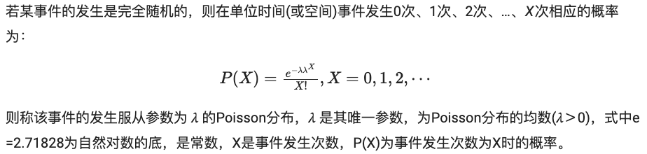

# 泊松分布(Poisson Distribution)

## 定义



```python
import numpy as np
import matplotlib.pyplot as plt

s = np.random.poisson(5, 10000)
count, bins, ignored = plt.hist(s, 14, density=True)
plt.show()
```