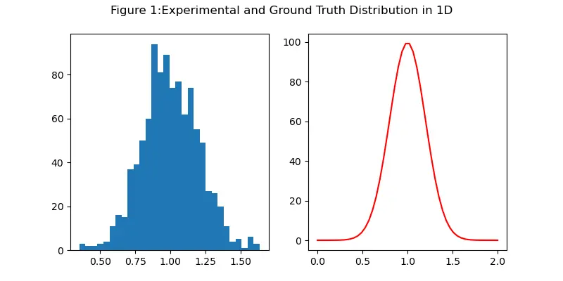
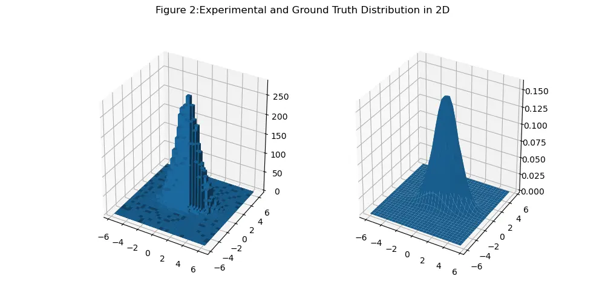
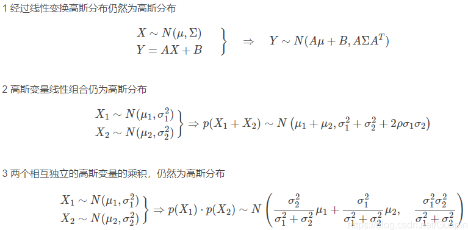
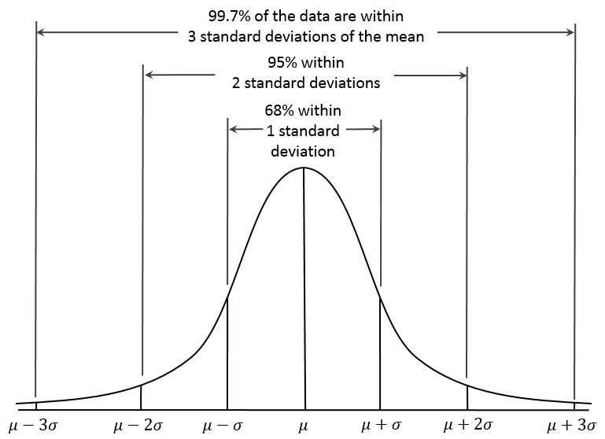
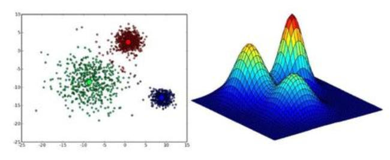

# 高斯分布

- [参考链接](#参考链接)
- [一维高斯分布](#一维高斯分布)
- [多维高斯分布](#多维高斯分布)
- [高斯分布的性质](#高斯分布的性质)
- [高斯分布与置信区间](#高斯分布与置信区间)
- [高斯混合模型](#高斯混合模型)

---

## 参考链接
- [那些你知道的和你不知道的性质(I):从简单的一维高斯分布讲起](https://zhuanlan.zhihu.com/p/24874304)

- [多元高斯分布完全解析](https://zhuanlan.zhihu.com/p/58987388)

- [python](https://datascienceplus.com/understanding-the-covariance-matrix/)

- [高斯混合模型（GMM）推导及实现](https://zhuanlan.zhihu.com/p/85338773)

- [机器学习算法（二十九）：高斯混合模型（Gaussian Mixed Model，GMM）](https://blog.csdn.net/weixin_39910711/article/details/123963434)
---

## 一维高斯分布
<div align=center>

</div>

```python
import numpy as np
import matplotlib.pyplot as plt
# This import registers the 3D projection, but is otherwise unused.
from mpl_toolkits.mplot3d import Axes3D


def gaussian(mu, sigma, X):
    return np.exp(-(X-mu)* (X-mu)/(2*sigma*sigma)) / (sigma*np.sqrt(2*np.pi))

# univariant gaussian distribution
mu = 1
sigma = 0.2
n_samples = 1000
bins = 30
Y_sampled = np.random.normal(mu, sigma, n_samples)
x = np.linspace(0, 2)
Y_truth = 50 * gaussian(mu, sigma, x)

plt.figure(figsize=(8,4))

plt.subplot(1,2,1)
plt.hist(Y_sampled, bins=bins, label='mu:{:0.2f}, sigma:{:0.2f}, bins:{:2d}'.format(mu, sigma, bins))
plt.legend()
plt.subplot(1,2,2)
plt.plot(x, Y_truth, 'r', label='mu:{:0.2f}, sigma:{:0.2f}'.format(mu, sigma))
plt.legend()
plt.suptitle('Figure 1:Sampled and Ground Truth Distribution in 1D')
```

<div align=center>

</div>


## 多维高斯分布

<div align=center>

</div>


```python
def multivariate_gaussian(mu, sigma, X):
    d = mu.shape[0]
    sigma_det = np.linalg.det(sigma)
    sigma_inv = np.linalg.inv(sigma)
    D = np.sqrt((2 * np.pi)**d * sigma_det)

    # This einsum call calculates (x-mu)T.sigma-1.(x-mu) in a vectorized
    # way across all the input variables.
    fac = np.einsum('...k,kl,...l->...', X-mu, sigma_inv, X-mu)

    return np.exp(-fac /2) / D


# Multivariate gaussian distribution
# Mean vector and covariance matrix
mu_v = np.array([0.5, -0.2])
sigma_v = np.array([[2,0.3], [0.3,0.5]])
bins = 30

# Random 2D gaussian distributed samples
Y_sampled=np.random.multivariate_normal(mu_v,sigma_v, 10000)

fig = plt.figure(figsize=(10,5))
ax = fig.add_subplot(121, projection='3d')
z,x,y= np.histogram2d(Y_sampled[:,0], Y_sampled[:,1], bins= 30, range=[[-6,6], [-6,6]])

# Construct arrays for the anchor position
x_pos, y_pos = np.meshgrid(x[:-1] + 0.25, y[:-1] + 0.25, indexing="ij")
x_pos = x_pos.ravel()
y_pos = y_pos.ravel()
z_pos = 0

# Construct arrays with the dimensions
dx = dy = 0.5 * np.ones_like(z_pos)
dz = z.ravel()
ax.bar3d(x_pos, y_pos,z_pos,dx,dy,dz, zsort='average')


x = y= np.linspace(-6, 6, 30, endpoint=False)
X, Y = np.meshgrid(x, y)

# Pack X and Y into a single 3-dimensional array
pos = np.empty(X.shape + (2,))
pos[:, :, 0] = X
pos[:, :, 1] = Y

Z = multivariate_gaussian(mu_v, sigma_v, pos)


ax1 = fig.add_subplot(122, projection='3d')
ax1.plot_surface(X, Y, Z)

plt.suptitle('Figure 2:Sampled and Ground Truth Distribution in 2D')

plt.show()

```

<div align=center>

</div>


## 高斯分布的性质

<div align=center>

</div>

## 高斯分布与置信区间

<div align=center>

</div>

## 高斯混合模型

$$ P(X_i = x) = \sum_{k=1}^K \pi_kP(X_i=x|Z_i=k) $$

如下面这个例子，就是三个高斯分布混合的分布图：

<div align=center>

</div>
