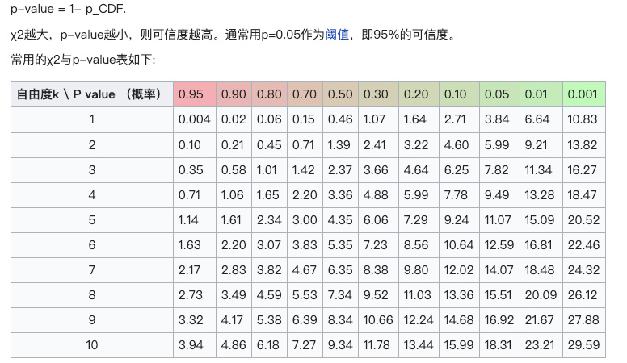

<!--
 * @Date: 2023-03-18 11:39:47
 * @LastEditors: charles hcheng1005@gmail.com
 * @LastEditTime: 2023-03-18 12:39:43
 * @FilePath: /all in one/数学/卡方分布.md
-->
# $\chi^2$分布

## 定义分布
若n个相互独立的随机变量ξ₁、ξ₂、……、ξn ，均服从标准正态分布（也称独立同分布于标准正态分布），则这n个服从标准正态分布的随机变量的平方和 构成一新的随机变量，其分布规律称为$\chi^2$分布（chi-square distribution），其中参数n=v，称为自由度，正如正态分布中均数或方差不同就是另一个正态分布一样，自由度不同就是另一个$\chi^2$分布。记为$Q ~ \chi^{2}_{v}$或者 Q ~ \chi^{2}(vw)$（其中$v=n-k$ ，$k$为限制条件数）。

卡方分布是由正态分布构造而成的一个新的分布，当自由度$v$很大时，$\chi^2$分布近似为正态分布。

对于任意正整数x， 自由度为$v$的卡方分布是一个随机变量X的机率分布。

## 卡方分布表

## 参考链接
- [卡方分布-百度](https://baike.baidu.com/link?url=Q2Uogutf0Z6LZnybLiw2L1z01TzwNNhh4lRYIp05-Y5VSBuOL0SymfOuIkMMpB4ANX5UZTpu-vh36KAIMv4M7dYUQ8Eogy2IWyXSTAhaYoM5QO_xd5sO1nk49jtEQNk4)
- [WIKI](https://zh.wikipedia.org/wiki/%E5%8D%A1%E6%96%B9%E5%88%86%E4%BD%88)