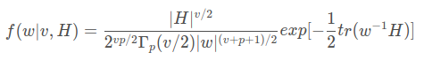

# 威沙特分布和逆威沙特分布

- [Wishart分布](#wishart分布)
  - [定义](#定义)
  - [概率密度函数](#概率密度函数)
- [逆威沙特分布](#逆威沙特分布)
  - [定义](#定义-1)
  - [概率密度函数](#概率密度函数-1)
- [参考链接](#参考链接)

## Wishart分布
### 定义
假设从一元正态分布中抽取的n个独立样本，则这些样本的方差应该服从自由度为$n-1$的$x^2$分布（具体介绍见如何抽取样本方差的分布）。而Wishart分布是分布在多元上的推广。

因此，**它可以用来描述多元正态分布样本的协方差矩阵**。它在多元正态分布分布的贝叶斯推导中非常重要。

### 概率密度函数

## 逆威沙特分布

### 定义
逆威沙特分布会用作多变量正态分布协方差矩阵的共轭先验分布.

### 概率密度函数

## 参考链接
- [Wishart分布简介](https://www.datalearner.com/blog/1051508471131357)
- [逆Wishart分布在贝叶斯推理中的应用](https://blog.csdn.net/mch2869253130/article/details/107303472)
