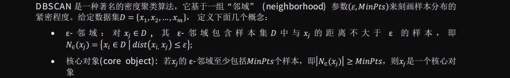
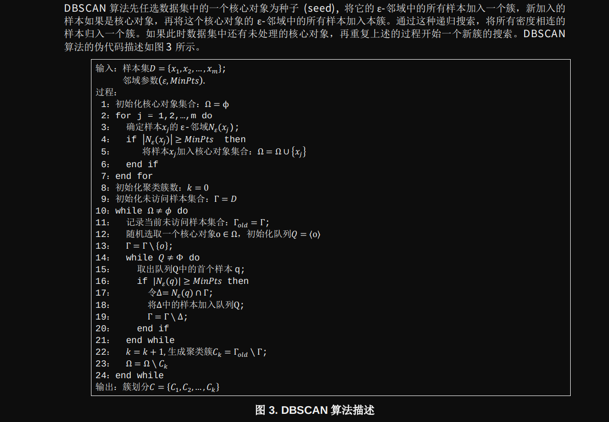
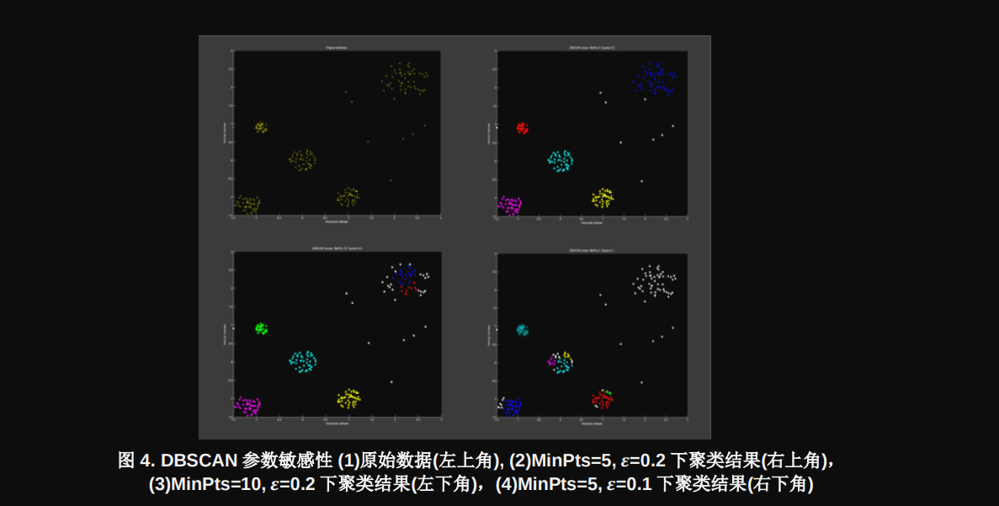
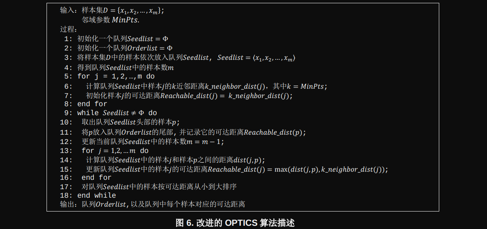
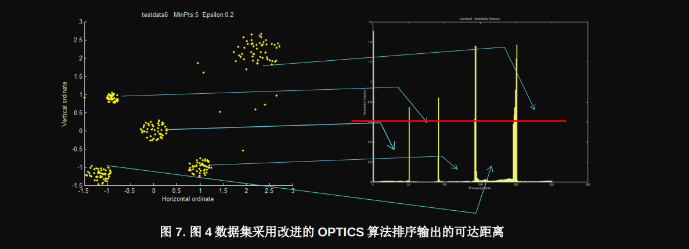

# DBSCAN

## 算法定义

## 算法流程

### 参数敏感性

DBSCAN 算法有两个输入参数，$MiniPts$定义为一个簇的邻域中的最少点数，而ϵ定义为邻域的半径。DBSCAN 算法的性能对这两个参数非常敏感，因此如何设置算法的入参对聚类的效果非常重要。不合适的入参设置将会产生错误的聚类结果。图 4 给出了一个在不同入参下 DBSCAN 聚类结果的例子。在子图(1)的原始的数据集中我们很容
易发现存在 5 个簇，子图(2)的聚类结果输出了 5 个簇，比较接近真实的场景。子图(3)因为选取了过大的$MiniPts,将原本比较稀疏的原始数据集中右上角的簇错误地分成了 2 个簇，而子图(4)因为选取了过小的ϵ导致聚类结果中出现了过多的簇划分，并且错误地将原始数据集中右上角的簇当成了噪声。同样通过对子图(2),(3),(4)的聚类结果计算的 DI 分别为 0.8323, 0.1234 和 0.1145，同样说明子图(2)的聚类效果比较好，而子图(3) 和(4)的聚类效果不太令人满意。

### 参数调整方法

大部分关于 DBSCAN 的文献都讨论的是算法本身，而很少涉及如何为算法选择合适的参数，而从上一节的介绍中可以看到参数的选取对聚类结果非常重要。汽车雷达使用 DBSCAN 时需要根据探测场景和目标检测算法的性能对参数有针对性地进行一些调整。实践中，通常选取一些典型的测试场景，对DBSCAN的入参进行调教以获得期望的聚类效果，最后对不同测试场景下的理想参数进行综合来确定车上实际使用的参数。这里将提出一种创新的方法,针对一个特定测试场景，确定最优的$MiniPts$和ϵ.

$MiniPts$是区别于噪声的一个簇内的最少点数。在理论上噪声和它的邻点之间的距离要大于目标点和它的邻点之间的距离。如果定义点p 和它的第k个最近的邻点之间的k近邻距离为k_neighbor_dis(p)，理论上噪声点的k近邻距离要大于目标点的k近邻距离。如果对一个数据集中的所有点分别计算k近邻距离并进行从大到小排序，k近邻距离较大的一些点对应的是噪声，而k近邻距离较小的一些点对应的是簇中的目标点。`另外如果分别计算一个数据集中所有点的 1 近邻，2 近邻，…k近邻距离，并对近邻距离最大的n个点的近邻距离分别进行平均，会发现这个平均值随着k的增加而增加，但是平均值的增量随着k的增加而降低。会发现一个特定的k，超过这个k后，k + 1近邻距离，k + 2近邻距离…会越来越接近。``**从理论上讲，这个k值接近于合理的$MiniPts$值**`，因为对于近邻距离最大的 n 个点(主要是噪声点)，其k近邻，k + 1近邻， k + 2近邻距离趋向接近，也就是对应的k近邻，k + 1近邻，k + 2近邻更加接近于簇中的目标点。基于这种思想，设计了下面的$MiniPts$搜索算法：

1. 计算数据集𝐷𝐷中所有样点的 1 近邻，2 近邻，…n 近邻距离，并对所有的近邻距离从大到小进行排序
2. 选定一个 n 值，从 1)中得到的 1 近邻，2 近邻，…n 近邻距离选择出最大的 n 个值，并求平均
3. 计算 2)中得到的相邻两个平均值之间的差值，找到一个𝑘𝑘值使得𝑘𝑘近邻的平均值大于𝑘𝑘 + 1近邻的平均值，并
且𝑘𝑘近邻的平均值减去𝑘𝑘 + 1近邻的平均值最小
4. 定义$MiniPts$ = 𝑘𝑘 − 1

---

ϵ决定了聚类时邻域搜索的半径，DBSCAN 算法中一个点的ϵ-邻域中的邻点的数目大于𝑀𝑀 𝑀𝑀𝑀𝑀𝑀𝑀𝑀𝑀的时候被定义为核心节点，并且这个点和所有它的ϵ-邻域中的点都被归入同一个簇。通常一个数据集越密集，聚类时选取的ϵ应该越小。
因此在调整ϵ参数的时候，需要分析数据集的密度结构。参考文献[3]介绍了一种 OPTICS (Ordering Points To Identify the Clustering Structure) 算法可以获得一个数据集的密度信息。作者基于 OPTICS 算法进行了一些改进，提出了一种更有效的ϵ搜索的算法。作者设计的ϵ搜索算法分为两步：第一步通过改进的 OPTICS 算法对数据集的密度信息进行分析，得到一个大致的ϵ搜索区间，第二步在第一步获得的ϵ搜索区中，按照一定的步长尝试进行DBSCAN 聚类，对聚类的结果分别计算 DI 进行评估，从而选择出最优的ϵ. 

## 示例代码
TBD

## 参考资料

[参考: 一种适用于汽车雷达的聚类算法研究和实现](https://www.ti.com.cn/cn/lit/an/zhca739/zhca739.pdf?ts=1710295116140&ref_url=https%253A%252F%252Fwww.google.com%252F)

[聚类算法之DBSCAN算法](https://blog.csdn.net/LoveCarpenter/article/details/85048944)

[聚类算法之OPTICS算法](https://blog.csdn.net/LoveCarpenter/article/details/85049135)