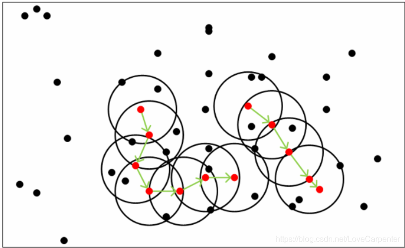

# OPTICS: 一种改进的DBSCAN方法

## 算法定义
OPTICS(Ordering points to identify the clustering structure)是一基于密度的聚类算法，OPTICS算法是DBSCAN的改进版本，因此OPTICS算法也是一种基于密度的聚类算法。在DBCSAN算法中需要输入两个参数：$\epsilon$和 $MinPts$，选择不同的参数会导致最终聚类的结果千差万别，因此DBCSAN对于输入参数过于敏感。

OPTICS算法的提出就是为了**帮助DBSCAN算法选择合适的参数，降低输入参数的敏感度**。

OPTICS主要针对输入参数$\epsilon$过敏感做的改进，OPTICS和DBSCNA的输入参数一样（$\epsilon$和$MinPts$），虽然OPTICS算法中也需要两个输入参数，但该算法对$\epsilon$输入不敏感（一般将$\epsilon$固定为无穷大），同时该算法中并不显式的生成数据聚类，只是对数据集合中的对象进行排序，得到一个有序的对象列表，通过该有序列表，可以得到一个决策图，通过决策图可以不同$\epsilon$参数的数据集中检测簇集，即：**先通过固定的$MinPts$和无穷大的$\epsilon$得到有序列表，然后得到决策图，通过决策图可以知道当$\epsilon$取特定值时（比如$\epsilon=3$）数据的聚类情况。**





## 算法流程


### 伪代码


## 示例代码

```python
def compute_squared_EDM(X):
  return squareform(pdist(X,metric='euclidean'))

def updateSeeds(seeds,core_PointId,neighbours,core_dists,reach_dists,disMat,isProcess):
    # 获得核心点core_PointId的核心距离
    core_dist=core_dists[core_PointId]
    # 遍历core_PointId 的每一个邻居点
    for neighbour in neighbours:
        # 如果neighbour没有被处理过，计算该核心距离
        if(isProcess[neighbour]==-1):
            # 首先计算改点的针对core_PointId的可达距离
            new_reach_dist = max(core_dist, disMat[core_PointId][neighbour])
            # 如果可达距离没有被计算过，将计算的可达距离赋予
            if(np.isnan(reach_dists[neighbour])):
                reach_dists[neighbour]=new_reach_dist
                seeds[neighbour] = new_reach_dist
            # 如果可达距离已经被计算过，判读是否要进行修改
            elif(new_reach_dist<reach_dists[neighbour]):
                reach_dists[neighbour] = new_reach_dist
                seeds[neighbour] = new_reach_dist
    return seeds


# 下面代码同样符合[TI:一种适用于汽车雷达的聚类算法研究和实现]中的OPTICS算法描述
def OPTICS(data,eps=np.inf,minPts=15):
    # 获得距离矩阵
    orders = []
    disMat = compute_squared_EDM(data)
    # 获得数据的行和列(一共有n条数据)
    n, m = data.shape
    # np.argsort(disMat)[:,minPts-1] 按照距离进行 行排序 找第minPts个元素的索引
    # disMat[np.arange(0,n),np.argsort(disMat)[:,minPts-1]] 计算minPts个元素的索引的距离
    temp_core_distances = disMat[np.arange(0,n),np.argsort(disMat)[:,minPts-1]]  # TI Step(6)
    # 计算核心距离
    core_dists = np.where(temp_core_distances <= eps, temp_core_distances, -1)
    # 将每一个点的可达距离未定义
    reach_dists= np.full((n,), np.nan)
    # 将矩阵的中小于minPts的数赋予1，大于minPts的数赋予零，然后1代表对每一行求和,然后求核心点坐标的索引
    core_points_index = np.where(np.sum(np.where(disMat <= eps, 1, 0), axis=1) >= minPts)[0]
    # 用于标识是否被处理，没有被处理，设置为-1
    isProcess = np.full((n,), -1)
    # 遍历所有的核心点
    for pointId in core_points_index:
        # 如果核心点未被分类，将其作为的种子点，开始寻找相应簇集
        if (isProcess[pointId] == -1):
            # 将点pointId标记为当前类别(即标识为已操作)
            isProcess[pointId] = 1
            orders.append(pointId) # TI Step(11)
            # 寻找种子点的eps邻域且没有被分类的点，将其放入种子集合
            neighbours = np.where((disMat[:, pointId] <= eps) & (disMat[:, pointId] > 0) & (isProcess == -1))[0]
            seeds = dict()

            # TI Step(15)
            seeds=updateSeeds(seeds,pointId,neighbours,core_dists,reach_dists,disMat,isProcess) 
            while len(seeds)>0:
                nextId = sorted(seeds.items(), key=operator.itemgetter(1))[0][0]
                del seeds[nextId]
                isProcess[nextId] = 1
                orders.append(nextId)
                # 寻找newPoint种子点eps邻域（包含自己）
                # 这里没有加约束isProcess == -1，是因为如果加了，本是核心点的，可能就变成了非和核心点
                queryResults = np.where(disMat[:, nextId] <= eps)[0]
                if len(queryResults) >= minPts:
                    # TI Step(15)
                    seeds=updateSeeds(seeds,nextId,queryResults,core_dists,reach_dists,disMat,isProcess)
                # 簇集生长完毕，寻找到一个类别
    # 返回数据集中的可达列表，及其可达距离
    return orders,reach_dists

```


## 参考资料

[聚类算法之OPTICS算法](https://blog.csdn.net/LoveCarpenter/article/details/85049135)

[Pcl-Optics](https://github.com/Nandite/Pcl-Optics)

[参考: 一种适用于汽车雷达的聚类算法研究和实现](https://www.ti.com.cn/cn/lit/an/zhca739/zhca739.pdf?ts=1710295116140&ref_url=https%253A%252F%252Fwww.google.com%252F)

[聚类算法之DBSCAN算法](https://blog.csdn.net/LoveCarpenter/article/details/85048944)
