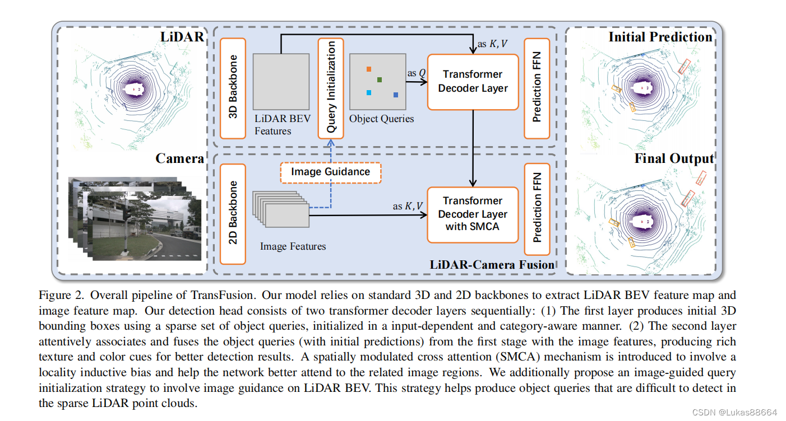
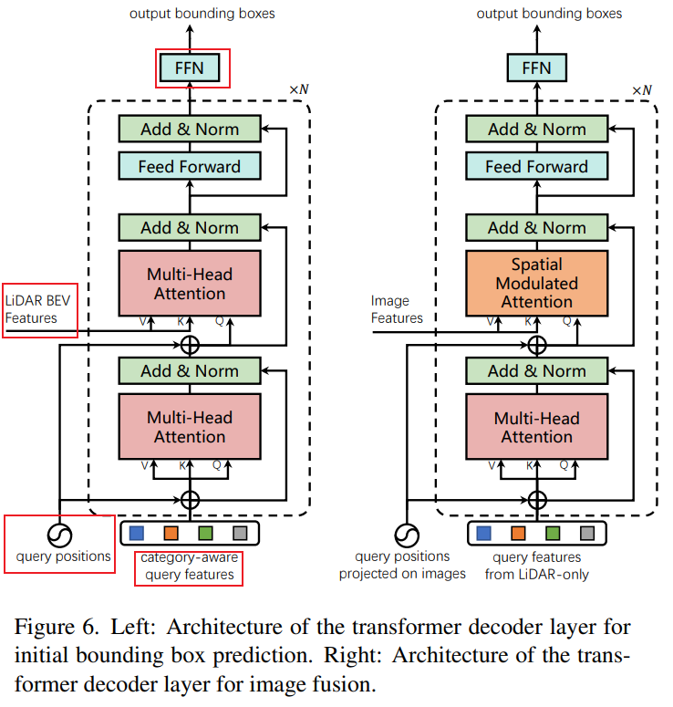

#　TransFusion 

<div align=center>

</div>


- [TBD](#tbd)
- [transfusion-head](#transfusion-head)
  - [检测头Init](#检测头init)
  - [推理流程](#推理流程)
    - [数据流](#数据流)
    - [1. Lidar特征提取](#1-lidar特征提取)
    - [2. 非极大值处理NMS](#2-非极大值处理nms)
    - [3. TOP-K特征提取](#3-top-k特征提取)
    - [4. Label编码](#4-label编码)
    - [5. Decoder过程](#5-decoder过程)
- [参考资料](#参考资料)


## TBD

## transfusion-head

<div align=center>

</div>

### 检测头Init

首先看下整个transfusion-head检测的初始化部分：

```python
# 共享的卷积层,用于提取输入特征
self.shared_conv = nn.Conv2d(in_channels=input_channels,out_channels=hidden_channel,kernel_size=3,padding=1)
layers = []
layers.append(BasicBlock2D(hidden_channel,hidden_channel, kernel_size=3,padding=1,bias=bias))
layers.append(nn.Conv2d(in_channels=hidden_channel,out_channels=num_class,kernel_size=3,padding=1))

# heatmap特征卷积网络
self.heatmap_head = nn.Sequential(*layers)

# 定义了一个卷积网络,用于将类别信息编码为特征
self.class_encoding = nn.Conv1d(num_class, hidden_channel, 1)

# transformer decoder layers for object query with LiDAR feature
self.decoder = TransformerDecoderLayer(hidden_channel, num_heads, ffn_channel, dropout, activation,
        self_posembed=PositionEmbeddingLearned(2, hidden_channel),
        cross_posembed=PositionEmbeddingLearned(2, hidden_channel))

heads = copy.deepcopy(self.model_cfg.SEPARATE_HEAD_CFG.HEAD_DICT)
heads['heatmap'] = dict(out_channels=self.num_classes, num_conv=self.model_cfg.NUM_HM_CONV)

# 预测头
self.prediction_head = SeparateHead_Transfusion(hidden_channel, 64, 1, heads, use_bias=bias)

self.init_weights()
self.bbox_assigner = HungarianAssigner3D(**self.model_cfg.TARGET_ASSIGNER_CONFIG.HUNGARIAN_ASSIGNER)
```

上述代码定义了一个名为 **TransFusionModel** 的 PyTorch 模块。它包含以下主要组件:

- 共享卷积层:

    使用 `nn.Conv2d `定义了一个共享的卷积层,用于提取输入特征。

- 热图特征卷积网络:

    使用 `nn.Sequential` 定义了一个卷积网络,用于生成热图特征。

    包含一个` BasicBlock2D` 和一个 `3x3 卷积层`。
    
- 类别编码卷积网络:

    使用 `nn.Conv1d `定义了一个卷积网络,用于将类别信息编码为特征。
    
- **Transformer 解码器层**:

    使用之前定义的 **`TransformerDecoderLayer`** 构建了一个 Transformer 解码器层。

    **使用可学习的位置编码作为输入特征的位置信息**。

- **预测头**:

    使用 `SeparateHead_Transfusion` 定义了一个预测头,用于生成最终的预测结果。

    **预测头包含多个子头,如热图、边界框等**。

- 权重初始化:

    调用 init_weights 方法对模型进行权重初始化。

- **目标分配器**:

    使用 **`HungarianAssigner3D`** 定义了一个 3D 目标分配器,用于将预测结果与真实标注进行匹配。

总的来说,这个 TransFusionModel 模块集成了卷积特征提取、Transformer 编码解码、多任务预测等功能,用于处理 3D 物体检测任务。它利用了可学习的位置编码和 Transformer 架构,以及专门设计的预测头和目标分配器,以提高模型的性能。


### 推理流程

现在看下完整的推理过程：


#### 数据流

1. 输入数据 inputs 进入模型,其形状为 [batch_size, ...]。

2. 通过共享的卷积层 self.shared_conv 处理输入数据,得到特征图 lidar_feat。

3. 将特征图展平为 lidar_feat_flatten。

4. **生成鸟瞰视图（BEV）的位置信息 bev_pos**。

5. 通过 self.heatmap_head 生成 heatmap feature dense_heatmap。
   
   `这里是一个CONV2D+BN+RELU+CONV2D的卷积网络`。 
   
   在经过一个sigmoid得到下文的heatmap。

6. 对 heatmap 进行非极大值抑制,得到 heatmap。

7. 从 **heatmap 中选择 top num_proposals 个 proposals**,得到 **top_proposals**、**top_proposals_class** 和 **top_proposals_index**。

8. **根据 top_proposals_index 从 lidar_feat_flatten 中选择对应的特征,得到 query_feat**。

9.  **根据 top_proposals_class 生成类别嵌入 query_cat_encoding,并与 query_feat 相加**。

10. 根据 top_proposals_index 从 bev_pos 中选择对应的位置信息 query_pos,并将其转换为 xy 坐标。

11. **将 query_feat、lidar_feat_flatten、query_pos 和 bev_pos 输入到解码器 self.decoder 中,得到更新后的 query_feat**。

12. 将 query_feat 输入到预测头 self.prediction_head 中,得到预测结果 res_layer。

13. 对 res_layer 进行后处理,包括将预测的中心坐标加上 query_pos 的偏移,以及从 heatmap 中选择对应的得分。

返回处理后的预测结果 res_layer。

#### 1. Lidar特征提取

```python
batch_size = inputs.shape[0]  # 获取输入数据的批量大小

# 通过共享卷积层处理输入数据
lidar_feat = self.shared_conv(inputs)
# 将特征图展平
lidar_feat_flatten = lidar_feat.view(batch_size, lidar_feat.shape[1], -1)

# 生成鸟瞰视图（BEV）位置信息
bev_pos = self.bev_pos.repeat(batch_size, 1, 1).to(lidar_feat.device)

# query initialization
# 通过 Conv+BN+ReLU 生成heatmap feature
dense_heatmap = self.heatmap_head(lidar_feat)
heatmap = dense_heatmap.detach().sigmoid()
```

#### 2. 非极大值处理NMS

```python
# 进行非极大值抑制（NMS）
padding = self.nms_kernel_size // 2
local_max = torch.zeros_like(heatmap)
local_max_inner = F.max_pool2d(heatmap, kernel_size=self.nms_kernel_size, stride=1, padding=0)
local_max[:, :, padding:(-padding), padding:(-padding)] = local_max_inner

# 针对不同数据集的特殊处理
if self.dataset_name == "nuScenes":
    local_max[ :, 8, ] = F.max_pool2d(heatmap[:, 8], kernel_size=1, stride=1, padding=0)
    local_max[ :, 9, ] = F.max_pool2d(heatmap[:, 9], kernel_size=1, stride=1, padding=0)
elif self.dataset_name == "Waymo":
    local_max[ :, 1, ] = F.max_pool2d(heatmap[:, 1], kernel_size=1, stride=1, padding=0)
    local_max[ :, 2, ] = F.max_pool2d(heatmap[:, 2], kernel_size=1, stride=1, padding=0)
heatmap = heatmap * (heatmap == local_max)
heatmap = heatmap.view(batch_size, heatmap.shape[1], -1)  # [1,10,32400]
```

这段代码实现了非极大值抑制(Non-Maximum Suppression, NMS)的过程,用于从 heatmap 中提取出最终的 proposals。以下是具体的解释:

1. 首先计算 NMS 核的 padding 大小,即 self.nms_kernel_size // 2。这个 padding 用于在后续步骤中保留边缘区域的信息。

2. 创建一个与 heatmap 形状相同的 local_max 张量,用于存储局部最大值。

3. **使用 F.max_pool2d() 函数在 heatmap 上进行最大池化操作,得到 local_max_inner。这个操作将每个位置周围的 self.nms_kernel_size 区域内的最大值保存下来**。

4. **将 local_max_inner 复制到 local_max 张量的中间区域,即 padding:(-padding) 范围内。这样就得到了完整的局部最大值张量 local_max**。

5. 接下来是针对不同数据集的特殊处理:

   - 对于 "nuScenes" 数据集,单独处理了第 8 和 9 类的局部最大值。

   - 对于 "Waymo" 数据集,单独处理了第 1 和 2 类的局部最大值。

6. 最后,通过将 heatmap 与 (heatmap == local_max) 进行逐元素乘法,得到了经过 NMS 处理后的 heatmap。这样可以保留下局部最大值位置的响应,而抑制掉其他位置的响应。

7. 将处理后的 heatmap 展平为 [batch_size, heatmap.shape[1], -1] 的形状,以便后续的处理。

总的来说,这段代码的目的是从 heatmap 中提取出最终的 proposals,并去除掉重叠区域中的冗余响应,为后续的处理做好准备。


#### 3. TOP-K特征提取

```python
top_proposals = heatmap.view(batch_size, -1).argsort(dim=-1, descending=True)[..., : self.num_proposals]

# 使用整数除法 // 可以得到每个 proposal 所属的类别索引。
top_proposals_class = top_proposals // heatmap.shape[-1]

# 使用取余运算 % 可以得到每个 proposal 在 heatmap 最后一个维度上的位置索引
top_proposals_index = top_proposals % heatmap.shape[-1]

# 从lidar_feat_flatten获取对应proposal的特征
query_feat = lidar_feat_flatten.gather(index=top_proposals_index[:, None, :].expand(-1, lidar_feat_flatten.shape[1], -1),dim=-1,)
```
#### 4. Label编码

```python
# add category embedding
one_hot = F.one_hot(top_proposals_class, num_classes=self.num_classes).permute(0, 2, 1)
```

F.one_hot编码过程：

```py
import torch.nn.functional as F

# 输入张量包含类别索引
input = torch.tensor([0, 1, 2, 0])

# 转换为one-hot编码
output = F.one_hot(input, num_classes=3)
print(output)
# 输出:
# tensor([[1, 0, 0],
#         [0, 1, 0],
#         [0, 0, 1],
#         [1, 0, 0]])
```

#### 5. Decoder过程

```py
# 生成鸟瞰视图（BEV）位置信息
bev_pos = self.bev_pos.repeat(batch_size, 1, 1).to(lidar_feat.device)

query_pos = bev_pos.gather(index=top_proposals_index[:, None, :].permute(0, 2, 1).expand(-1, -1, bev_pos.shape[-1]),dim=1,)
query_pos = query_pos.flip(dims=[-1])  #  x,y 坐标顺序调整为 (y, x),
bev_pos = bev_pos.flip(dims=[-1]) #  x,y 坐标顺序调整为 (y, x),

# 经过卷积层处理 nn.Conv1d(num_class, hidden_channel, 1)
query_cat_encoding = self.class_encoding(one_hot.float()) 
query_feat += query_cat_encoding

# 通过解码器处理特征
query_feat = self.decoder(query_feat, lidar_feat_flatten, query_pos, bev_pos)
```

其中bev_Pos在初始化阶段就已经生成：

```py
def create_2D_grid(self, x_size, y_size):
    meshgrid = [[0, x_size - 1, x_size], [0, y_size - 1, y_size]]
    # NOTE: modified
    batch_x, batch_y = torch.meshgrid(
        *[torch.linspace(it[0], it[1], it[2]) for it in meshgrid]
    )
    batch_x = batch_x + 0.5
    batch_y = batch_y + 0.5
    coord_base = torch.cat([batch_x[None], batch_y[None]], dim=0)[None]
    coord_base = coord_base.view(1, 2, -1).permute(0, 2, 1)
    return coord_base

self.bev_pos = self.create_2D_grid(x_size, y_size)
```

**重点分析Decoder过程：**

首先看下decoder的输入：
- query_feat： 包含类别嵌入
  
- lidar_feat_flatten： 展平的点云特征
  
- query_pos：proposal位置
  
- bev_pos：鸟瞰图位置


继续分析**self.decoder**部分：

```py
self.decoder = TransformerDecoderLayer(hidden_channel, num_heads, ffn_channel, dropout, activation,
                self_posembed=PositionEmbeddingLearned(2, hidden_channel),
                cross_posembed=PositionEmbeddingLearned(2, hidden_channel))
```

**self.decoder 是一个 TransformerDecoderLayer 对象,它是一个基于 Transformer 架构的解码器层**。这个解码器层有以下几个主要组成部分:

1. 隐藏层大小 (hidden_channel): 这是特征向量的维度大小,决定了模型的复杂度和表达能力。

2. 注意力头数 (num_heads): 多头注意力机制使用的注意力头数量,可以帮助模型捕捉不同粒度的特征。

3. 前馈网络大小 (ffn_channel): 解码器层中前馈神经网络的隐藏层大小。

4. Dropout 概率 (dropout): 用于防止过拟合的dropout率。

5. 激活函数 (activation): 使用的非线性激活函数,如 ReLU、Swish 等。

此外,这个解码器层还使用了两种位置编码方式:

1. 自注意力位置编码 (self_posembed): 用于给query特征添加位置信息,这里使用的是可学习的位置编码。

2. 交叉注意力位置编码 (cross_posembed): 用于给key-value特征(如点云特征)添加位置信息,同样使用可学习的位置编码。

其中**位置编码定义**如下：
```py
class PositionEmbeddingLearned(nn.Module):
    """
    Absolute pos embedding, learned.
    """

    def __init__(self, input_channel, num_pos_feats=288):
        super().__init__()
        # 卷积网络
        self.position_embedding_head = nn.Sequential(
            nn.Conv1d(input_channel, num_pos_feats, kernel_size=1),
            nn.BatchNorm1d(num_pos_feats),
            nn.ReLU(inplace=True),
            nn.Conv1d(num_pos_feats, num_pos_feats, kernel_size=1))

    def forward(self, xyz):
        xyz = xyz.transpose(1, 2).contiguous()
        position_embedding = self.position_embedding_head(xyz)
        return position_embedding
```

进一步分析**TransformerDecoderLayer**模块：

TransformerDecoderLayer的forward函数定义如下：

```py
# 可学习的position embedding模块
class PositionEmbeddingLearned(nn.Module):
    """
    Absolute pos embedding, learned.
    """

    def __init__(self, input_channel, num_pos_feats=288):
        super().__init__()
        self.position_embedding_head = nn.Sequential(
            nn.Conv1d(input_channel, num_pos_feats, kernel_size=1),
            nn.BatchNorm1d(num_pos_feats),
            nn.ReLU(inplace=True),
            nn.Conv1d(num_pos_feats, num_pos_feats, kernel_size=1))

    def forward(self, xyz):
        xyz = xyz.transpose(1, 2).contiguous()
        position_embedding = self.position_embedding_head(xyz)
        return position_embedding

def with_pos_embed(self, tensor, pos_embed):
    return tensor if pos_embed is None else tensor + pos_embed
    
def forward(self, query, key, query_pos, key_pos, key_padding_mask=None, attn_mask=None):
    # NxCxP to PxNxC

    # 首先,使用 self_posembed 和 cross_posembed 分别计算 query_pos_embed 和 key_pos_embed,并将其维度顺序调整为 (P, N, C)
    query_pos_embed = self.self_posembed(query_pos).permute(2, 0, 1)
    key_pos_embed = self.cross_posembed(key_pos).permute(2, 0, 1)
    
    # 将 query 和 key 的维度顺序从 (N, C, P) 调整为 (P, N, C)
    query = query.permute(2, 0, 1)
    key = key.permute(2, 0, 1)

    # 使用 with_pos_embed 函数将位置编码嵌入到 query 中,得到 q、k 和 v
    q = k = v = self.with_pos_embed(query, query_pos_embed)

    #　计算自注意力,得到更新后的 query,并通过残差连接和层归一化
    query2 = self.self_attn(q, k, value=v)[0]  # self-attention
    query = query + self.dropout1(query2)
    query = self.norm1(query) # nn.LayerNorm(d_model)
    
    # 计算跨注意力,使用 with_pos_embed 函数将位置编码嵌入到 query、key 和 value 中,并执行多头注意力计算。
    query2 = self.multihead_attn(query=self.with_pos_embed(query, query_pos_embed),
                                    key=self.with_pos_embed(key, key_pos_embed),
                                    value=self.with_pos_embed(key, key_pos_embed), 
                                    key_padding_mask=key_padding_mask, attn_mask=attn_mask)[0] # cross-attention

    # 将跨注意力的结果通过残差连接和层归一化,得到更新后的 query
    query = query + self.dropout2(query2)
    query = self.norm2(query)

    query2 = self.linear2(self.dropout(self.activation(self.linear1(query))))
    query = query + self.dropout3(query2)
    query = self.norm3(query)

    # NxCxP to PxNxC
    query = query.permute(1, 2, 0)
    return query
```

根据之前的分析，query就是包含类别嵌入的proposal，key是展平的点云特征。

上述代码实现了一个 Transformer 解码器层的前向传播过程,包括以下几个主要部分:

1. **可学习的位置编码模块 PositionEmbeddingLearned**:

    - 这个模块使用一个小型卷积神经网络来学习输入坐标 xyz 的位置编码。
    - 网络由两个 1D 卷积层、一个 BatchNorm 层和一个 ReLU 激活函数组成。
    - 在 forward 函数中,首先将 xyz 的维度转置为 (N, P, C)(其中 N 是批大小,P 是点数,C 是输入通道数),然后通过 position_embedding_head 网络得到位置编码。

2. **with_pos_embed 函数**:

    - 这个函数用于将位置编码嵌入到输入张量中。
    - 如果 pos_embed 为 None,则直接返回输入张量;否则,将输入张量与位置编码相加。

3. **forward 函数**:

    - 首先,使用 self_posembed 和 cross_posembed 分别计算 query_pos_embed 和 key_pos_embed,并将其维度顺序调整为 (P, N, C)。
    - 将 query 和 key 的维度顺序从 (N, C, P) 调整为 (P, N, C)。
    - 使用 with_pos_embed 函数将位置编码嵌入到 query 中,得到 q、k 和 v。
    - 计算自注意力,得到更新后的 query,并通过残差连接和层归一化。
    - 计算跨注意力,使用 with_pos_embed 函数将位置编码嵌入到 query、key 和 value 中,并执行多头注意力计算。
    - 将跨注意力的结果通过残差连接和层归一化,得到更新后的 query。
    - 执行前馈网络操作,包括全连接层、激活函数和 dropout,并通过残差连接和层归一化得到最终的 query。
    - 最后,将 query 的维度顺序从 (P, N, C) 调整回 (N, C, P),并返回。

这段代码展示了如何在 Transformer 解码器层中使用可学习的位置编码,并结合自注意力和跨注意力机制来处理输入的查询(query)和键值对(key-value)。通过位置编码,模型能够捕捉输入数据的空间结构信息,从而提高特征表示的质量和模型的性能。

值得注意的是,这段代码中使用了两个不同的位置编码模块 self_posembed 和 cross_posembed,分别用于自注意力和跨注意力计算。这种设计可能是为了捕捉不同注意力机制中的位置信息。


上述流程对应的正是：

<div align=center>

</div>

**图中从下往上推理，对应的正是自注意力模块+交叉注意力模块。**


## 参考资料
- [TransFusion](https://blog.csdn.net/m0_58702532/article/details/123965665)
