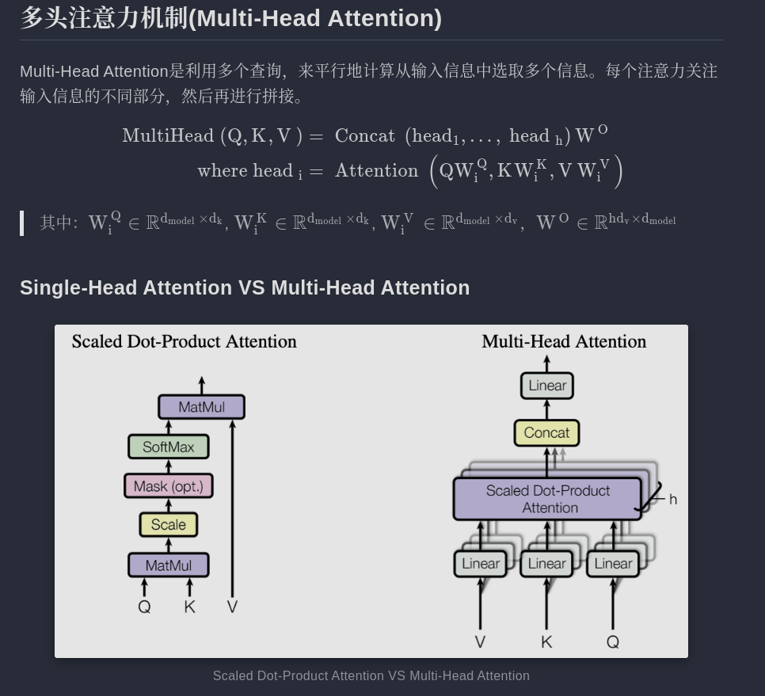
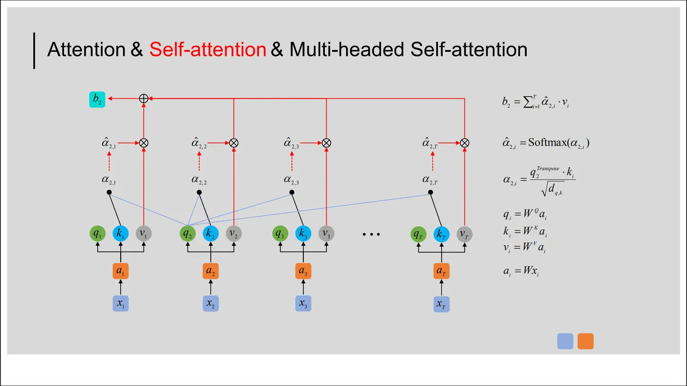
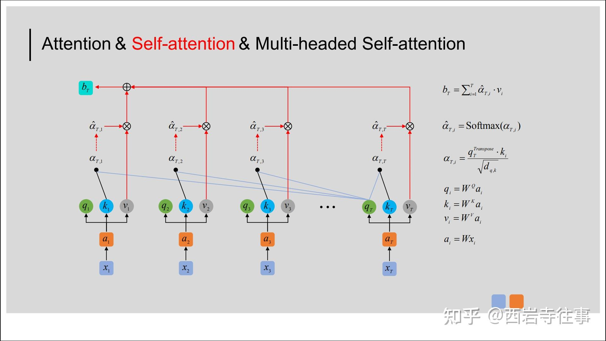
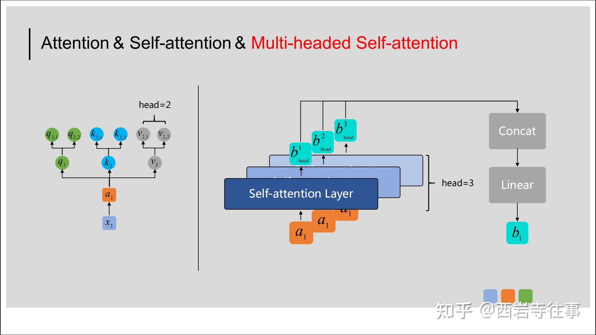
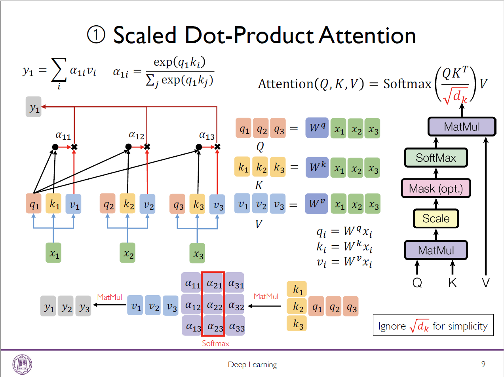
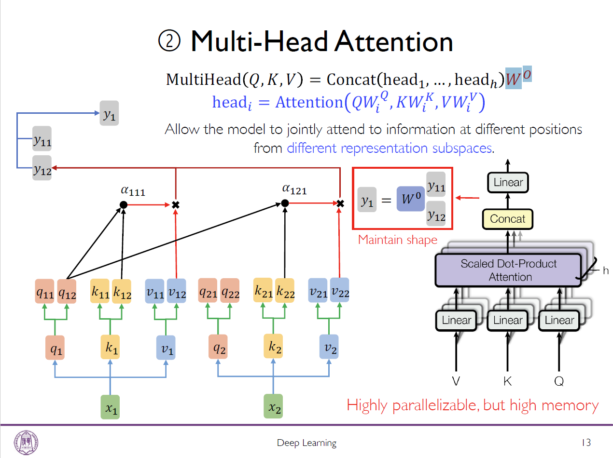

# 多头自注意力

---

[Multi-headed Self-attention（多头自注意力）机制介绍👍👍](https://zhuanlan.zhihu.com/p/365386753)

---

## 参考资料

[Multi-headed Self-attention（多头自注意力）机制介绍👍👍](https://zhuanlan.zhihu.com/p/365386753)

[为什么Transformer需要进行Multi-head Attention？👍👍👍👍](https://www.zhihu.com/question/341222779)
