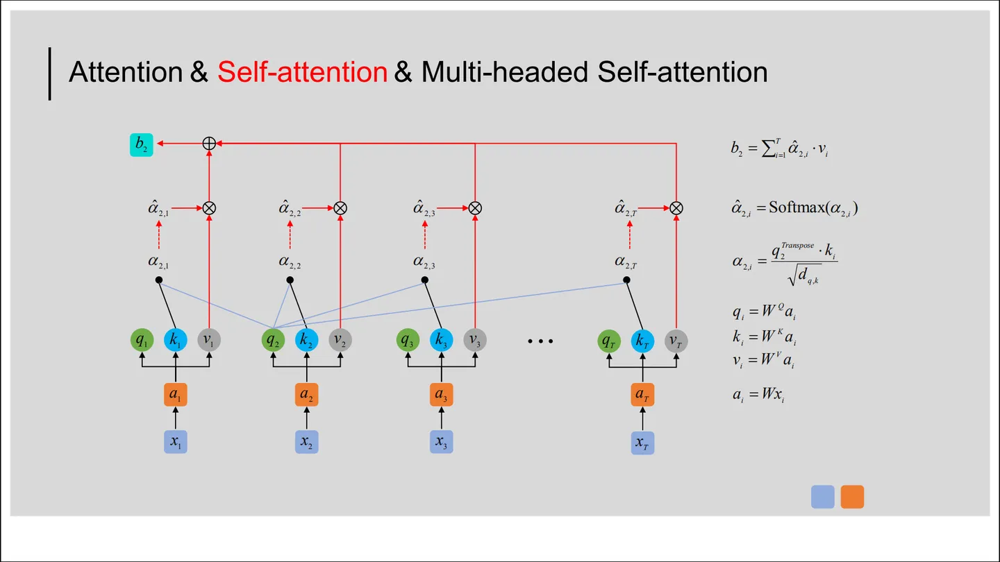

# Self-Attention 自注意力机制

## 链接
[台大李宏毅自注意力机制和Transformer详解](https://www.bilibili.com/video/BV1v3411r78R?p=1&vd_source=285a0f3fdc2fd10c78e15004be5bcf60)

[图解 Transformer -- 李宏毅](https://zhuanlan.zhihu.com/p/349569097)

[Multi-headed Self-attention（多头自注意力）机制介绍 ](https://zhuanlan.zhihu.com/p/365386753)

[为什么Transformer 需要进行 Multi-head Attention？](https://www.zhihu.com/question/341222779)

---

- [链接](#链接)
- [Q K V](#q-k-v)
  - [总结](#总结)
- [Multi-head self-Attention](#multi-head-self-attention)
- [Positional Encoding](#positional-encoding)

## Q K V

对于序列a1-a4，如何确定彼此之间的联系？

### 总结

## Multi-head self-Attention

## Positional Encoding

两种方式：**人为设定与自动学习**

