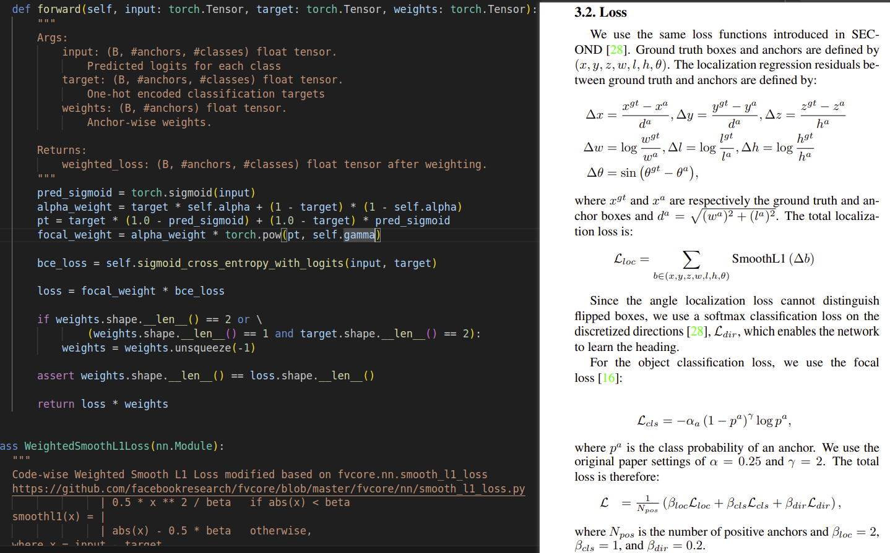

# 基于Anchor的目标检测

- [什么是Anchor(锚框)](#什么是anchor锚框)
- [1. 前景和背景匹配的详细流程](#1-前景和背景匹配的详细流程)
- [2. 背景的意义](#2-背景的意义)
- [3. 基于anchor的LOSS计算及box生成](#3-基于anchor的loss计算及box生成)
  - [Box的编码与解码](#box的编码与解码)
    - [小结](#小结)
  - [LOSS计算](#loss计算)
    - [Q1: 负样本参与loss计算吗?](#q1-负样本参与loss计算吗)
    - [Q2: 什么是Focal Loss?](#q2-什么是focal-loss)
  - [openpcDet中的Focal Loss](#openpcdet中的focal-loss)
  - [Reg回归损失计算](#reg回归损失计算)
    - [注意](#注意)

---


## 什么是Anchor(锚框)

在目标检测领域，锚框（Anchor）是一种预定义的、固定大小和形状的矩形框，用于在图像中搜索和定位目标对象。锚框是一种在特定检测框架中，如R-CNN系列（包括Fast R-CNN、Faster R-CNN等）和SSD中广泛使用的概念。它们是目标检测算法中的一个关键组成部分，尤其是在基于区域的卷积神经网络（Region-based Convolutional Neural Networks, R-CNNs）中。

**锚框的作用**

锚框的主要作用是作为候选区域的初始集合，为模型提供一组固定的参考框架，以便检测图像中的对象。在训练阶段，这些锚框将与真实的标注框（ground truth boxes）进行匹配，以确定哪些锚框贴近真实对象（正样本）和哪些远离真实对象（负样本）。通过这种方式，模型学习如何调整这些锚框以更好地覆盖和定位图像中的目标。

**锚框的特点**

尺寸和比例：通常，锚框会有多种尺寸和宽高比例，以适应图像中不同大小和形状的目标。这些尺寸和比例是预先定义的，并根据特定的任务和数据集进行调整。

密集布局：锚框在图像中的分布是密集的，覆盖整个图像区域。对于给定的位置，可能会有多个不同尺寸或比例的锚框与之对应。

正负样本分配：在训练过程中，锚框根据与真实标注框的IoU（交并比）来分配为正样本或负样本。通常，IoU高于某个阈值（例如0.7）的锚框被视为正样本，而IoU低于另一个阈值（例如0.3）的锚框被视为负样本。

**锚框的应用**

Faster R-CNN：在Faster R-CNN中，锚框是通过区域提议网络（Region Proposal Network, RPN）生成的，RPN会对每个锚框预测两个东西：该锚框含有目标的概率（前景概率）和该锚框需要调整的量（以更好地匹配真实目标）。

SSD：在SSD（Single Shot MultiBox Detector）中，锚框被称为默认框（default boxes），并且在多个特征图尺度上进行预测，允许模型检测不同尺寸的目标。

通过这种方式，锚框机制极大地简化了目标检测任务，使得模型能够更有效地学习如何定位和识别图像中的目标。

 
## 1. 前景和背景匹配的详细流程

前景和背景匹配是目标检测中的一个关键步骤，特别是在使用锚框（anchors）的检测模型中。这个过程涉及到将每个锚框与真实标注框（ground truth boxes）进行比较，以决定哪些锚框应该被视为前景（即包含目标的锚框），哪些应该被视为背景，以及如何为这些锚框分配训练目标。以下是前景和背景匹配过程的详细描述：

1. **计算IoU（交并比）**
   
    首先，需要计算每个锚框与所有真实标注框之间的交并比（Intersection over Union, IoU）。IoU是一个衡量两个框重叠程度的指标，通过计算两个框的交集面积除以它们的并集面积得到。IoU值的范围是[0, 1]，值越大表示重叠程度越高。

2. **定义匹配阈值**
   
    接下来，定义两个阈值：匹配阈值（matched_threshold）和不匹配阈值（unmatched_threshold）。这两个阈值用于决定一个锚框被认为是与某个真实框匹配（即视为前景）还是不匹配（即视为背景）。

    匹配阈值：如果一个锚框与任何真实框的IoU超过这个阈值，那么这个锚框被认为是前景。

    不匹配阈值：如果一个锚框与所有真实框的IoU都低于这个阈值，那么这个锚框被认为是背景。

3. **分配前景和背景**
   
    根据上述阈值，对每个锚框进行分类：

    前景锚框：与至少一个真实框的IoU超过匹配阈值的锚框。

    背景锚框：与所有真实框的IoU都低于不匹配阈值的锚框。

4. **处理重叠情况**
   
    可能会有一些锚框同时与多个真实框的IoU超过匹配阈值。对于这种情况，有几种处理策略：

    每个锚框只匹配到IoU最高的真实框：这是最常见的策略，确保每个锚框只被分配给一个真实框。
    允许多个匹配：在某些情况下，可能会允许一个锚框匹配到多个真实框，尤其是在处理高度重叠的目标时。

5. **分配训练目标**
   
    对于每个前景锚框，需要为其分配一个分类目标（即它应该属于哪个类别）和一个回归目标（即如何调整锚框的位置以更好地覆盖对应的真实框）。

    分类目标：通常是与锚框匹配的真实框的类别。

    回归目标：根据锚框和它匹配的真实框之间的位置差异，计算一个调整量（如中心点坐标的偏移量和尺寸的比例变化）。

6.  **处理无匹配的锚框**
    对于既不是前景也不是背景的锚框（即它们的IoU值介于匹配阈值和不匹配阈值之间），有几种处理策略：

    忽略：在计算损失时忽略这些锚框。

    特殊处理：为这些锚框分配特殊的标签或权重，以区分于前景和背景。

前景和背景匹配是训练目标检测模型的基础，直接影响到模型的学习效果和最终性能。正确的匹配策略可以帮助模型更有效地学习到目标的特征，从而提高检测精度.


```python

"""首先定义一个函数来计算两个框之间的IoU"""
import numpy as np

def compute_iou(box1, box2):
    """
    计算两个框之间的IoU。
    box1, box2: [x1, y1, x2, y2], 其中(x1, y1)是左上角的坐标，(x2, y2)是右下角的坐标。
    """
    x1 = max(box1[0], box2[0])
    y1 = max(box1[1], box2[1])
    x2 = min(box1[2], box2[2])
    y2 = min(box1[3], box2[3])
    
    inter_area = max(0, x2 - x1) * max(0, y2 - y1)
    box1_area = (box1[2] - box1[0]) * (box1[3] - box1[1])
    box2_area = (box2[2] - box2[0]) * (box2[3] - box2[1])
    
    iou = inter_area / float(box1_area + box2_area - inter_area)
    return iou


"""实现前景和背景分配的逻辑"""
def assign_foreground_background(anchors, gt_boxes, matched_threshold=0.5, unmatched_threshold=0.4):
    """
    为锚框分配前景和背景。
    anchors: 锚框数组，形状为[num_anchors, 4]。
    gt_boxes: 真实框数组，形状为[num_gt_boxes, 4]。
    matched_threshold: 匹配阈值。
    unmatched_threshold: 不匹配阈值。
    """
    num_anchors = anchors.shape[0]
    num_gt_boxes = gt_boxes.shape[0]
    
    # 初始化标签，0表示背景，1表示前景，-1表示忽略
    labels = np.zeros(num_anchors, dtype=np.int32) - 1
    
    # 对于每个锚框，找到与之IoU最高的真实框及其IoU值
    max_iou_for_each_anchor = np.zeros(num_anchors)
    gt_index_for_each_anchor = np.zeros(num_anchors, dtype=np.int32)
    
    for anchor_idx in range(num_anchors):
        anchor = anchors[anchor_idx]
        ious = np.array([compute_iou(anchor, gt_box) for gt_box in gt_boxes])
        max_iou = np.max(ious)
        max_iou_for_each_anchor[anchor_idx] = max_iou
        gt_index_for_each_anchor[anchor_idx] = np.argmax(ious)
    
    # 分配前景和背景
    labels[max_iou_for_each_anchor >= matched_threshold] = 1  # 前景
    labels[max_iou_for_each_anchor < unmatched_threshold] = 0  # 背景
    
    return labels, gt_index_for_each_anchor
```

## 2. 背景的意义

在目标检测中，背景的意义和作用是多方面的，主要包括以下几个方面：

- **平衡正负样本：**
  
  目标检测任务中，前景（即感兴趣的目标）往往只占据图像中的一小部分区域，而大部分区域是背景。直接使用所有区域作为训练样本会导致正负样本（前景和背景）极度不平衡，这种不平衡会影响模型的训练效果。通过合理地选择背景样本，可以调整正负样本的比例，帮助模型更有效地学习。

- **提高鲁棒性：**
  
  在训练过程中，包含背景的样本可以帮助模型学习到背景的特征，从而在预测时能够更好地区分前景目标和背景，提高模型对于背景干扰的鲁棒性。

- **减少误检：**

    通过对背景的学习，模型可以更好地识别出非目标区域，减少将背景误识别为目标的情况，从而降低误检率。

- **提高检测精度：**

    在一些高级的目标检测模型中，背景的特征也被用来辅助目标的定位和分类。例如，通过分析目标周围的背景特征，可以更准确地预测目标的位置和类别。

- **支持多任务学习：**

    在一些复杂的场景中，目标检测不仅需要识别出前景目标，还需要对背景进行一定的理解和分类（如场景分类、语义分割等）。这种情况下，背景的信息对于模型的整体性能至关重要。

- **数据增强：**

    在数据预处理阶段，通过对背景的变换（如裁剪、平移、缩放等）可以生成更多的训练样本，有助于提高模型的泛化能力。

综上所述，背景在目标检测中不仅是填充空间的存在，而是对模型训练、性能提升和泛化能力等方面起到了重要作用。正确处理和利用背景信息，是提高目标检测模型性能的关键之一。


## 3. 基于anchor的LOSS计算及box生成

### Box的编码与解码

首先回顾在openpcdet工程中, 如何进行anchor与gt-box分配的流程.

首先在`pcdet/models/dense_heads/target_assigner/axis_aligned_target_assigner.py` 中,有如下代码:

```python
# 2.2.2 调用assign_targets_single计算某一类别的anchors和gt_boxes，计算前景和背景anchor的类别，box编码和回归权重
single_target = self.assign_targets_single(
                    anchors,
                    cur_gt[mask],
                    gt_classes=selected_classes,
                    matched_threshold=self.matched_thresholds[anchor_class_name],
                    unmatched_threshold=self.unmatched_thresholds[anchor_class_name])
```
上述代码做了如下事情:

**初始化：**

为每个anchor初始化类别标签和与之最匹配的真实框索引。

**1. 计算前景和背景：**

计算每个anchor与每个真实框之间的IoU（交并比）。

找到每个anchor最匹配的真实框及其IoU值。

找到每个真实框最匹配的anchor及其IoU值。

标记和选择前景和背景anchor。

**2. 筛选和赋值：**

如果设置了前景采样比例，则根据该比例和采样大小调整前景和背景anchor的数量。

更新类别标签，前景保留其对应的真实框类别，背景设置为0。

**3. 计算回归目标和权重：**

对于前景anchor，计算它们与对应真实框之间的回归目标。

设置前景anchor的回归权重，如果设置了按样本数量归一化，则对权重进行调整。

---

**上述流程有如下关键点:**

**1. IoU计算：**

这是确定anchor是否匹配真实框的关键步骤。

不同的IoU计算方法（3D IoU、BEV IoU）适用于不同的场景和需求。

**2. 前景和背景的定义：**

通过matched_threshold和unmatched_threshold定义前景和背景，这对模型的性能有重要影响。

**3. 采样：**

通过调整前景和背景的数量，可以平衡正负样本，避免模型偏向于多数类。

**4. 回归目标编码：**

采用特定的编码方式（如Delta编码）将前景anchor和它们对应的真实框之间的空间关系转换为模型可以学习的形式。


这里有一个很关键的部分: `**回归目标编码**`

该部分代码如下:

```python
#------------------4.计算bbox_targets和reg_weights--------------------#
# 初始化bbox_targets
bbox_targets = anchors.new_zeros((num_anchors, self.box_coder.code_size)) # (107136,7)
if len(gt_boxes) > 0 and anchors.shape[0] > 0:
    # 提取前景对应的gt box
    fg_gt_boxes = gt_boxes[anchor_to_gt_argmax[fg_inds], :] 

    # 提取前景anchor
    fg_anchors = anchors[fg_inds, :] 

    # 编码gt和前景anchor，并赋值到bbox_targets的对应位置
    bbox_targets[fg_inds, :] = self.box_coder.encode_torch(fg_gt_boxes, fg_anchors) 

"""box 编码"""
def encode_torch(self, boxes, anchors):
        """
        Args:
            boxes: (N, 7 + C) [x, y, z, dx, dy, dz, heading, ...]
            anchors: (N, 7 + C) [x, y, z, dx, dy, dz, heading or *[cos, sin], ...]

        Returns:

        """
        anchors[:, 3:6] = torch.clamp_min(anchors[:, 3:6], min=1e-5)
        boxes[:, 3:6] = torch.clamp_min(boxes[:, 3:6], min=1e-5)

        xa, ya, za, dxa, dya, dza, ra, *cas = torch.split(anchors, 1, dim=-1)
        xg, yg, zg, dxg, dyg, dzg, rg, *cgs = torch.split(boxes, 1, dim=-1)

        diagonal = torch.sqrt(dxa ** 2 + dya ** 2)
        xt = (xg - xa) / diagonal
        yt = (yg - ya) / diagonal
        zt = (zg - za) / dza
        dxt = torch.log(dxg / dxa)
        dyt = torch.log(dyg / dya)
        dzt = torch.log(dzg / dza)
        if self.encode_angle_by_sincos:
            rt_cos = torch.cos(rg) - torch.cos(ra)
            rt_sin = torch.sin(rg) - torch.sin(ra)
            rts = [rt_cos, rt_sin]
        else:
            rts = [rg - ra]

        cts = [g - a for g, a in zip(cgs, cas)]
        return torch.cat([xt, yt, zt, dxt, dyt, dzt, *rts, *cts], dim=-1)

```

顺便的,看下box-decode部分:

```python
def decode_torch(self, box_encodings, anchors):
        """
        Args:
            box_encodings: (B, N, 7 + C) or (N, 7 + C) [x, y, z, dx, dy, dz, heading or *[cos, sin], ...]
            anchors: (B, N, 7 + C) or (N, 7 + C) [x, y, z, dx, dy, dz, heading, ...]

        Returns:

        """
        xa, ya, za, dxa, dya, dza, ra, *cas = torch.split(anchors, 1, dim=-1)
        if not self.encode_angle_by_sincos:
            xt, yt, zt, dxt, dyt, dzt, rt, *cts = torch.split(box_encodings, 1, dim=-1)
        else:
            xt, yt, zt, dxt, dyt, dzt, cost, sint, *cts = torch.split(box_encodings, 1, dim=-1)

        # 对角线长度
        diagonal = torch.sqrt(dxa ** 2 + dya ** 2) 
        
        # box位置解码
        xg = xt * diagonal + xa
        yg = yt * diagonal + ya
        zg = zt * dza + za

        # box形状解码
        dxg = torch.exp(dxt) * dxa
        dyg = torch.exp(dyt) * dya
        dzg = torch.exp(dzt) * dza

        # box朝向解码
        if self.encode_angle_by_sincos:
            rg_cos = cost + torch.cos(ra)
            rg_sin = sint + torch.sin(ra)
            # rg = torch.atan2(rg_sin, rg_cos)
            rg = torch.atan(rg_sin/(rg_cos+1e6))
        else:
            rg = rt + ra # using sincos
        
        cgs = [t + a for t, a in zip(cts, cas)]
        return torch.cat([xg, yg, zg, dxg, dyg, dzg, rg, *cgs], dim=-1)
```

所以这里有一个重要的点:

模型最后的feature map经过卷积层后,得到的`cls_pred`以及`box_preds`:
```python
cls_preds = self.conv_cls(spatial_features_2d) # 每个anchor的类别预测-->(4,18,248,216)
box_preds = self.conv_box(spatial_features_2d) # 每个anchor的box预测-->(4,42,248,216)
```
`其实是一个与anchor有关的编码结果,想要的到最后的boundingbox,需要进行解码计算!!`


#### 小结

总体的流程顺序如下:

1. anchor与gt-box分配.
   
2. 分配到gt-box的anchor进行编码(即前景anchor).
   
3. 训练阶段: 前景anchor的box编码与模型预测的box编码进行loss计算.
   
4. 预测阶段: 模型预测的box解码生产最终的boundingBox.


### LOSS计算

#### Q1: 负样本参与loss计算吗?

**背景参与损失计算的主要方式是通过分类损失**，其中背景被视为一个独立的类别。这种设计使得模型能够学习区分背景和各种前景目标。对于边界框回归损失，**背景通常不直接参与计算**，因为边界框回归旨在精确定位前景目标。然而，通过置信度损失或类似机制，模型仍然需要学习如何区分背景和包含目标的边界框，以减少对背景的错误检测。


#### Q2: 什么是Focal Loss?

Focal Cross Entropy Loss（焦点交叉熵损失）是一种在2017年由Lin等人在论文《Focal Loss for Dense Object Detection》中提出的损失函数，旨在解决目标检测中的类别不平衡问题。它是交叉熵损失的一个变体，通过改变损失函数，使模型更加关注难以分类的样本（即那些模型预测错误或不确定的样本），而对于那些容易分类的样本给予较小的权重。

Focal Loss的数学表达式如下：

$$
FL(p_t) = -\alpha_t (1 - p_t)^\gamma \log(p_t)
$$

其中：
- $p_t$ 是模型对正确类别的预测概率。对于二分类问题，如果真实类别是1，$p_t=p$；如果真实类别是0，则$p_t=1-p$，其中$p$是模型预测为类别1的概率。
- $\alpha_t$ 是用于平衡正负样本的权重系数，可以根据实际问题来设置。
- $\gamma$ 是Focal Loss的焦点参数，它用于调整易分类样本对损失函数的贡献度，$\gamma \geq 0$。当$\gamma=0$时，Focal Loss退化为标准的交叉熵损失。

**Focal Loss的关键思想是通过$(1 - p_t)^\gamma$这一项来降低那些已经被正确分类的样本（$p_t$接近1）对损失的贡献，从而使模型的训练过程更加关注那些难以分类的样本**。**随着$\gamma$值的增加，对于那些容易分类的样本（即模型对其分类很有信心的样本），其对损失函数的贡献会进一步减少**。这样，Focal Loss可以有效地缓解类别不平衡问题，并提高模型对难分类样本的识别能力。

Focal Loss在目标检测、图像分割等领域特别是在类别不平衡显著的任务中显示了其有效性，能够显著提高模型的性能。

### openpcDet中的Focal Loss



看起来似乎和pointpillars论文中的loss不一样.

下面是参考资料的推导:


### Reg回归损失计算


采用的是SmoothL1损失.

```python
"""
Code-wise Weighted Smooth L1 Loss modified based on fvcore.nn.smooth_l1_loss
https://github.com/facebookresearch/fvcore/blob/master/fvcore/nn/smooth_l1_loss.py
                | 0.5 * x ** 2 / beta   if abs(x) < beta
smoothl1(x) = |
                | abs(x) - 0.5 * beta   otherwise,
where x = input - target.
"""
```

完整SmoothL1 Loss代码:

```python
class WeightedSmoothL1Loss(nn.Module):
    """
    Code-wise Weighted Smooth L1 Loss modified based on fvcore.nn.smooth_l1_loss
    https://github.com/facebookresearch/fvcore/blob/master/fvcore/nn/smooth_l1_loss.py
                  | 0.5 * x ** 2 / beta   if abs(x) < beta
    smoothl1(x) = |
                  | abs(x) - 0.5 * beta   otherwise,
    where x = input - target.
    """
    def __init__(self, beta: float = 1.0 / 9.0, code_weights: list = None):
        """
        Args:
            beta: Scalar float.
                L1 to L2 change point.
                For beta values < 1e-5, L1 loss is computed.
            code_weights: (#codes) float list if not None.
                Code-wise weights.
        """
        super(WeightedSmoothL1Loss, self).__init__()
        self.beta = beta
        if code_weights is not None:
            self.code_weights = np.array(code_weights, dtype=np.float32)
            self.code_weights = torch.from_numpy(self.code_weights).cuda()

    @staticmethod
    def smooth_l1_loss(diff, beta):
        if beta < 1e-5:
            loss = torch.abs(diff)
        else:
            n = torch.abs(diff)
            loss = torch.where(n < beta, 0.5 * n ** 2 / beta, n - 0.5 * beta)

        return loss

    def forward(self, input: torch.Tensor, target: torch.Tensor, weights: torch.Tensor = None):
        """
        Args:
            input: (B, #anchors, #codes) float tensor.
                Ecoded predicted locations of objects.
            target: (B, #anchors, #codes) float tensor.
                Regression targets.
            weights: (B, #anchors) float tensor if not None.

        Returns:
            loss: (B, #anchors) float tensor.
                Weighted smooth l1 loss without reduction.
        """
        target = torch.where(torch.isnan(target), input, target)  # ignore nan targets

        diff = input - target
        # code-wise weighting
        if self.code_weights is not None:
            diff = diff * self.code_weights.view(1, 1, -1)

        loss = self.smooth_l1_loss(diff, self.beta)

        # anchor-wise weighting
        if weights is not None:
            assert weights.shape[0] == loss.shape[0] and weights.shape[1] == loss.shape[1]
            loss = loss * weights.unsqueeze(-1)

        return loss
```

#### 注意

**注意,论文中的 $\Delta b$ 在bbox-encoder就已经计算好了!!**

**模型回归的结果就是各类 $\Delta b$, 这一点一定要梳理清楚!.**