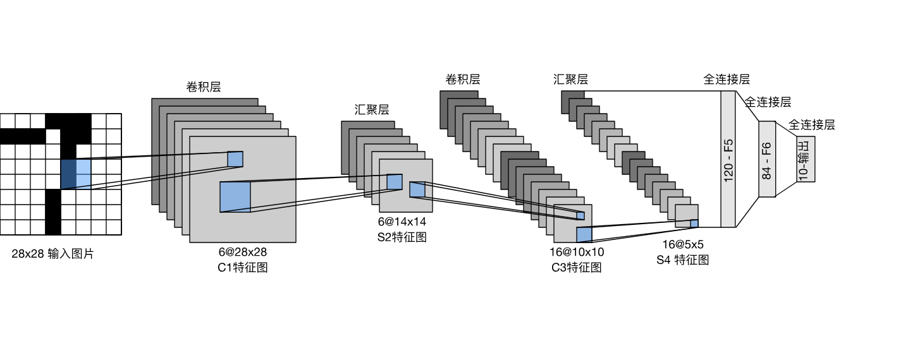
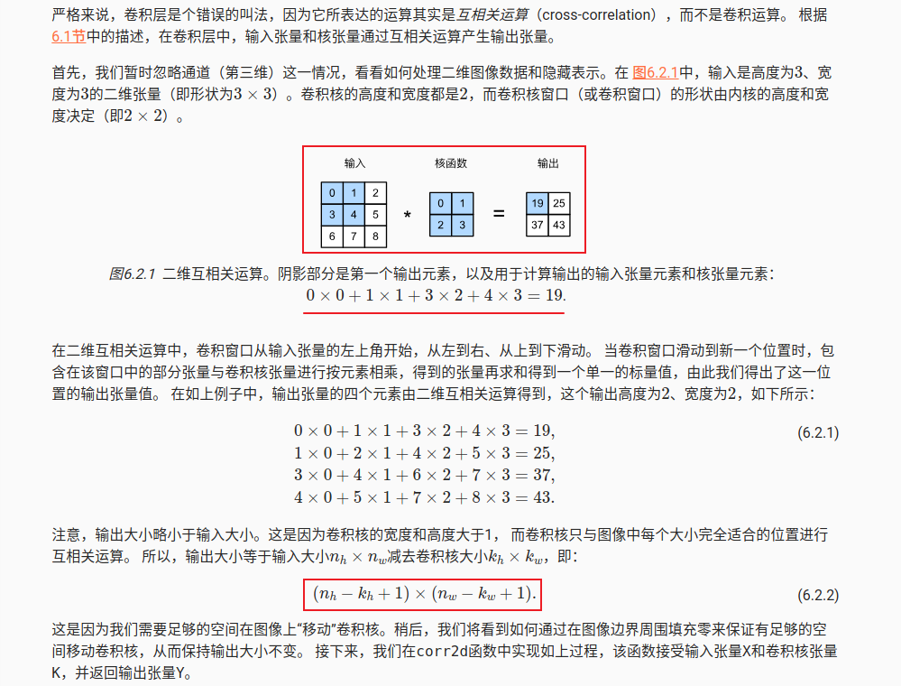
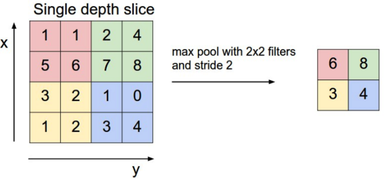

# 卷积神经网络



```python
import torch
from torch import nn
from d2l import torch as d2l

net = nn.Sequential(
    nn.Conv2d(1, 6, kernel_size=5, padding=2), # 输入通道数， 输出通道数（也就是kernel个数），kernel size，padding，默认stride为1
    nn.Sigmoid(),
    nn.AvgPool2d(kernel_size=2, stride=2),
    nn.Conv2d(6, 16, kernel_size=5), 
    nn.Sigmoid(),
    nn.AvgPool2d(kernel_size=2, stride=2),
    nn.Flatten(),
    nn.Linear(16 * 5 * 5, 120), 
    nn.Sigmoid(),
    nn.Linear(120, 84), 
    nn.Sigmoid(),
    nn.Linear(84, 10))
```

---

## 什么是卷积



```python
import torch
from torch import nn
from d2l import torch as d2l

class Conv2D(nn.Module):
    def __init__(self, kernel_size):
        super().__init__()
        self.weight = nn.Parameter(torch.rand(kernel_size))
        self.bias = nn.Parameter(torch.zeros(1))

    def corr2d(X, K):  #@save
        """计算二维互相关运算"""
        h, w = K.shape
        Y = torch.zeros((X.shape[0] - h + 1, X.shape[1] - w + 1))
        for i in range(Y.shape[0]):
            for j in range(Y.shape[1]):
                Y[i, j] = (X[i:i + h, j:j + w] * K).sum()
        return Y

    def forward(self, x):
        return self.corr2d(x, self.weight) + self.bias
```


## 填充padding与步幅stride
TBD


## 卷积层输出值的计算

图像大小、步幅和卷积后的Feature Map大小，满足下面的关系：

$$
W_2=(W1−F+2P)/S+1
$$

$$
H_2=(H1−F+2P)/S+1
$$

在上面两个公式中：W2是卷积后Feature Map的宽度；W1是卷积前图像的宽度；F是filter的宽度；P是Zero Padding数量，Zero Padding是指在原始图像周围补几圈0，如果P的值是1，那么就补1圈0；S是步幅；H2是卷积后Feature Map的高度；H1是卷积前图像的宽度。

下面的显示包含两个filter的卷积层的计算。可以看到773输入，经过两个333filter的卷积(步幅为2)，得到了332的输出。另外也会看到下图的Zero padding是1，也就是在输入元素的周围补了一圈0。


## 池化pooling

池化层主要的作用是下采样，通过去掉Feature Map中不重要的样本，进一步减少参数数量。池化的方法最常用的是Max Pooling，即样本中取最大值，作为采样后的样本值。下例是2*2 max pooling




## 参考
- [卷积神经网络（CNN）详解](https://www.zhihu.com/tardis/zm/art/47184529?source_id=1003)

- [一文读懂卷积神经网络中的1x1卷积核](https://zhuanlan.zhihu.com/p/40050371)

- [pytorch之torch.nn.Conv2d()函数详解](https://blog.csdn.net/qq_34243930/article/details/107231539)