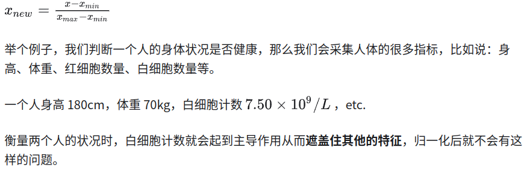
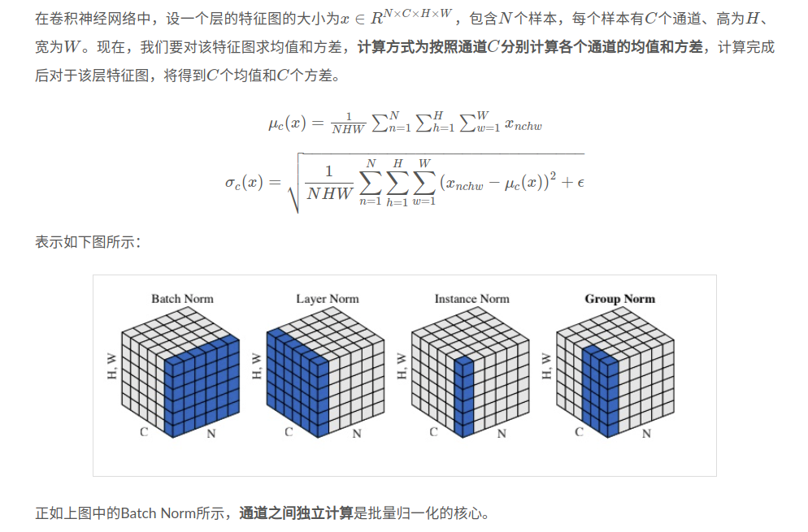
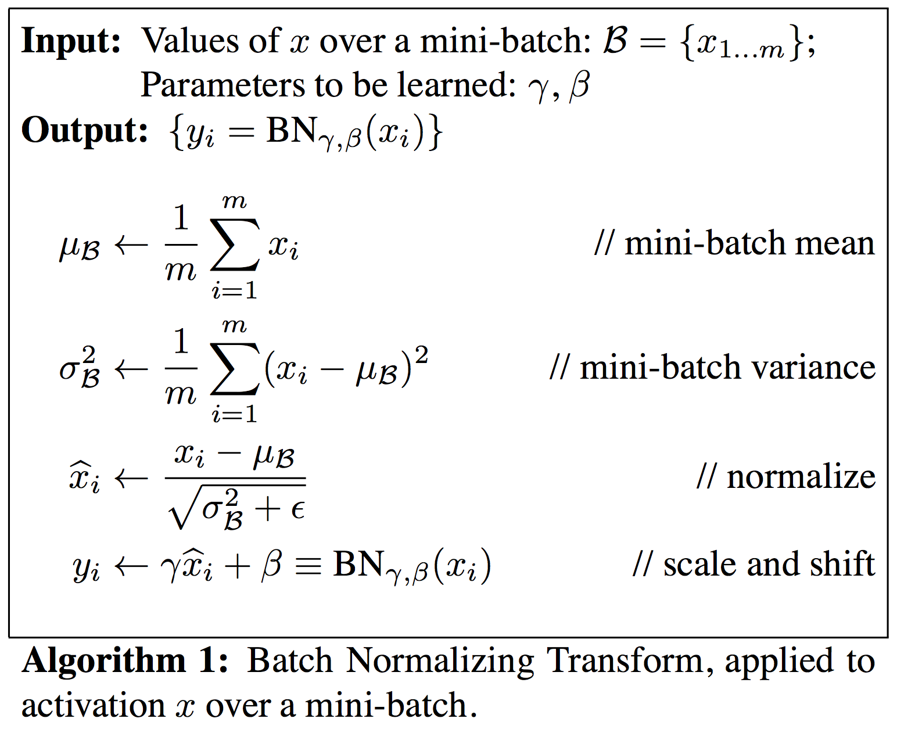
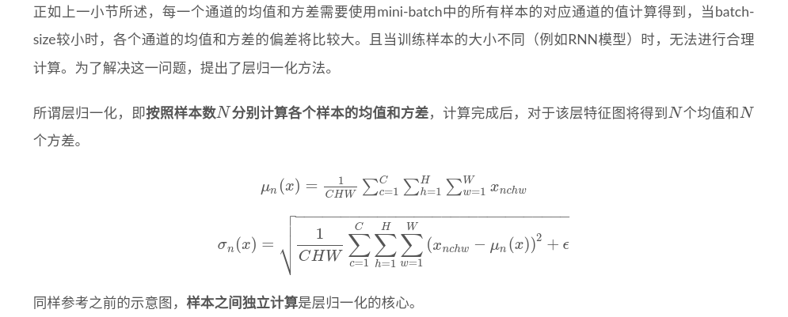
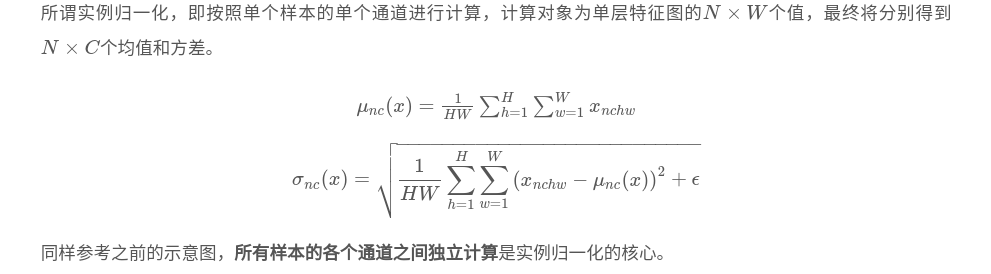
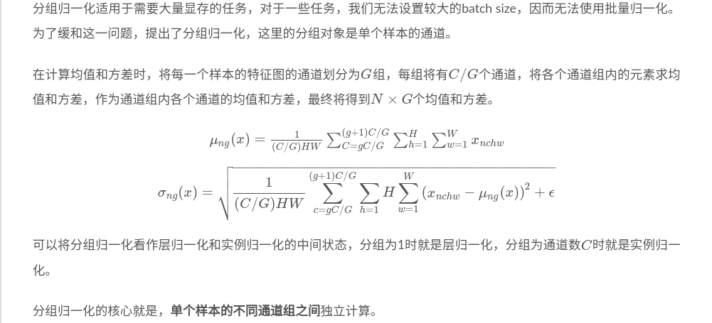
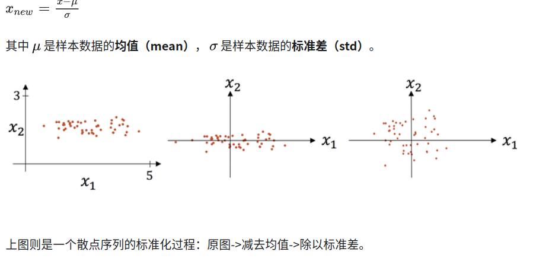
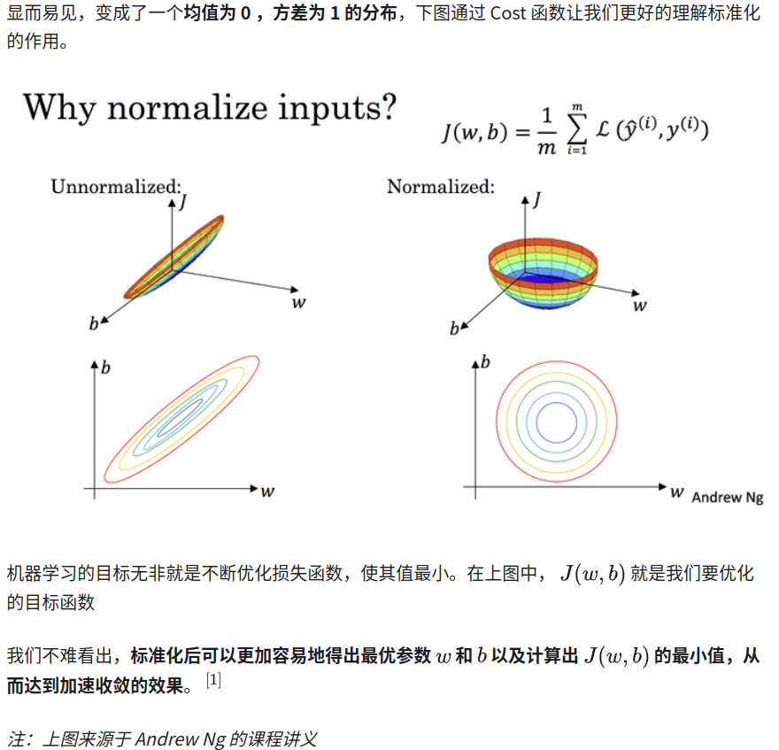

# 深度学习中的归一化、标准化和正则化

- [归一化操作](#归一化操作)
  - [Min-Max 归一化](#min-max-归一化)
- [训练过程归一化操作](#训练过程归一化操作)
  - [批量归一化（Batch Normalization, BN）](#批量归一化batch-normalization-bn)
  - [层归一化（Layer Normalization, LN）](#层归一化layer-normalization-ln)
  - [实例归一化（Instance Normalization, IN](#实例归一化instance-normalization-in)
  - [分组归一化（Group Normalization, GN）](#分组归一化group-normalization-gn)
  - [小结](#小结)
- [标准化 Normalization](#标准化-normalization)
  - [Z-Score 标准化](#z-score-标准化)
- [正则化 Regularization](#正则化-regularization)
  - [L1、L2正则](#l1l2正则)
  - [DropOut法](#dropout法)
- [参考资料](#参考资料)

归一化、标准化和正则化是数据预处理和模型优化中的重要技术，它们各有不同的目的和应用场景：

- **归一化（Normalization）**：归一化的目的是将数据按比例缩放，使之落入一个小的特定区间，如[0, 1]或[-1, 1]。这样做可以消除不同量纲的影响，使得不同特征之间具有可比性。常见的方法有最小-最大归一化。归一化主要用于数据预处理阶段。

- **标准化（Standardization）**：标准化的目的是将数据处理成均值为0，标准差为1的分布，即转换为标准正态分布。这样做可以减少不同特征间的尺度差异，提高算法的收敛速度。常见的方法有Z得分标准化。标准化也主要用于数据预处理阶段。

- **正则化（Regularization）**：正则化的目的是防止模型过拟合，提高模型的泛化能力。它通过在损失函数中添加一个正则项来约束模型的复杂度，使模型在减少训练误差的同时，也不会过度拟合训练数据。常见的方法有L1正则化、L2正则化和弹性网正则化。正则化主要用于模型训练阶段。

总的来说，归一化和标准化是处理数据的方法，目的是使数据更适合模型的训练，而正则化是优化模型的方法，目的是提高模型的泛化能力，防止过拟合。

## 归一化操作

归一化一般是将数据映射到指定的范围，用于去除不同维度数据的量纲以及量纲单位。

常见的映射范围有 [0, 1] 和 [-1, 1] ，最常见的归一化方法就是 Min-Max 归一化：

### Min-Max 归一化

## 训练过程归一化操作

### 批量归一化（Batch Normalization, BN）

Batch Normalization 由两部分组成，第一部分是**缩放与平移（scale and shift）**，第二部分是训**练缩放尺度和平移的参数（train a BN Network）**，算法步骤如下：

### 层归一化（Layer Normalization, LN）

### 实例归一化（Instance Normalization, IN

### 分组归一化（Group Normalization, GN）

###  小结

各种归一化方法主要在于它们计算均值和方差的维度上有所不同：

- 批量归一化（Batch Normalization, BN）：在批量（Batch）的维度上进行归一化，即对每个特征通道计算整个小批量数据的均值和方差。适用于批量数据处理，能够稳定训练过程，加速收敛。

- 层归一化（Layer Normalization, LN）：在特征（Layer）的维度上进行归一化，即对每个样本计算所有特征通道的均值和方差。适用于处理大小不一的样本，如循环神经网络中的不同时间步长数据。

- 实例归一化（Instance Normalization, IN）：在单个样本的单个通道上进行归一化，即对每个样本的每个通道独立计算均值和方差。主要应用于风格迁移等任务中。

- 分组归一化（Group Normalization, GN）：介于层归一化和实例归一化之间，将每个样本的通道分成若干组，对每组内的通道计算均值和方差。适用于小批量数据处理，尤其是当批量大小受限时

## 标准化 Normalization

### Z-Score 标准化

## 正则化 Regularization

> **正则化主要用于避免过拟合的产生和减少网络误差。**

正则化是机器学习中一种用于防止模型过拟合的技术，其主要目的是提高模型的泛化能力。过拟合是指模型在训练数据上表现很好，但在未见过的新数据上表现较差，即模型过于复杂，捕捉到了训练数据中的噪声，而没有学到数据的真实分布。**正则化通过向模型的损失函数中添加一个正则项（惩罚项）来解决这个问题，限制模型的复杂度，使模型在学习训练数据的同时，还能保持一定的泛化能力。**

正则化一般具有如下形式：

$$J(w, b)=\frac{1}{m} \sum_{i=1}^{m} L(f(x), y)+\lambda R(f)$$

其中，第1项是经验风险，第2项是正则项， $\lambda > 0$为调整两者之间关系的系数。

第1项的经验风险较小的模型可能较复杂（有多个非零参数），这时第2项的模型复杂度会较大。

常见的有正则项有**L1正则**和 **L2正则**，其中L2正则的控制过拟合的效果比L1正则的好。

正则化的作用是选择经验风险与模型复杂度同时较小的模型。 

常见的有正则项有**L1正则**和 **L2正则**以及**Dropout**。

### L1、L2正则

L1和L2正则化是机器学习中常用的两种正则化技术，它们通过在模型的损失函数中添加一个正则项来减少过拟合，从而提高模型的泛化能力。这两种正则化方法的关键区别在于正则项的形式：

1. **L1正则化（Lasso正则化）**：
   -正则项是模型权重的绝对值之和：$\lambda \sum_{i=1}^{n} |w_i|$，其中$\lambda$是正则化强度，$w_i$是模型权重。

   - L1正则化倾向于产生稀疏的权重矩阵，即很多权重会变为0。这意味着L1正则化可以用于特征选择，因为它可以自动地将不重要的特征的权重降为0。
  
   - L1正则化可能导致模型的解不唯一，特别是当有很多高度相关的特征时。

2. **L2正则化（岭回归正则化）**：
   - 正则项是模型权重的平方和：$\lambda \sum_{i=1}^{n} w_i^2$，其中$\lambda$是正则化强度，$w_i$是模型权重。
  
   - L2正则化倾向于将权重均匀地分散到所有特征上，而不是将它们集中到少数几个特征上。这意味着L2正则化不会产生稀疏模型，所有的特征都会被保留。
  
   - L2正则化有助于处理特征之间的共线性问题，可以提高模型的稳定性和泛化能力。
  
   - L2正则化通常会导致模型的解是唯一的。

在实际应用中，选择L1还是L2正则化取决于具体问题和数据集的特点。有时候，为了同时利用L1和L2正则化的优点，会使用弹性网（Elastic Net）正则化，它是L1和L2正则化的线性组合。

### DropOut法

[丢弃法（Dropout）](https://paddlepedia.readthedocs.io/en/latest/tutorials/deep_learning/model_tuning/regularization/dropout.html)

Dropout指在训练神经网络过程中随机丢掉一部分神经元来减少神经网络复杂度，从而防止过拟合。Dropout实现方法很简单：在每次迭代训练中，以一定概率随机屏蔽每一层中若干神经元，用余下神经元所构成网络来继续训练。

## 参考资料

- [ML 入门：归一化、标准化和正则化](https://zhuanlan.zhihu.com/p/29957294)

- [神经网络中的归一化操作](https://xiangqianma.github.io/shen-du-xue-xi/ji-chu-zhi-shi/shen-jing-wang-luo-zhong-de-gui-yi-hua/)