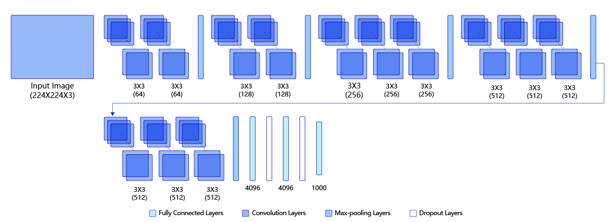

# VGG

## 模型介绍

随着AlexNet在2012年的ImageNet大赛上大放异彩后，卷积神经网络进入了飞速发展的阶段。2014年，由Simonyan和Zisserman提出的VGG<sup>[1]</sup>网络在ImageNet上取得了亚军的成绩。VGG的命名来源于论文作者所在的实验室Visual Geometry Group，其对卷积神经网络进行了改良，探索了网络深度与性能的关系，用更小的卷积核和更深的网络结构，取得了较好的效果，成为了CNN发展史上较为重要的一个网络。VGG中使用了一系列大小为3x3的小尺寸卷积核和池化层构造深度卷积神经网络，因为其结构简单、应用性极强而广受研究者欢迎，尤其是它的网络结构设计方法，为构建深度神经网络提供了方向。

## 模型结构

**图1** 是VGG-16的网络结构示意图，有13层卷积和3层全连接层。VGG网络的设计严格使用$3\times 3$的卷积层和池化层来提取特征，并在网络的最后面使用三层全连接层，将最后一层全连接层的输出作为分类的预测。

VGG中还有一个显著特点：每次经过池化层（maxpooling）后特征图的尺寸减小一倍，而通道数增加一倍（最后一个池化层除外）。

在VGG中每层卷积将使用ReLU作为激活函数，在全连接层之后添加dropout来抑制过拟合。使用小的卷积核能够有效地减少参数的个数，使得训练和测试变得更加有效。比如使用两层$3\times 3$ 卷积层，可以得到感受野为5的特征图，而比使用$5 \times 5$的卷积层需要更少的参数。由于卷积核比较小，可以堆叠更多的卷积层，加深网络的深度，这对于图像分类任务来说是有利的。VGG模型的成功证明了增加网络的深度，可以更好的学习图像中的特征模式。



<center>图1 VGG模型网络结构示意图</center><br></br>

## 模型实现

基于Paddle框架，VGG的具体实现如下代码所示：


```python
# -*- coding:utf-8 -*-

# VGG模型代码
import numpy as np
import paddle
# from paddle.nn import Conv2D, MaxPool2D, BatchNorm, Linear
from paddle.nn import Conv2D, MaxPool2D, BatchNorm2D, Linear

# 定义vgg网络
class VGG(paddle.nn.Layer):
    def __init__(self):
        super(VGG, self).__init__()

        in_channels = [3, 64, 128, 256, 512, 512]
        # 定义第一个卷积块，包含两个卷积
        self.conv1_1 = Conv2D(in_channels=in_channels[0], out_channels=in_channels[1], kernel_size=3, padding=1, stride=1)
        self.conv1_2 = Conv2D(in_channels=in_channels[1], out_channels=in_channels[1], kernel_size=3, padding=1, stride=1)
        # 定义第二个卷积块，包含两个卷积
        self.conv2_1 = Conv2D(in_channels=in_channels[1], out_channels=in_channels[2], kernel_size=3, padding=1, stride=1)
        self.conv2_2 = Conv2D(in_channels=in_channels[2], out_channels=in_channels[2], kernel_size=3, padding=1, stride=1)
        # 定义第三个卷积块，包含三个卷积
        self.conv3_1 = Conv2D(in_channels=in_channels[2], out_channels=in_channels[3], kernel_size=3, padding=1, stride=1)
        self.conv3_2 = Conv2D(in_channels=in_channels[3], out_channels=in_channels[3], kernel_size=3, padding=1, stride=1)
        self.conv3_3 = Conv2D(in_channels=in_channels[3], out_channels=in_channels[3], kernel_size=3, padding=1, stride=1)
        # 定义第四个卷积块，包含三个卷积
        self.conv4_1 = Conv2D(in_channels=in_channels[3], out_channels=in_channels[4], kernel_size=3, padding=1, stride=1)
        self.conv4_2 = Conv2D(in_channels=in_channels[4], out_channels=in_channels[4], kernel_size=3, padding=1, stride=1)
        self.conv4_3 = Conv2D(in_channels=in_channels[4], out_channels=in_channels[4], kernel_size=3, padding=1, stride=1)
        # 定义第五个卷积块，包含三个卷积
        self.conv5_1 = Conv2D(in_channels=in_channels[4], out_channels=in_channels[5], kernel_size=3, padding=1, stride=1)
        self.conv5_2 = Conv2D(in_channels=in_channels[5], out_channels=in_channels[5], kernel_size=3, padding=1, stride=1)
        self.conv5_3 = Conv2D(in_channels=in_channels[5], out_channels=in_channels[5], kernel_size=3, padding=1, stride=1)

        # 使用Sequential 将全连接层和relu组成一个线性结构（fc + relu）
        # 当输入为224x224时，经过五个卷积块和池化层后，特征维度变为[512x7x7]
        self.fc1 = paddle.nn.Sequential(paddle.nn.Linear(512 * 7 * 7, 4096), paddle.nn.ReLU())
        self.drop1_ratio = 0.5
        self.dropout1 = paddle.nn.Dropout(self.drop1_ratio, mode='upscale_in_train')
        # 使用Sequential 将全连接层和relu组成一个线性结构（fc + relu）
        self.fc2 = paddle.nn.Sequential(paddle.nn.Linear(4096, 4096), paddle.nn.ReLU())

        self.drop2_ratio = 0.5
        self.dropout2 = paddle.nn.Dropout(self.drop2_ratio, mode='upscale_in_train')
        self.fc3 = paddle.nn.Linear(4096, 1)

        self.relu = paddle.nn.ReLU()
        self.pool = MaxPool2D(stride=2, kernel_size=2)

    def forward(self, x):
        x = self.relu(self.conv1_1(x))
        x = self.relu(self.conv1_2(x))
        x = self.pool(x)

        x = self.relu(self.conv2_1(x))
        x = self.relu(self.conv2_2(x))
        x = self.pool(x)

        x = self.relu(self.conv3_1(x))
        x = self.relu(self.conv3_2(x))
        x = self.relu(self.conv3_3(x))
        x = self.pool(x)

        x = self.relu(self.conv4_1(x))
        x = self.relu(self.conv4_2(x))
        x = self.relu(self.conv4_3(x))
        x = self.pool(x)

        x = self.relu(self.conv5_1(x))
        x = self.relu(self.conv5_2(x))
        x = self.relu(self.conv5_3(x))
        x = self.pool(x)

        x = paddle.flatten(x, 1, -1)
        x = self.dropout1(self.relu(self.fc1(x)))
        x = self.dropout2(self.relu(self.fc2(x)))
        x = self.fc3(x)
        return x
```

## 模型特点

- 整个网络都使用了同样大小的卷积核尺寸$3\times3$和最大池化尺寸$2\times2$。
- $1\times1$卷积的意义主要在于线性变换，而输入通道数和输出通道数不变，没有发生降维。
- 两个$3\times3$的卷积层串联相当于1个$5\times5$的卷积层，感受野大小为$5\times5$。同样地，3个$3\times3$的卷积层串联的效果则相当于1个$7\times7$的卷积层。这样的连接方式使得网络参数量更小，而且多层的激活函数令网络对特征的学习能力更强。
- VGGNet在训练时有一个小技巧，先训练浅层的的简单网络VGG11，再复用VGG11的权重来初始化VGG13，如此反复训练并初始化VGG19，能够使训练时收敛的速度更快。
- 在训练过程中使用多尺度的变换对原始数据做数据增强，使得模型不易过拟合。

## 模型指标

VGG 在 2014 年的 ImageNet 比赛上取得了亚军的好成绩，具体指标如 **图2** 所示。**图2** 第一行为在 ImageNet 比赛中的指标，测试集的Error rate达到了7.3%，在论文中，作者对算法又进行了一定的优化，最终可以达到 6.8% 的Error rate。


<center>图2 VGG模型指标</center><br></br>

## 参考文献

[1] [Very deep convolutional networks for large-scale image recognition.](https://arxiv.org/pdf/1409.1556.pdf)

