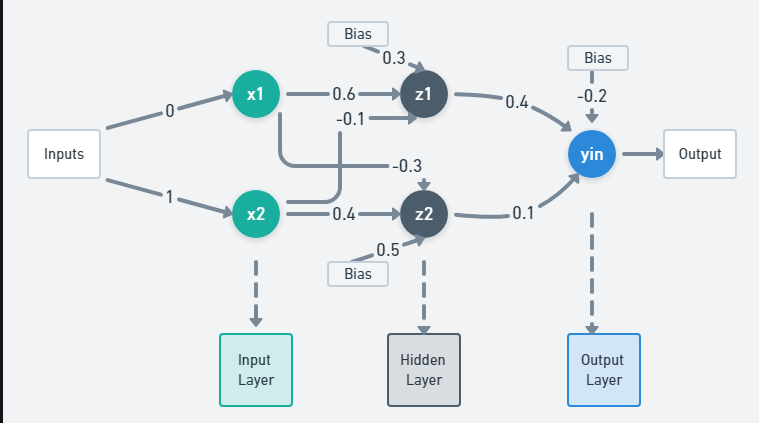
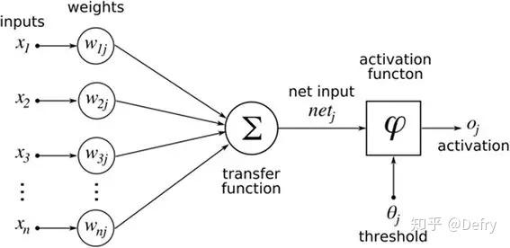
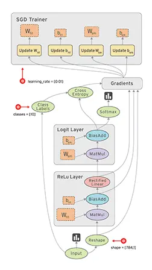
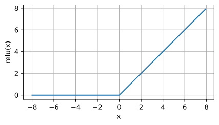
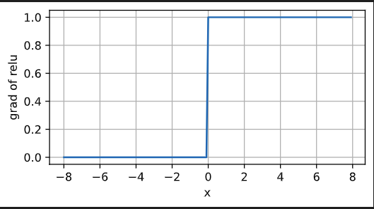
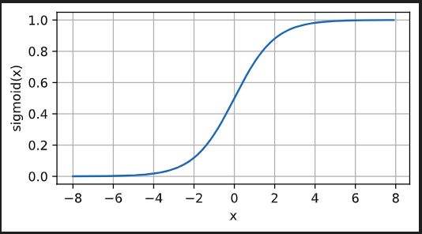
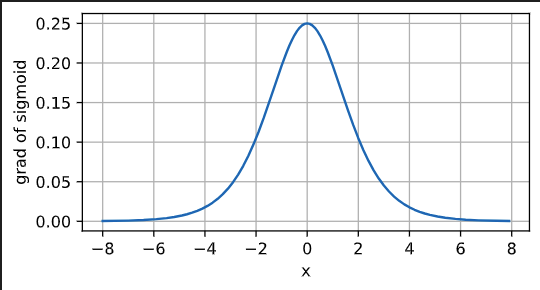
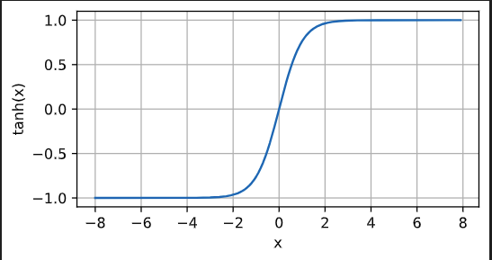
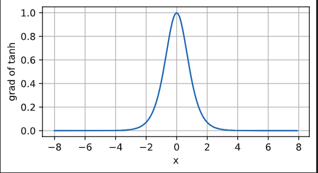

# 神经网络

## 什么是神经网络

神经网络是深度学习的核心，模拟人脑的神经元网络来处理和学习复杂的数据模式。神经网络的基本框架包括以下几个关键组成部分：







1. **输入层（Input Layer**）
   
   - 作用: 接收输入数据。每个输入单元对应数据集中的一个特征。
  
2. **隐藏层（Hidden Layers**）
   
   - 作用: 在输入层和输出层之间，可以有一个或多个隐藏层。隐藏层负责进行数据的非线性变换，提取特征。
   - 组成: 每个隐藏层由多个神经元（或节点）组成，每个神经元都对前一层的输出进行加权求和，然后通过一个激活函数来引入非线性。

3. **输出层（Output Layer）**
    - 作用: 产生最终的输出。对于分类任务，输出层的神经元数量通常等于类别的数量；对于回归任务，输出层通常只有一个神经元。
  
4. **权重（Weights）和偏置（Biases）**
   - 作用: 神经网络的学习参数。每个连接线上都有一个权重，每个神经元都有一个偏置。通过学习算法调整这些参数，神经网络能够学习数据的特征和模式。
  
5. **激活函数（Activation Functions）**
   - 作用: 引入非线性，使得神经网络可以学习复杂的数据模式。常见的激活函数包括ReLU（Rectified Linear Unit）、Sigmoid和Tanh等。
  
6. **损失函数（Loss Function）**
   - 作用: 评估模型的预测值与实际值之间的差异。常见的损失函数有均方误差（MSE）用于回归任务，交叉熵损失（Cross-Entropy Loss）用于分类任务。
  
7. **优化算法（Optimization Algorithms）**
   - 作用: 调整神经网络的权重和偏置，以最小化损失函数。常用的优化算法包括梯度下降（Gradient Descent）、Adam等。
  
**工作流程：**
1. 前向传播（Forward Propagation）: 从输入层到输出层，逐层计算每个神经元的输出。

2. 计算损失（Compute Loss）: 使用损失函数计算模型输出与实际标签之间的差异。

3. 反向传播（Backward Propagation）: 从输出层到输入层，逐层计算损失函数相对于每个参数的梯度，并更新参数。
   
通过这个过程，神经网络能够学习数据中的复杂模式和关系，从而进行有效的预测和分类。


**简单的pytorch示例**
```python
# nn是神经网络的缩写
from torch import nn

"""构造一个线性模型"""
net = nn.Sequential(nn.Linear(2, 1))

"""初始化模型的权重和偏置"""
net[0].weight.data.normal_(0, 0.01)
net[0].bias.data.fill_(0)

"""定义损失函数，这里是L2损失"""
loss = nn.MSELoss()

"""定义优化器"""
trainer = torch.optim.SGD(net.parameters(), lr=0.03)

"""开始模型训练"""
num_epochs = 3
for epoch in range(num_epochs):
    for X, y in data_iter:
        l = loss(net(X) ,y) # 模型前向传播并计算loss
        trainer.zero_grad() # 清空之前的梯度
        l.backward() # 自动计算梯度
        trainer.step() # 模型参数更新
    l = loss(net(features), labels)
    print(f'epoch {epoch + 1}, loss {l:f}')
```


## 激活函数

参考：[激活函数 sigmoid、tanh、relu](https://www.jianshu.com/p/857d5859d2cc)

---

激活函数（activation functions）的目标是，将神经网络非线性化。激活函数是**连续的（continuous）**，且**可导的（differential）**。

> 连续的：当输入值发生较小的改变时，输出值也发生较小的改变；
> 
> 可导的：在定义域中，每一处都是存在导数

下面介绍几种常见的激活函数;

### ReLU

最受欢迎的激活函数是*修正线性单元*（Rectified linear unit，*ReLU*），
因为它实现简单，同时在各种预测任务中表现良好。
[**ReLU提供了一种非常简单的非线性变换**]。

**给定元素$x$，ReLU函数被定义为该元素与$0$的最大值**：

$$\operatorname{ReLU}(x) = \max(x, 0).$$

通俗地说，ReLU函数通过将相应的活性值设为0，仅保留正元素并丢弃所有负元素。

为了直观感受一下，我们可以画出函数的曲线图。

正如从图中所看到，激活函数是分段线性的。

```python
x = torch.arange(-8.0, 8.0, 0.1, requires_grad=True)
y = torch.relu(x)
d2l.plot(x.detach(), y.detach(), 'x', 'relu(x)', figsize=(5, 2.5))
```



当输入为负时，ReLU函数的导数为0，而当输入为正时，ReLU函数的导数为1。

注意，当输入值精确等于0时，ReLU函数不可导。在此时，我们默认使用左侧的导数，即当输入为0时导数为0。

我们可以忽略这种情况，因为输入可能永远都不会是0。
这里引用一句古老的谚语，“如果微妙的边界条件很重要，我们很可能是在研究数学而非工程”，这个观点正好适用于这里。

下面我们绘制ReLU函数的导数。




### sigmoid

[**对于一个定义域在$\mathbb{R}$中的输入，
*sigmoid函数*将输入变换为区间(0, 1)上的输出**]。
因此，sigmoid通常称为*挤压函数*（squashing function）：
它将范围（-inf, inf）中的任意输入压缩到区间（0, 1）中的某个值：

$$\operatorname{sigmoid}(x) = \frac{1}{1 + \exp(-x)}.$$

```python
y = torch.sigmoid(x)
d2l.plot(x.detach(), y.detach(), 'x', 'sigmoid(x)', figsize=(5, 2.5))
```



sigmoid函数的导数为下面的公式：

$$\frac{d}{dx} \operatorname{sigmoid}(x) = \frac{\exp(-x)}{(1 + \exp(-x))^2} = \operatorname{sigmoid}(x)\left(1-\operatorname{sigmoid}(x)\right).$$

sigmoid函数的导数图像如下所示。
注意，当输入为0时，sigmoid函数的导数达到最大值0.25；
而输入在任一方向上越远离0点时，导数越接近0。



### tanh

与sigmoid函数类似，
[**tanh(双曲正切)函数也能将其输入压缩转换到区间(-1, 1)上**]。
tanh函数的公式如下：

$$\operatorname{tanh}(x) = \frac{1 - \exp(-2x)}{1 + \exp(-2x)}.$$

下面我们绘制tanh函数。
注意，当输入在0附近时，tanh函数接近线性变换。
函数的形状类似于sigmoid函数，
不同的是tanh函数关于坐标系原点中心对称。

```python
y = torch.tanh(x)
d2l.plot(x.detach(), y.detach(), 'x', 'tanh(x)', figsize=(5, 2.5))
```



tanh函数的导数是：

$$\frac{d}{dx} \operatorname{tanh}(x) = 1 - \operatorname{tanh}^2(x).$$

tanh函数的导数图像如下所示。
当输入接近0时，tanh函数的导数接近最大值1。
与我们在sigmoid函数图像中看到的类似，
输入在任一方向上越远离0点，导数越接近0。

```python
x.grad.data.zero_()
y.backward(torch.ones_like(x),retain_graph=True)
d2l.plot(x.detach(), x.grad, 'x', 'grad of tanh', figsize=(5, 2.5))
```




## 损失函数及其应用

损失函数（Loss Function）是衡量模型预测值与真实值之间差异的一个函数，是神经网络训练中优化的目标。根据不同的任务类型（如回归、分类等），会选择不同的损失函数。以下是一些常用的损失函数及其应用：

### 1. 均方误差（Mean Squared Error, MSE）
- **公式:** $MSE = \frac{1}{n} \sum_{i=1}^{n} (y_i - \hat{y}_i)^2$
- **应用:** 适用于回归问题，用于衡量预测值与真实值之间的平方差之和。

### 2. 均方根误差（Root Mean Squared Error, RMSE）
- **公式:** $RMSE = \sqrt{\frac{1}{n} \sum_{i=1}^{n} (y_i - \hat{y}_i)^2}$
- **应用:** 适用于回归问题，尤其是当大误差需要被重点关注时。

### 3. 平均绝对误差（Mean Absolute Error, MAE）
- **公式:** $MAE = \frac{1}{n} \sum_{i=1}^{n} |y_i - \hat{y}_i|$
- **应用:** 适用于回归问题，对异常值不如MSE敏感。

### 4. 交叉熵损失（Cross-Entropy Loss）
- **公式:** 对于二分类问题，$CE = -\frac{1}{n} \sum_{i=1}^{n} [y_i \log(\hat{y}_i) + (1 - y_i) \log(1 - \hat{y}_i)]$
- **应用:** 适用于分类问题，尤其是二分类和多分类问题。

### 5. 对数损失（Log Loss）
- **公式:** 与交叉熵损失相同，在二分类问题中表现为上述交叉熵损失的形式。
- **应用:** 用于二分类问题中，特别是在概率估计场景中。


选择哪种损失函数取决于具体的应用场景和问题类型。例如，对于回归问题，通常选择MSE或MAE；对于分类问题，一般选择交叉熵损失。正确选择和应用损失函数对于训练高性能的神经网络模型至关重要。

## 反向传播

反向传播（英语：Backpropagation，缩写为BP）是“误差反向传播”的简称，是一种与最优化方法（如梯度下降法）结合使用的，用来训练人工神经网络的常见方法。该方法计算对网络中所有权重计算损失函数的梯度。这个梯度会反馈给最优化方法，用来更新权值以最小化损失函数。 在神经网络上执行梯度下降法的主要算法。该算法会先按前向传播方式计算（并缓存）每个节点的输出值，然后再按反向传播遍历图的方式计算损失函数值相对于每个参数的偏导数。

[一文弄懂神经网络中的反向传播法——BackPropagation](https://www.cnblogs.com/charlotte77/p/5629865.html)

[反向传播算法](https://www.jiqizhixin.com/graph/technologies/7332347c-8073-4783-bfc1-1698a6257db3)

## 优化算法

[README](./优化算法.md)